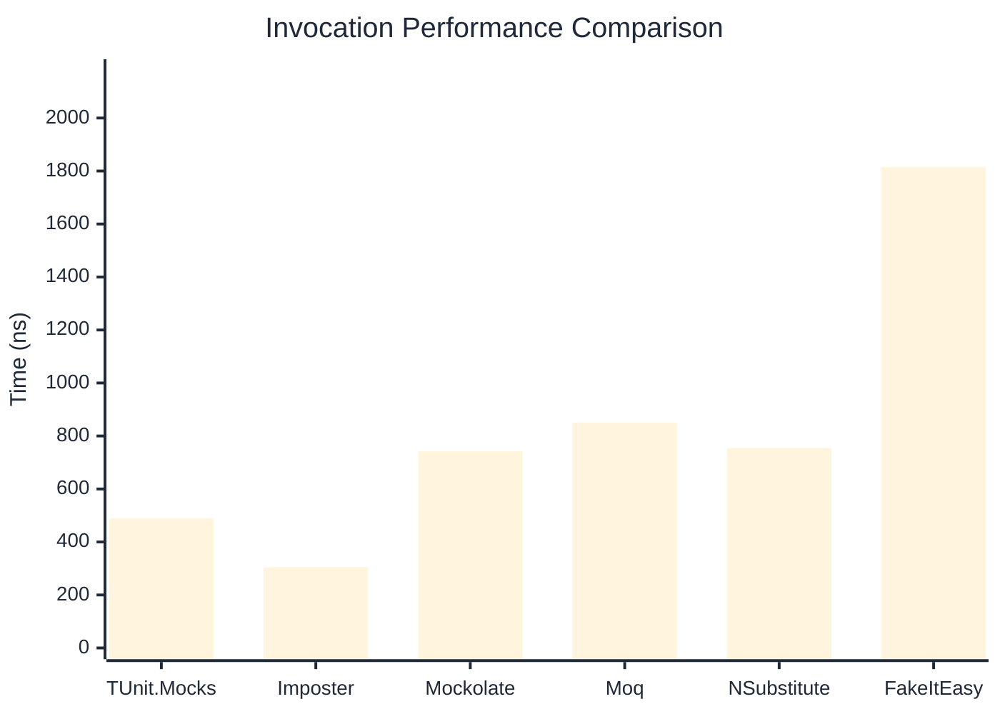
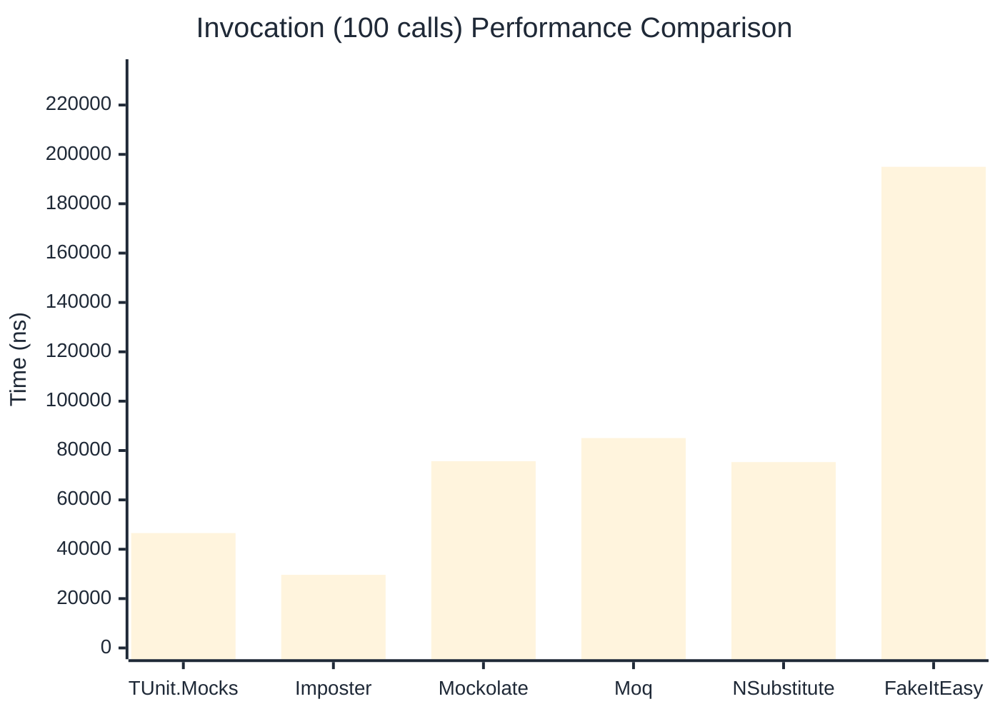

# Invocation Benchmark

:::info Last Updated
This benchmark was automatically generated on **2026-03-29** from the latest CI run.

**Environment:** Ubuntu Latest • .NET SDK 10.0.201
:::

## 📊 Results

Calling methods on mock objects:

| Library | Mean | Error | StdDev | Allocated |
|---------|------|-------|--------|-----------|
| **TUnit.Mocks** | 488.4 ns | 231.99 ns | 12.72 ns | 224 B |
| Imposter | 304.4 ns | 151.38 ns | 8.30 ns | 168 B |
| Mockolate | 742.3 ns | 142.36 ns | 7.80 ns | 688 B |
| Moq | 850.8 ns | 164.70 ns | 9.03 ns | 376 B |
| NSubstitute | 754.4 ns | 191.02 ns | 10.47 ns | 304 B |
| FakeItEasy | 1,815.7 ns | 824.76 ns | 45.21 ns | 944 B |

---

### String

| Library | Mean | Error | StdDev | Allocated |
|---------|------|-------|--------|-----------|
| **TUnit.Mocks** | 325.3 ns | 93.04 ns | 5.10 ns | 160 B |
| Imposter | 298.6 ns | 90.16 ns | 4.94 ns | 168 B |
| Mockolate | 633.7 ns | 694.75 ns | 38.08 ns | 568 B |
| Moq | 562.4 ns | 170.86 ns | 9.37 ns | 296 B |
| NSubstitute | 655.1 ns | 243.87 ns | 13.37 ns | 272 B |
| FakeItEasy | 1,652.2 ns | 222.13 ns | 12.18 ns | 776 B |

---

### 100 calls

| Library | Mean | Error | StdDev | Allocated |
|---------|------|-------|--------|-----------|
| **TUnit.Mocks** | 46,554.3 ns | 16,336.06 ns | 895.43 ns | 23296 B |
| Imposter | 29,634.4 ns | 9,350.49 ns | 512.53 ns | 16800 B |
| Mockolate | 75,684.0 ns | 70,445.98 ns | 3,861.38 ns | 68800 B |
| Moq | 85,060.0 ns | 15,481.89 ns | 848.61 ns | 37600 B |
| NSubstitute | 75,318.0 ns | 16,084.25 ns | 881.63 ns | 30848 B |
| FakeItEasy | 194,965.6 ns | 83,304.82 ns | 4,566.22 ns | 94400 B |

## 🎯 Key Insights

This benchmark compares **TUnit.Mocks** (source-generated) against runtime proxy-based mocking libraries for calling methods on mock objects.

---

:::note Methodology
View the [mock benchmarks overview](/docs/benchmarks/mocks) for methodology details and environment information.
:::

*Last generated: 2026-03-29T22:20:59.126Z*
