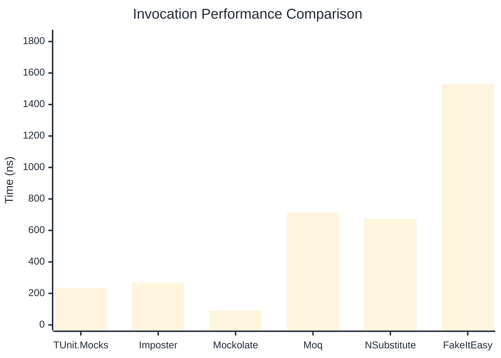

# Invocation Benchmark

:::info Last Updated
This benchmark was automatically generated on **2026-05-06** from the latest CI run.

**Environment:** Ubuntu Latest • .NET SDK 10.0.203
:::

## 📊 Results

Calling methods on mock objects:

| Library | Mean | Error | StdDev | Allocated |
|---------|------|-------|--------|-----------|
| **TUnit.Mocks** | 233.02 ns | 77.76 ns | 4.262 ns | 120 B |
| Imposter | 267.71 ns | 53.17 ns | 2.915 ns | 168 B |
| Mockolate | 92.02 ns | 20.98 ns | 1.150 ns | 84 B |
| Moq | 713.40 ns | 260.71 ns | 14.290 ns | 376 B |
| NSubstitute | 673.83 ns | 142.09 ns | 7.789 ns | 360 B |
| FakeItEasy | 1,531.74 ns | 376.17 ns | 20.619 ns | 944 B |

---

### String

| Library | Mean | Error | StdDev | Allocated |
|---------|------|-------|--------|-----------|
| **TUnit.Mocks** | 144.21 ns | 67.99 ns | 3.727 ns | 88 B |
| Imposter | 266.34 ns | 97.99 ns | 5.371 ns | 168 B |
| Mockolate | 83.62 ns | 13.86 ns | 0.760 ns | 60 B |
| Moq | 481.25 ns | 39.23 ns | 2.150 ns | 296 B |
| NSubstitute | 589.46 ns | 63.31 ns | 3.470 ns | 272 B |
| FakeItEasy | 1,377.74 ns | 231.05 ns | 12.665 ns | 776 B |

---

### 100 calls

| Library | Mean | Error | StdDev | Allocated |
|---------|------|-------|--------|-----------|
| **TUnit.Mocks** | 23,685.24 ns | 9,145.49 ns | 501.295 ns | 11936 B |
| Imposter | 26,672.96 ns | 730.92 ns | 40.064 ns | 16800 B |
| Mockolate | 9,008.94 ns | 1,871.82 ns | 102.601 ns | 8400 B |
| Moq | 69,538.52 ns | 9,099.66 ns | 498.783 ns | 37600 B |
| NSubstitute | 63,140.44 ns | 10,488.85 ns | 574.929 ns | 30848 B |
| FakeItEasy | 154,965.78 ns | 63,324.58 ns | 3,471.034 ns | 94400 B |

## 🎯 Key Insights

This benchmark compares **TUnit.Mocks** (source-generated) against runtime proxy-based mocking libraries for calling methods on mock objects.

---

:::note Methodology
View the [mock benchmarks overview](/docs/benchmarks/mocks) for methodology details and environment information.
:::

*Last generated: 2026-05-06T03:25:44.139Z*
