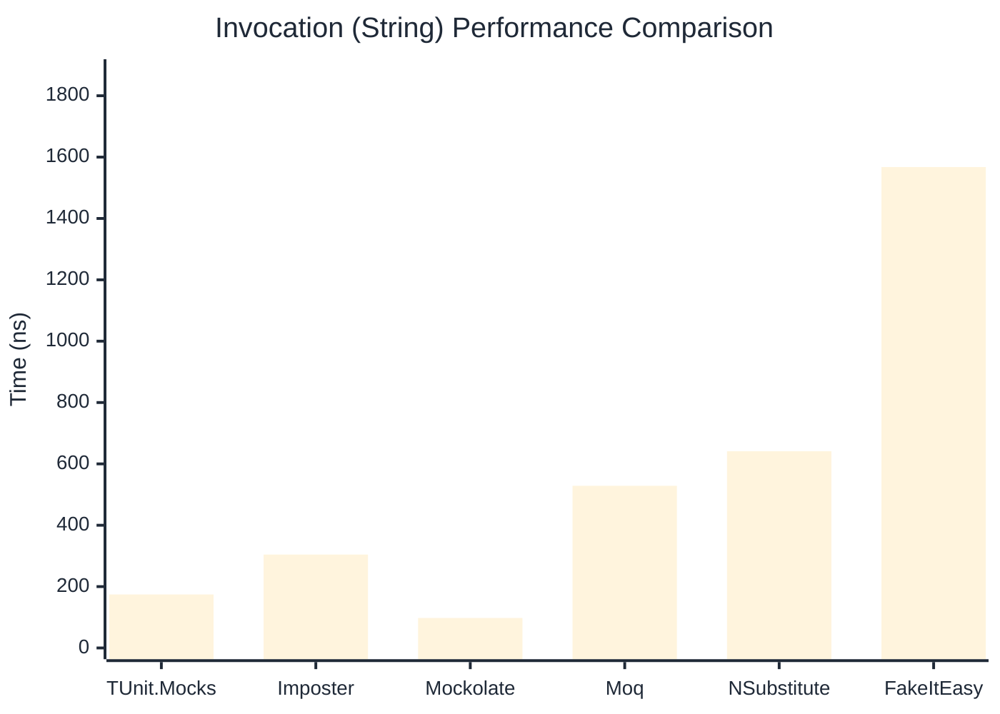

# Invocation Benchmark

> Calling methods on mock objects — comparing **TUnit.Mocks** (source-generated) against runtime proxy-based mocking libraries.

:::info Last Updated
This benchmark was automatically generated on **2026-07-21** from the latest CI run.

**Environment:** Ubuntu Latest • .NET SDK 10.0.302
:::

## 📊 Results

Calling methods on mock objects:

| Library | Mean | Error | StdDev | Allocated |
|---------|------|-------|--------|-----------|
| **TUnit.Mocks** | 276.94 ns | 92.79 ns | 5.086 ns | 128 B |
| Imposter | 301.53 ns | 75.26 ns | 4.125 ns | 168 B |
| Mockolate | 107.91 ns | 17.09 ns | 0.937 ns | 84 B |
| Moq | 780.48 ns | 85.58 ns | 4.691 ns | 376 B |
| NSubstitute | 726.83 ns | 158.00 ns | 8.661 ns | 304 B |
| FakeItEasy | 1,746.43 ns | 252.15 ns | 13.821 ns | 944 B |

---

### String

| Library | Mean | Error | StdDev | Allocated |
|---------|------|-------|--------|-----------|
| **TUnit.Mocks** | 174.37 ns | 66.21 ns | 3.629 ns | 96 B |
| Imposter | 304.46 ns | 41.07 ns | 2.251 ns | 168 B |
| Mockolate | 97.77 ns | 13.04 ns | 0.715 ns | 60 B |
| Moq | 528.66 ns | 79.87 ns | 4.378 ns | 296 B |
| NSubstitute | 641.27 ns | 87.74 ns | 4.809 ns | 328 B |
| FakeItEasy | 1,567.58 ns | 185.91 ns | 10.191 ns | 776 B |

---

### 100 calls

| Library | Mean | Error | StdDev | Allocated |
|---------|------|-------|--------|-----------|
| **TUnit.Mocks** | 27,072.25 ns | 12,918.69 ns | 708.117 ns | 12736 B |
| Imposter | 29,729.26 ns | 10,474.30 ns | 574.132 ns | 16800 B |
| Mockolate | 10,740.23 ns | 2,293.32 ns | 125.704 ns | 8400 B |
| Moq | 77,763.55 ns | 16,019.76 ns | 878.097 ns | 37600 B |
| NSubstitute | 74,225.55 ns | 24,621.95 ns | 1,349.612 ns | 30848 B |
| FakeItEasy | 174,682.49 ns | 52,277.83 ns | 2,865.524 ns | 94400 B |

## 🎯 Key Insights

This benchmark compares **TUnit.Mocks** (source-generated) against runtime proxy-based mocking libraries for calling methods on mock objects.

---

:::note Methodology
View the [mock benchmarks overview](/docs/benchmarks/mocks) for methodology details and environment information.
:::

*Last generated: 2026-07-21T03:22:31.280Z*
