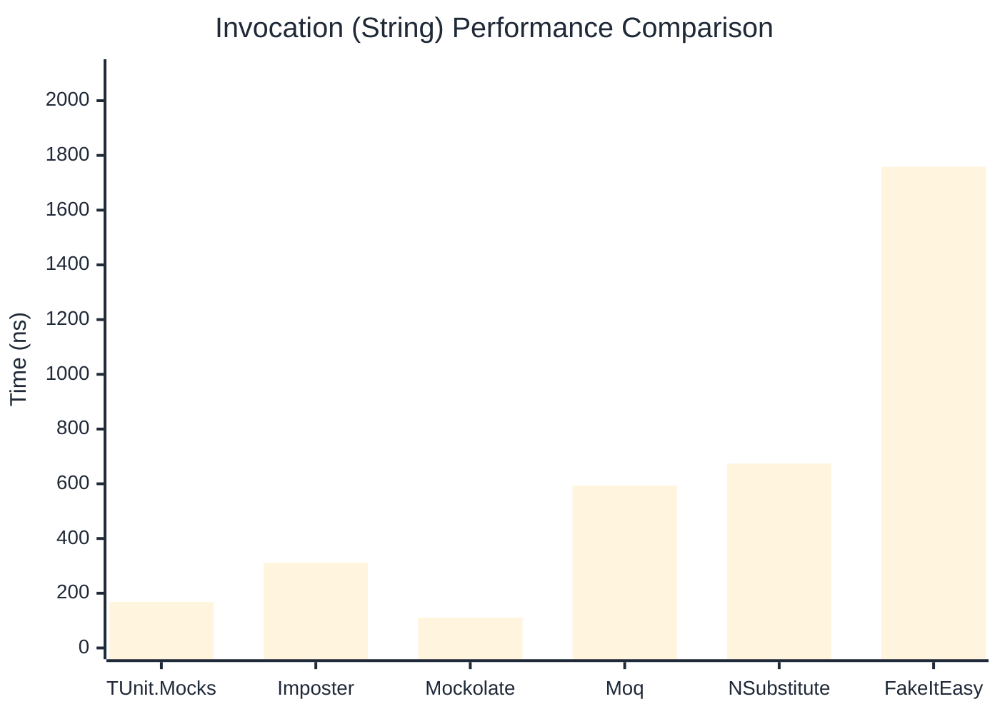

# Invocation Benchmark

> Calling methods on mock objects — comparing **TUnit.Mocks** (source-generated) against runtime proxy-based mocking libraries.

:::info Last Updated
This benchmark was automatically generated on **2026-07-12** from the latest CI run.

**Environment:** Ubuntu Latest • .NET SDK 10.0.301
:::

## 📊 Results

Calling methods on mock objects:

| Library | Mean | Error | StdDev | Allocated |
|---------|------|-------|--------|-----------|
| **TUnit.Mocks** | 281.0 ns | 70.47 ns | 3.86 ns | 128 B |
| Imposter | 309.4 ns | 158.97 ns | 8.71 ns | 168 B |
| Mockolate | 133.9 ns | 36.89 ns | 2.02 ns | 84 B |
| Moq | 853.2 ns | 105.51 ns | 5.78 ns | 376 B |
| NSubstitute | 762.2 ns | 179.93 ns | 9.86 ns | 304 B |
| FakeItEasy | 1,921.3 ns | 337.99 ns | 18.53 ns | 944 B |

---

### String

| Library | Mean | Error | StdDev | Allocated |
|---------|------|-------|--------|-----------|
| **TUnit.Mocks** | 168.5 ns | 69.60 ns | 3.82 ns | 96 B |
| Imposter | 311.4 ns | 176.84 ns | 9.69 ns | 168 B |
| Mockolate | 110.5 ns | 74.91 ns | 4.11 ns | 60 B |
| Moq | 592.9 ns | 328.56 ns | 18.01 ns | 296 B |
| NSubstitute | 673.5 ns | 327.20 ns | 17.93 ns | 272 B |
| FakeItEasy | 1,758.3 ns | 381.09 ns | 20.89 ns | 776 B |

---

### 100 calls

| Library | Mean | Error | StdDev | Allocated |
|---------|------|-------|--------|-----------|
| **TUnit.Mocks** | 28,081.0 ns | 16,220.19 ns | 889.08 ns | 12736 B |
| Imposter | 30,281.4 ns | 6,525.29 ns | 357.67 ns | 16800 B |
| Mockolate | 13,069.8 ns | 1,595.90 ns | 87.48 ns | 8400 B |
| Moq | 86,355.1 ns | 33,569.25 ns | 1,840.04 ns | 37600 B |
| NSubstitute | 77,843.4 ns | 6,846.92 ns | 375.30 ns | 30848 B |
| FakeItEasy | 193,710.2 ns | 47,320.94 ns | 2,593.82 ns | 94400 B |

## 🎯 Key Insights

This benchmark compares **TUnit.Mocks** (source-generated) against runtime proxy-based mocking libraries for calling methods on mock objects.

---

:::note Methodology
View the [mock benchmarks overview](/docs/benchmarks/mocks) for methodology details and environment information.
:::

*Last generated: 2026-07-12T03:30:57.252Z*
