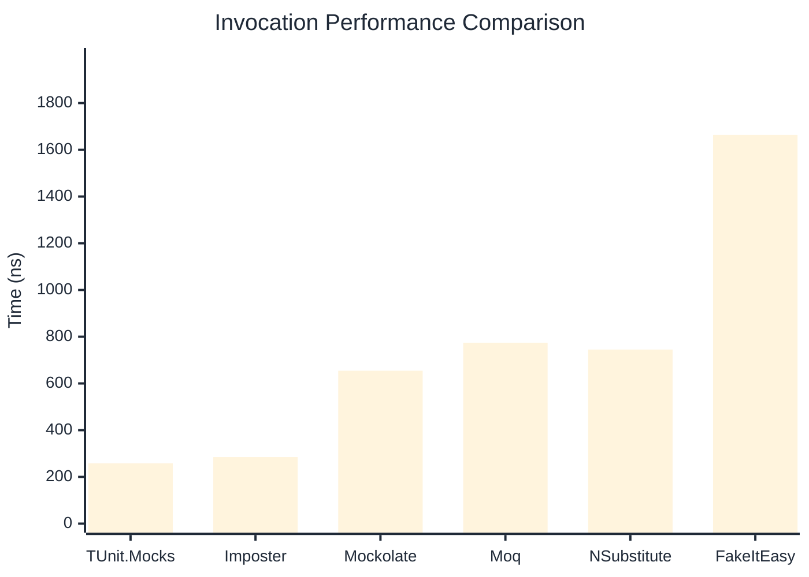

# Invocation Benchmark

:::info Last Updated
This benchmark was automatically generated on **2026-04-13** from the latest CI run.

**Environment:** Ubuntu Latest • .NET SDK 10.0.201
:::

## 📊 Results

Calling methods on mock objects:

| Library | Mean | Error | StdDev | Allocated |
|---------|------|-------|--------|-----------|
| **TUnit.Mocks** | 257.9 ns | 69.64 ns | 3.82 ns | 120 B |
| Imposter | 285.1 ns | 59.64 ns | 3.27 ns | 168 B |
| Mockolate | 654.4 ns | 85.62 ns | 4.69 ns | 640 B |
| Moq | 774.4 ns | 114.27 ns | 6.26 ns | 376 B |
| NSubstitute | 745.1 ns | 103.74 ns | 5.69 ns | 360 B |
| FakeItEasy | 1,663.6 ns | 489.11 ns | 26.81 ns | 944 B |

---

### String

| Library | Mean | Error | StdDev | Allocated |
|---------|------|-------|--------|-----------|
| **TUnit.Mocks** | 158.1 ns | 77.93 ns | 4.27 ns | 88 B |
| Imposter | 294.2 ns | 122.37 ns | 6.71 ns | 168 B |
| Mockolate | 532.6 ns | 28.03 ns | 1.54 ns | 520 B |
| Moq | 525.8 ns | 161.44 ns | 8.85 ns | 296 B |
| NSubstitute | 596.4 ns | 277.37 ns | 15.20 ns | 272 B |
| FakeItEasy | 1,474.5 ns | 97.90 ns | 5.37 ns | 776 B |

---

### 100 calls

| Library | Mean | Error | StdDev | Allocated |
|---------|------|-------|--------|-----------|
| **TUnit.Mocks** | 25,691.5 ns | 8,118.38 ns | 445.00 ns | 11936 B |
| Imposter | 28,142.1 ns | 7,299.08 ns | 400.09 ns | 16800 B |
| Mockolate | 64,509.4 ns | 16,052.25 ns | 879.88 ns | 64000 B |
| Moq | 78,189.3 ns | 33,829.06 ns | 1,854.28 ns | 37600 B |
| NSubstitute | 69,342.2 ns | 9,908.65 ns | 543.13 ns | 30848 B |
| FakeItEasy | 174,935.1 ns | 136,771.22 ns | 7,496.89 ns | 94400 B |

## 🎯 Key Insights

This benchmark compares **TUnit.Mocks** (source-generated) against runtime proxy-based mocking libraries for calling methods on mock objects.

---

:::note Methodology
View the [mock benchmarks overview](/docs/benchmarks/mocks) for methodology details and environment information.
:::

*Last generated: 2026-04-13T03:23:34.678Z*
