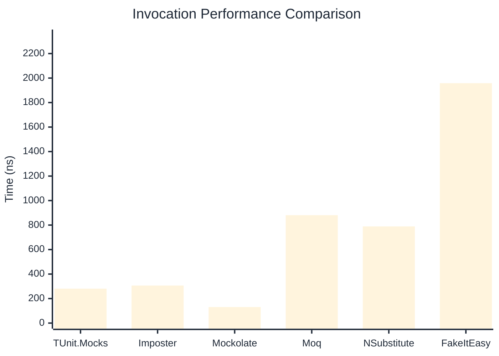

# Invocation Benchmark

> Calling methods on mock objects — comparing **TUnit.Mocks** (source-generated) against runtime proxy-based mocking libraries.

:::info Last Updated
This benchmark was automatically generated on **2026-07-03** from the latest CI run.

**Environment:** Ubuntu Latest • .NET SDK 10.0.301
:::

## 📊 Results

Calling methods on mock objects:

| Library | Mean | Error | StdDev | Allocated |
|---------|------|-------|--------|-----------|
| **TUnit.Mocks** | 280.9 ns | 94.17 ns | 5.16 ns | 128 B |
| Imposter | 306.3 ns | 72.49 ns | 3.97 ns | 168 B |
| Mockolate | 130.9 ns | 66.37 ns | 3.64 ns | 84 B |
| Moq | 880.6 ns | 193.05 ns | 10.58 ns | 376 B |
| NSubstitute | 789.1 ns | 186.89 ns | 10.24 ns | 304 B |
| FakeItEasy | 1,958.3 ns | 745.20 ns | 40.85 ns | 944 B |

---

### String

| Library | Mean | Error | StdDev | Allocated |
|---------|------|-------|--------|-----------|
| **TUnit.Mocks** | 166.5 ns | 78.42 ns | 4.30 ns | 96 B |
| Imposter | 311.9 ns | 57.02 ns | 3.13 ns | 168 B |
| Mockolate | 114.9 ns | 31.02 ns | 1.70 ns | 60 B |
| Moq | 580.7 ns | 96.62 ns | 5.30 ns | 296 B |
| NSubstitute | 674.0 ns | 274.78 ns | 15.06 ns | 272 B |
| FakeItEasy | 1,712.2 ns | 315.83 ns | 17.31 ns | 776 B |

---

### 100 calls

| Library | Mean | Error | StdDev | Allocated |
|---------|------|-------|--------|-----------|
| **TUnit.Mocks** | 28,496.1 ns | 10,831.94 ns | 593.74 ns | 12736 B |
| Imposter | 30,685.8 ns | 23,304.53 ns | 1,277.40 ns | 16800 B |
| Mockolate | 12,529.8 ns | 2,941.75 ns | 161.25 ns | 8400 B |
| Moq | 86,416.3 ns | 18,631.76 ns | 1,021.27 ns | 37600 B |
| NSubstitute | 73,579.7 ns | 16,845.44 ns | 923.36 ns | 30848 B |
| FakeItEasy | 194,238.6 ns | 80,335.00 ns | 4,403.43 ns | 94400 B |

## 🎯 Key Insights

This benchmark compares **TUnit.Mocks** (source-generated) against runtime proxy-based mocking libraries for calling methods on mock objects.

---

:::note Methodology
View the [mock benchmarks overview](/docs/benchmarks/mocks) for methodology details and environment information.
:::

*Last generated: 2026-07-03T04:04:39.541Z*
