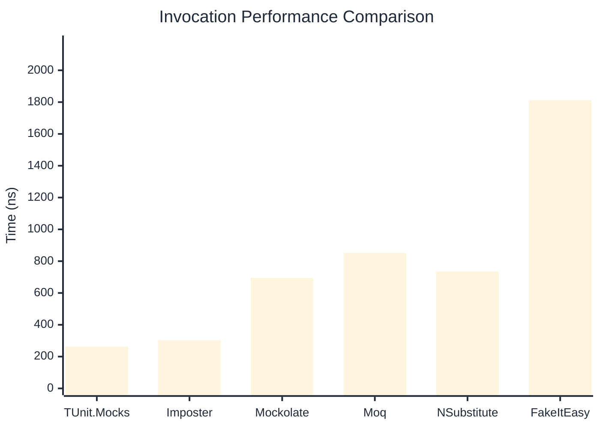

# Invocation Benchmark

:::info Last Updated
This benchmark was automatically generated on **2026-04-16** from the latest CI run.

**Environment:** Ubuntu Latest • .NET SDK 10.0.202
:::

## 📊 Results

Calling methods on mock objects:

| Library | Mean | Error | StdDev | Allocated |
|---------|------|-------|--------|-----------|
| **TUnit.Mocks** | 262.9 ns | 87.03 ns | 4.77 ns | 120 B |
| Imposter | 302.5 ns | 61.38 ns | 3.36 ns | 168 B |
| Mockolate | 694.4 ns | 180.17 ns | 9.88 ns | 640 B |
| Moq | 851.5 ns | 206.80 ns | 11.34 ns | 376 B |
| NSubstitute | 734.4 ns | 148.63 ns | 8.15 ns | 304 B |
| FakeItEasy | 1,812.9 ns | 408.72 ns | 22.40 ns | 944 B |

---

### String

| Library | Mean | Error | StdDev | Allocated |
|---------|------|-------|--------|-----------|
| **TUnit.Mocks** | 157.3 ns | 81.04 ns | 4.44 ns | 88 B |
| Imposter | 300.7 ns | 42.70 ns | 2.34 ns | 168 B |
| Mockolate | 543.7 ns | 188.98 ns | 10.36 ns | 520 B |
| Moq | 562.1 ns | 89.18 ns | 4.89 ns | 296 B |
| NSubstitute | 628.7 ns | 78.20 ns | 4.29 ns | 272 B |
| FakeItEasy | 1,645.3 ns | 253.86 ns | 13.92 ns | 776 B |

---

### 100 calls

| Library | Mean | Error | StdDev | Allocated |
|---------|------|-------|--------|-----------|
| **TUnit.Mocks** | 26,674.2 ns | 15,350.85 ns | 841.43 ns | 11936 B |
| Imposter | 29,524.3 ns | 10,411.38 ns | 570.68 ns | 16800 B |
| Mockolate | 66,514.3 ns | 29,938.23 ns | 1,641.02 ns | 64000 B |
| Moq | 84,478.0 ns | 24,794.97 ns | 1,359.10 ns | 37600 B |
| NSubstitute | 78,702.1 ns | 11,264.77 ns | 617.46 ns | 36448 B |
| FakeItEasy | 190,003.8 ns | 33,840.70 ns | 1,854.92 ns | 94400 B |

## 🎯 Key Insights

This benchmark compares **TUnit.Mocks** (source-generated) against runtime proxy-based mocking libraries for calling methods on mock objects.

---

:::note Methodology
View the [mock benchmarks overview](/docs/benchmarks/mocks) for methodology details and environment information.
:::

*Last generated: 2026-04-16T03:23:00.282Z*
