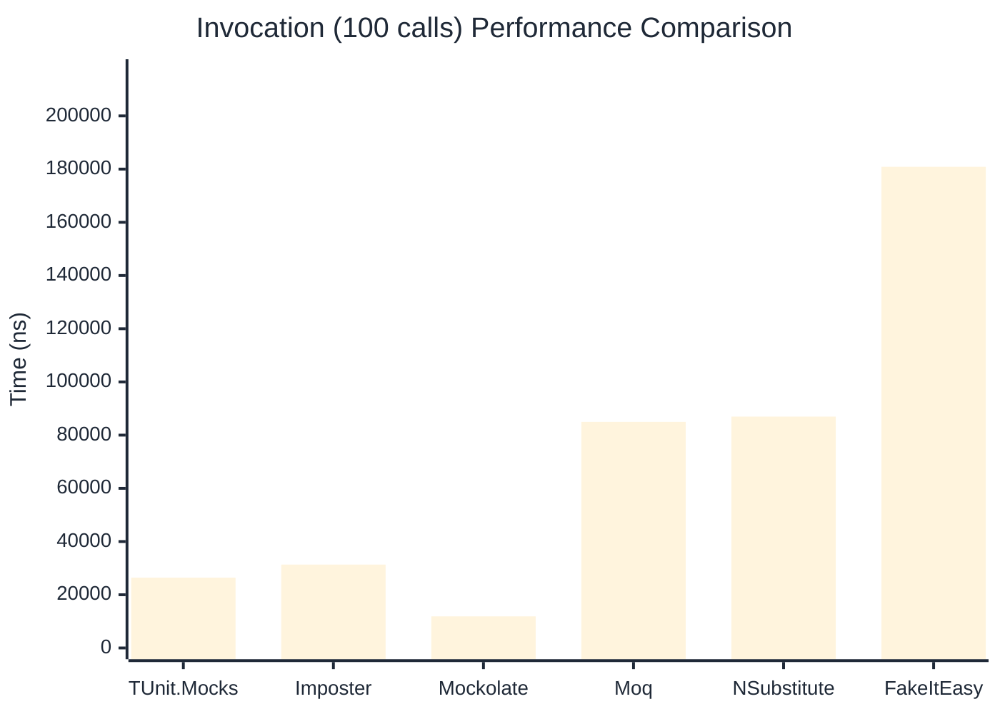

# Invocation Benchmark

:::info Last Updated
This benchmark was automatically generated on **2026-05-05** from the latest CI run.

**Environment:** Ubuntu Latest • .NET SDK 10.0.203
:::

## 📊 Results

Calling methods on mock objects:

| Library | Mean | Error | StdDev | Allocated |
|---------|------|-------|--------|-----------|
| **TUnit.Mocks** | 254.6 ns | 62.89 ns | 3.45 ns | 120 B |
| Imposter | 315.1 ns | 114.14 ns | 6.26 ns | 168 B |
| Mockolate | 116.6 ns | 38.32 ns | 2.10 ns | 84 B |
| Moq | 896.3 ns | 372.60 ns | 20.42 ns | 376 B |
| NSubstitute | 809.4 ns | 676.82 ns | 37.10 ns | 304 B |
| FakeItEasy | 1,784.0 ns | 559.06 ns | 30.64 ns | 944 B |

---

### String

| Library | Mean | Error | StdDev | Allocated |
|---------|------|-------|--------|-----------|
| **TUnit.Mocks** | 160.5 ns | 62.51 ns | 3.43 ns | 88 B |
| Imposter | 320.6 ns | 145.25 ns | 7.96 ns | 168 B |
| Mockolate | 103.1 ns | 52.66 ns | 2.89 ns | 60 B |
| Moq | 599.0 ns | 816.95 ns | 44.78 ns | 296 B |
| NSubstitute | 634.5 ns | 331.35 ns | 18.16 ns | 272 B |
| FakeItEasy | 1,653.4 ns | 401.30 ns | 22.00 ns | 776 B |

---

### 100 calls

| Library | Mean | Error | StdDev | Allocated |
|---------|------|-------|--------|-----------|
| **TUnit.Mocks** | 26,421.0 ns | 16,107.33 ns | 882.90 ns | 11936 B |
| Imposter | 31,338.6 ns | 23,761.32 ns | 1,302.44 ns | 16800 B |
| Mockolate | 11,872.1 ns | 1,713.65 ns | 93.93 ns | 8400 B |
| Moq | 84,982.1 ns | 28,250.65 ns | 1,548.51 ns | 37600 B |
| NSubstitute | 86,959.4 ns | 56,683.89 ns | 3,107.04 ns | 36448 B |
| FakeItEasy | 180,855.7 ns | 51,758.53 ns | 2,837.06 ns | 94400 B |

## 🎯 Key Insights

This benchmark compares **TUnit.Mocks** (source-generated) against runtime proxy-based mocking libraries for calling methods on mock objects.

---

:::note Methodology
View the [mock benchmarks overview](/docs/benchmarks/mocks) for methodology details and environment information.
:::

*Last generated: 2026-05-05T03:26:21.616Z*
