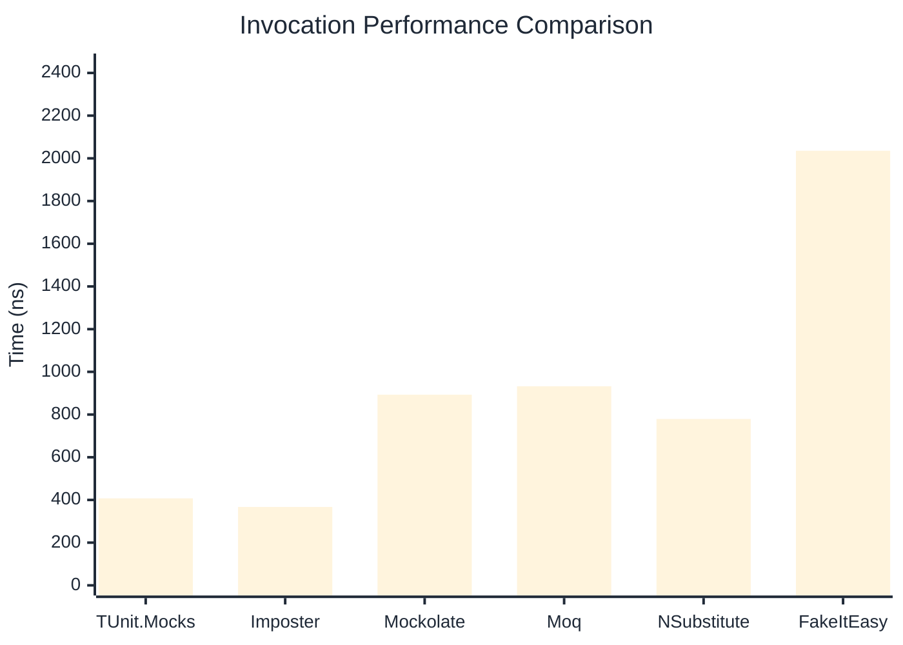

# Invocation Benchmark

:::info Last Updated
This benchmark was automatically generated on **2026-04-03** from the latest CI run.

**Environment:** Ubuntu Latest • .NET SDK 10.0.201
:::

## 📊 Results

Calling methods on mock objects:

| Library | Mean | Error | StdDev | Allocated |
|---------|------|-------|--------|-----------|
| **TUnit.Mocks** | 407.4 ns | 518.5 ns | 28.42 ns | 176 B |
| Imposter | 367.2 ns | 159.0 ns | 8.72 ns | 168 B |
| Mockolate | 893.1 ns | 3,517.4 ns | 192.80 ns | 640 B |
| Moq | 932.6 ns | 1,573.8 ns | 86.27 ns | 376 B |
| NSubstitute | 779.3 ns | 305.0 ns | 16.72 ns | 304 B |
| FakeItEasy | 2,035.5 ns | 3,960.5 ns | 217.09 ns | 944 B |

---

### String

| Library | Mean | Error | StdDev | Allocated |
|---------|------|-------|--------|-----------|
| **TUnit.Mocks** | 254.9 ns | 519.8 ns | 28.49 ns | 112 B |
| Imposter | 358.9 ns | 494.4 ns | 27.10 ns | 168 B |
| Mockolate | 717.0 ns | 2,234.2 ns | 122.47 ns | 520 B |
| Moq | 671.4 ns | 956.6 ns | 52.43 ns | 296 B |
| NSubstitute | 668.1 ns | 267.3 ns | 14.65 ns | 272 B |
| FakeItEasy | 1,814.5 ns | 2,852.2 ns | 156.34 ns | 776 B |

---

### 100 calls

| Library | Mean | Error | StdDev | Allocated |
|---------|------|-------|--------|-----------|
| **TUnit.Mocks** | 45,205.9 ns | 64,310.9 ns | 3,525.10 ns | 18048 B |
| Imposter | 35,226.0 ns | 37,029.1 ns | 2,029.69 ns | 16800 B |
| Mockolate | 86,306.0 ns | 203,555.6 ns | 11,157.57 ns | 64000 B |
| Moq | 90,700.6 ns | 78,208.8 ns | 4,286.89 ns | 37600 B |
| NSubstitute | 80,693.8 ns | 69,554.7 ns | 3,812.53 ns | 30848 B |
| FakeItEasy | 212,593.6 ns | 204,886.3 ns | 11,230.51 ns | 94400 B |

## 🎯 Key Insights

This benchmark compares **TUnit.Mocks** (source-generated) against runtime proxy-based mocking libraries for calling methods on mock objects.

---

:::note Methodology
View the [mock benchmarks overview](/docs/benchmarks/mocks) for methodology details and environment information.
:::

*Last generated: 2026-04-03T03:23:45.860Z*
