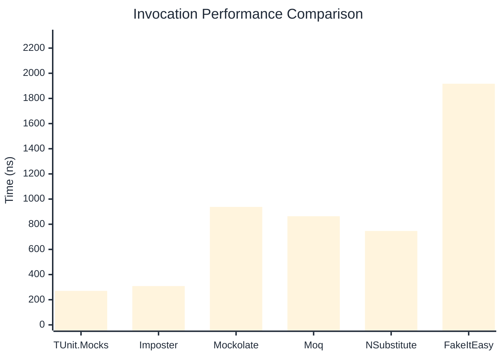

# Invocation Benchmark

:::info Last Updated
This benchmark was automatically generated on **2026-04-19** from the latest CI run.

**Environment:** Ubuntu Latest • .NET SDK 10.0.202
:::

## 📊 Results

Calling methods on mock objects:

| Library | Mean | Error | StdDev | Allocated |
|---------|------|-------|--------|-----------|
| **TUnit.Mocks** | 270.4 ns | 92.47 ns | 5.07 ns | 120 B |
| Imposter | 308.5 ns | 92.21 ns | 5.05 ns | 168 B |
| Mockolate | 937.8 ns | 346.32 ns | 18.98 ns | 640 B |
| Moq | 863.8 ns | 394.29 ns | 21.61 ns | 376 B |
| NSubstitute | 746.5 ns | 139.14 ns | 7.63 ns | 304 B |
| FakeItEasy | 1,917.0 ns | 44.18 ns | 2.42 ns | 944 B |

---

### String

| Library | Mean | Error | StdDev | Allocated |
|---------|------|-------|--------|-----------|
| **TUnit.Mocks** | 163.9 ns | 110.25 ns | 6.04 ns | 88 B |
| Imposter | 309.7 ns | 99.20 ns | 5.44 ns | 168 B |
| Mockolate | 648.5 ns | 546.33 ns | 29.95 ns | 520 B |
| Moq | 588.2 ns | 188.99 ns | 10.36 ns | 296 B |
| NSubstitute | 664.4 ns | 245.65 ns | 13.46 ns | 272 B |
| FakeItEasy | 1,698.6 ns | 323.03 ns | 17.71 ns | 776 B |

---

### 100 calls

| Library | Mean | Error | StdDev | Allocated |
|---------|------|-------|--------|-----------|
| **TUnit.Mocks** | 27,086.2 ns | 16,601.94 ns | 910.01 ns | 11936 B |
| Imposter | 30,284.6 ns | 7,895.03 ns | 432.75 ns | 16800 B |
| Mockolate | 81,795.1 ns | 119,964.61 ns | 6,575.66 ns | 64000 B |
| Moq | 88,144.6 ns | 16,720.64 ns | 916.51 ns | 37600 B |
| NSubstitute | 74,097.0 ns | 16,067.85 ns | 880.73 ns | 30848 B |
| FakeItEasy | 198,368.9 ns | 53,259.89 ns | 2,919.35 ns | 94400 B |

## 🎯 Key Insights

This benchmark compares **TUnit.Mocks** (source-generated) against runtime proxy-based mocking libraries for calling methods on mock objects.

---

:::note Methodology
View the [mock benchmarks overview](/docs/benchmarks/mocks) for methodology details and environment information.
:::

*Last generated: 2026-04-19T03:31:38.770Z*
