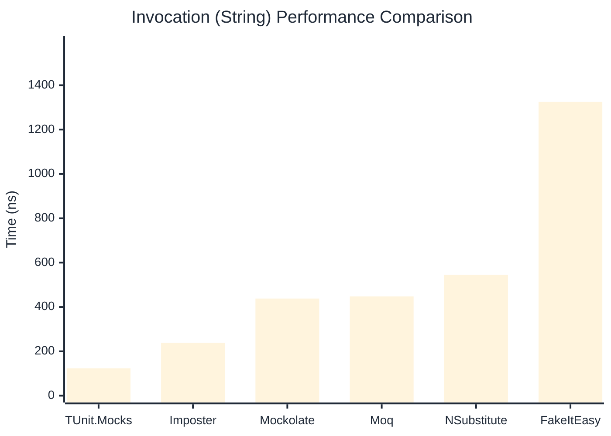

# Invocation Benchmark

:::info Last Updated
This benchmark was automatically generated on **2026-04-25** from the latest CI run.

**Environment:** Ubuntu Latest • .NET SDK 10.0.203
:::

## 📊 Results

Calling methods on mock objects:

| Library | Mean | Error | StdDev | Allocated |
|---------|------|-------|--------|-----------|
| **TUnit.Mocks** | 203.0 ns | 115.40 ns | 6.33 ns | 120 B |
| Imposter | 243.4 ns | 106.40 ns | 5.83 ns | 168 B |
| Mockolate | 546.3 ns | 73.08 ns | 4.01 ns | 640 B |
| Moq | 686.5 ns | 139.43 ns | 7.64 ns | 376 B |
| NSubstitute | 590.7 ns | 109.15 ns | 5.98 ns | 304 B |
| FakeItEasy | 1,479.1 ns | 352.04 ns | 19.30 ns | 944 B |

---

### String

| Library | Mean | Error | StdDev | Allocated |
|---------|------|-------|--------|-----------|
| **TUnit.Mocks** | 123.4 ns | 55.57 ns | 3.05 ns | 88 B |
| Imposter | 238.9 ns | 42.73 ns | 2.34 ns | 168 B |
| Mockolate | 438.1 ns | 82.45 ns | 4.52 ns | 520 B |
| Moq | 447.8 ns | 246.08 ns | 13.49 ns | 296 B |
| NSubstitute | 545.2 ns | 276.42 ns | 15.15 ns | 328 B |
| FakeItEasy | 1,324.7 ns | 223.26 ns | 12.24 ns | 776 B |

---

### 100 calls

| Library | Mean | Error | StdDev | Allocated |
|---------|------|-------|--------|-----------|
| **TUnit.Mocks** | 20,654.3 ns | 15,400.38 ns | 844.15 ns | 11936 B |
| Imposter | 23,684.3 ns | 1,787.97 ns | 98.00 ns | 16800 B |
| Mockolate | 55,071.4 ns | 14,148.40 ns | 775.52 ns | 64000 B |
| Moq | 64,592.3 ns | 15,574.07 ns | 853.67 ns | 37600 B |
| NSubstitute | 61,095.9 ns | 6,661.83 ns | 365.16 ns | 30848 B |
| FakeItEasy | 151,051.9 ns | 54,366.85 ns | 2,980.03 ns | 94400 B |

## 🎯 Key Insights

This benchmark compares **TUnit.Mocks** (source-generated) against runtime proxy-based mocking libraries for calling methods on mock objects.

---

:::note Methodology
View the [mock benchmarks overview](/docs/benchmarks/mocks) for methodology details and environment information.
:::

*Last generated: 2026-04-25T03:21:02.718Z*
