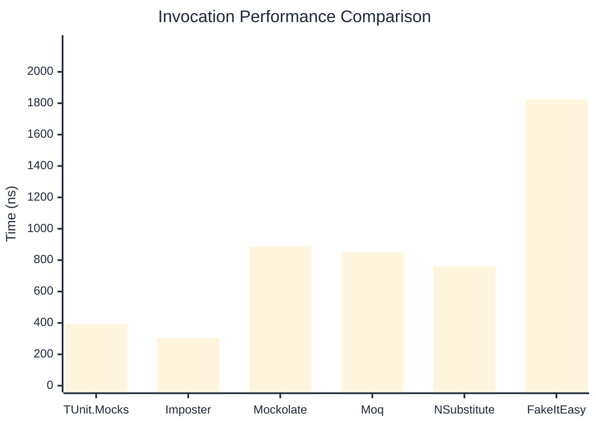
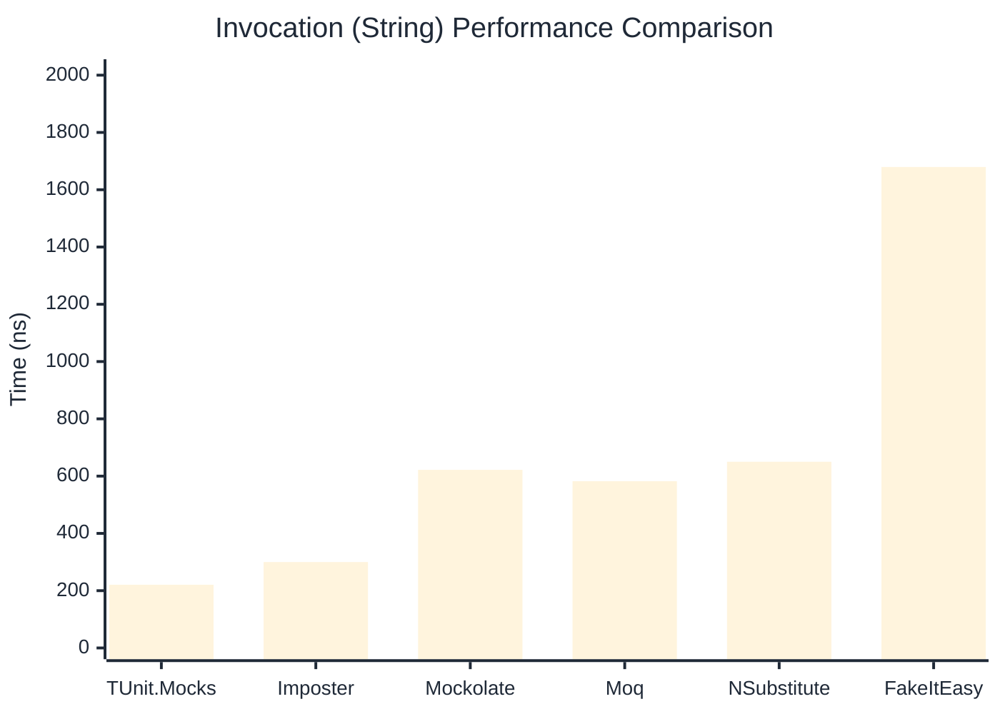

# Invocation Benchmark

:::info Last Updated
This benchmark was automatically generated on **2026-03-30** from the latest CI run.

**Environment:** Ubuntu Latest • .NET SDK 10.0.201
:::

## 📊 Results

Calling methods on mock objects:

| Library | Mean | Error | StdDev | Allocated |
|---------|------|-------|--------|-----------|
| **TUnit.Mocks** | 392.6 ns | 59.58 ns | 3.27 ns | 192 B |
| Imposter | 304.7 ns | 56.39 ns | 3.09 ns | 168 B |
| Mockolate | 885.6 ns | 732.76 ns | 40.16 ns | 688 B |
| Moq | 849.4 ns | 174.97 ns | 9.59 ns | 376 B |
| NSubstitute | 761.2 ns | 121.49 ns | 6.66 ns | 304 B |
| FakeItEasy | 1,824.7 ns | 441.83 ns | 24.22 ns | 944 B |

---

### String

| Library | Mean | Error | StdDev | Allocated |
|---------|------|-------|--------|-----------|
| **TUnit.Mocks** | 220.8 ns | 41.29 ns | 2.26 ns | 128 B |
| Imposter | 299.9 ns | 71.00 ns | 3.89 ns | 168 B |
| Mockolate | 621.9 ns | 155.47 ns | 8.52 ns | 568 B |
| Moq | 582.4 ns | 114.72 ns | 6.29 ns | 296 B |
| NSubstitute | 650.2 ns | 369.49 ns | 20.25 ns | 272 B |
| FakeItEasy | 1,679.4 ns | 252.09 ns | 13.82 ns | 776 B |

---

### 100 calls

| Library | Mean | Error | StdDev | Allocated |
|---------|------|-------|--------|-----------|
| **TUnit.Mocks** | 38,521.0 ns | 6,997.75 ns | 383.57 ns | 20096 B |
| Imposter | 29,722.5 ns | 13,873.17 ns | 760.44 ns | 16800 B |
| Mockolate | 83,410.5 ns | 115,205.89 ns | 6,314.82 ns | 68800 B |
| Moq | 85,740.5 ns | 26,144.64 ns | 1,433.08 ns | 37600 B |
| NSubstitute | 83,542.7 ns | 33,744.77 ns | 1,849.66 ns | 36448 B |
| FakeItEasy | 193,514.9 ns | 91,970.66 ns | 5,041.22 ns | 94400 B |

## 🎯 Key Insights

This benchmark compares **TUnit.Mocks** (source-generated) against runtime proxy-based mocking libraries for calling methods on mock objects.

---

:::note Methodology
View the [mock benchmarks overview](/docs/benchmarks/mocks) for methodology details and environment information.
:::

*Last generated: 2026-03-30T01:06:26.815Z*
