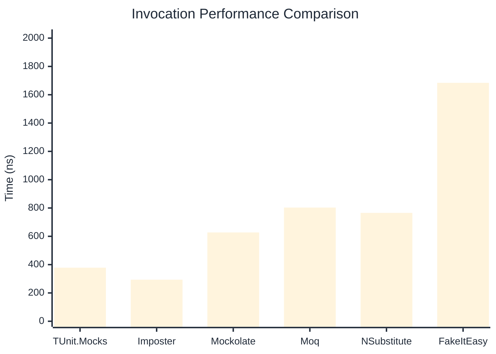
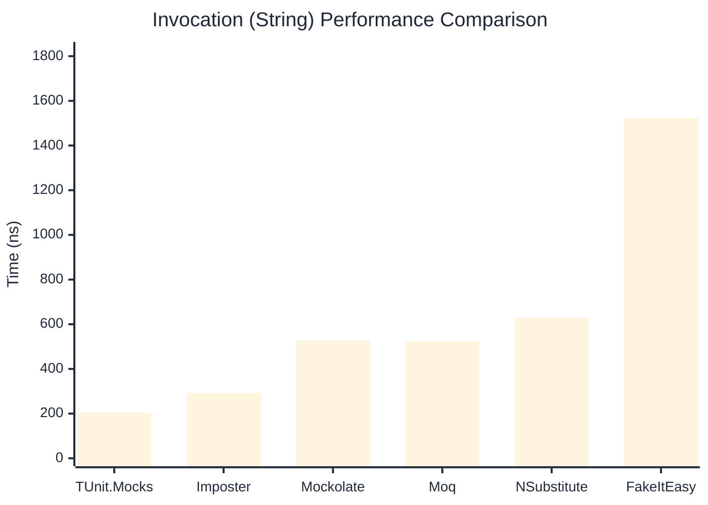
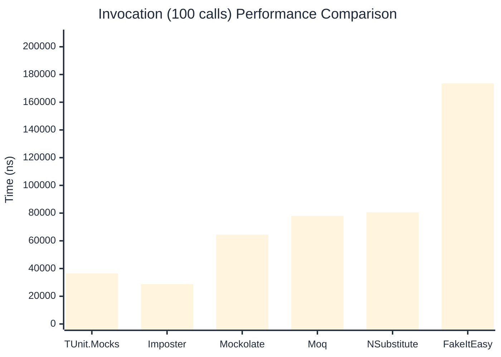

# Invocation Benchmark

:::info Last Updated
This benchmark was automatically generated on **2026-03-30** from the latest CI run.

**Environment:** Ubuntu Latest • .NET SDK 10.0.201
:::

## 📊 Results

Calling methods on mock objects:

| Library | Mean | Error | StdDev | Allocated |
|---------|------|-------|--------|-----------|
| **TUnit.Mocks** | 378.3 ns | 148.70 ns | 8.15 ns | 192 B |
| Imposter | 293.6 ns | 22.11 ns | 1.21 ns | 168 B |
| Mockolate | 627.4 ns | 68.88 ns | 3.78 ns | 640 B |
| Moq | 803.1 ns | 22.67 ns | 1.24 ns | 376 B |
| NSubstitute | 765.5 ns | 54.01 ns | 2.96 ns | 360 B |
| FakeItEasy | 1,684.3 ns | 59.92 ns | 3.28 ns | 944 B |

---

### String

| Library | Mean | Error | StdDev | Allocated |
|---------|------|-------|--------|-----------|
| **TUnit.Mocks** | 203.8 ns | 25.92 ns | 1.42 ns | 128 B |
| Imposter | 291.8 ns | 90.39 ns | 4.95 ns | 168 B |
| Mockolate | 526.6 ns | 66.93 ns | 3.67 ns | 520 B |
| Moq | 523.3 ns | 223.75 ns | 12.26 ns | 296 B |
| NSubstitute | 628.4 ns | 202.93 ns | 11.12 ns | 272 B |
| FakeItEasy | 1,522.7 ns | 26.06 ns | 1.43 ns | 776 B |

---

### 100 calls

| Library | Mean | Error | StdDev | Allocated |
|---------|------|-------|--------|-----------|
| **TUnit.Mocks** | 36,443.1 ns | 8,227.20 ns | 450.96 ns | 20096 B |
| Imposter | 28,771.9 ns | 10,101.08 ns | 553.67 ns | 16800 B |
| Mockolate | 64,463.7 ns | 25,051.83 ns | 1,373.18 ns | 64000 B |
| Moq | 78,017.1 ns | 19,146.92 ns | 1,049.51 ns | 37600 B |
| NSubstitute | 80,578.8 ns | 63,529.21 ns | 3,482.25 ns | 36448 B |
| FakeItEasy | 173,574.7 ns | 47,306.89 ns | 2,593.05 ns | 94400 B |

## 🎯 Key Insights

This benchmark compares **TUnit.Mocks** (source-generated) against runtime proxy-based mocking libraries for calling methods on mock objects.

---

:::note Methodology
View the [mock benchmarks overview](/docs/benchmarks/mocks) for methodology details and environment information.
:::

*Last generated: 2026-03-30T21:56:59.028Z*
