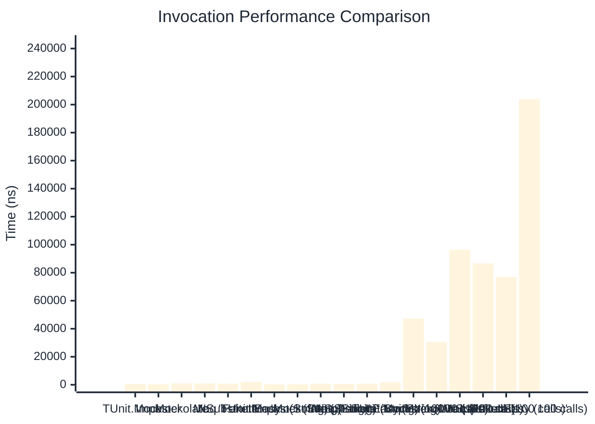

# Invocation Benchmark

:::info Last Updated
This benchmark was automatically generated on **2026-03-29** from the latest CI run.

**Environment:** Ubuntu Latest • .NET SDK 10.0.201
:::

## 📊 Results

Calling methods on mock objects:

| Method | Mean | Error | StdDev | Allocated |
|--------|------|-------|--------|-----------|
| **TUnit.Mocks** | 500.1 ns | 102.68 ns | 5.63 ns | 224 B |
| Imposter | 311.8 ns | 58.16 ns | 3.19 ns | 168 B |
| Mockolate | 941.5 ns | 239.36 ns | 13.12 ns | 688 B |
| Moq | 890.1 ns | 93.81 ns | 5.14 ns | 376 B |
| NSubstitute | 780.0 ns | 104.66 ns | 5.74 ns | 304 B |
| FakeItEasy | 1,953.4 ns | 252.30 ns | 13.83 ns | 944 B |
| **'TUnit.Mocks (String)'** | 337.0 ns | 102.32 ns | 5.61 ns | 160 B |
| 'Imposter (String)' | 316.2 ns | 72.29 ns | 3.96 ns | 168 B |
| 'Mockolate (String)' | 719.0 ns | 443.85 ns | 24.33 ns | 568 B |
| 'Moq (String)' | 591.0 ns | 103.11 ns | 5.65 ns | 296 B |
| 'NSubstitute (String)' | 696.1 ns | 75.84 ns | 4.16 ns | 272 B |
| 'FakeItEasy (String)' | 1,722.0 ns | 132.02 ns | 7.24 ns | 776 B |
| **'TUnit.Mocks (100 calls)'** | 47,241.5 ns | 15,481.67 ns | 848.60 ns | 23296 B |
| 'Imposter (100 calls)' | 30,554.5 ns | 7,620.94 ns | 417.73 ns | 16800 B |
| 'Mockolate (100 calls)' | 96,384.4 ns | 35,907.44 ns | 1,968.21 ns | 68800 B |
| 'Moq (100 calls)' | 86,619.9 ns | 32,860.05 ns | 1,801.17 ns | 37600 B |
| 'NSubstitute (100 calls)' | 76,936.4 ns | 22,168.67 ns | 1,215.14 ns | 30848 B |
| 'FakeItEasy (100 calls)' | 203,940.4 ns | 58,422.17 ns | 3,202.32 ns | 94400 B |

## 📈 Visual Comparison

## 🎯 Key Insights

This benchmark compares **TUnit.Mocks** (source-generated) against runtime proxy-based mocking libraries for calling methods on mock objects.

---

:::note Methodology
View the [mock benchmarks overview](/docs/benchmarks/mocks) for methodology details and environment information.
:::

*Last generated: 2026-03-29T21:50:09.524Z*
