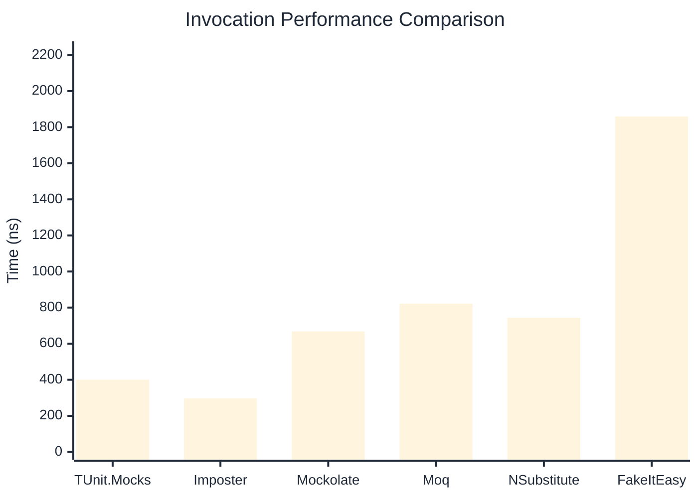
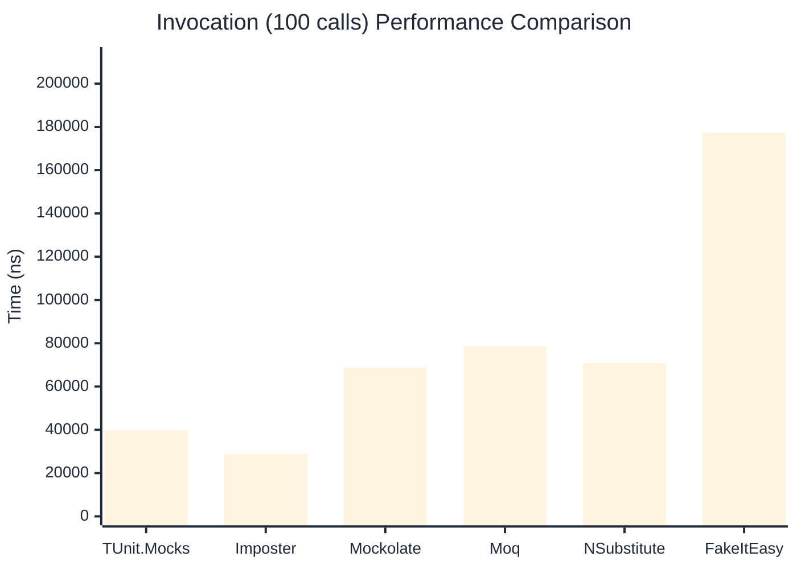

# Invocation Benchmark

:::info Last Updated
This benchmark was automatically generated on **2026-03-31** from the latest CI run.

**Environment:** Ubuntu Latest • .NET SDK 10.0.201
:::

## 📊 Results

Calling methods on mock objects:

| Library | Mean | Error | StdDev | Allocated |
|---------|------|-------|--------|-----------|
| **TUnit.Mocks** | 400.3 ns | 29.01 ns | 1.59 ns | 176 B |
| Imposter | 296.2 ns | 77.32 ns | 4.24 ns | 168 B |
| Mockolate | 667.8 ns | 179.77 ns | 9.85 ns | 640 B |
| Moq | 821.8 ns | 317.86 ns | 17.42 ns | 376 B |
| NSubstitute | 743.4 ns | 314.11 ns | 17.22 ns | 304 B |
| FakeItEasy | 1,859.5 ns | 692.58 ns | 37.96 ns | 944 B |

---

### String

| Library | Mean | Error | StdDev | Allocated |
|---------|------|-------|--------|-----------|
| **TUnit.Mocks** | 218.2 ns | 145.69 ns | 7.99 ns | 112 B |
| Imposter | 300.2 ns | 42.47 ns | 2.33 ns | 168 B |
| Mockolate | 581.7 ns | 397.05 ns | 21.76 ns | 520 B |
| Moq | 544.3 ns | 436.74 ns | 23.94 ns | 296 B |
| NSubstitute | 617.8 ns | 131.08 ns | 7.19 ns | 272 B |
| FakeItEasy | 1,568.9 ns | 366.02 ns | 20.06 ns | 776 B |

---

### 100 calls

| Library | Mean | Error | StdDev | Allocated |
|---------|------|-------|--------|-----------|
| **TUnit.Mocks** | 39,730.8 ns | 33,472.02 ns | 1,834.71 ns | 18048 B |
| Imposter | 28,857.9 ns | 5,403.68 ns | 296.19 ns | 16800 B |
| Mockolate | 68,815.9 ns | 17,088.85 ns | 936.70 ns | 64000 B |
| Moq | 78,758.3 ns | 10,955.34 ns | 600.50 ns | 37600 B |
| NSubstitute | 70,921.5 ns | 18,135.11 ns | 994.05 ns | 30848 B |
| FakeItEasy | 177,200.5 ns | 122,363.56 ns | 6,707.16 ns | 94400 B |

## 🎯 Key Insights

This benchmark compares **TUnit.Mocks** (source-generated) against runtime proxy-based mocking libraries for calling methods on mock objects.

---

:::note Methodology
View the [mock benchmarks overview](/docs/benchmarks/mocks) for methodology details and environment information.
:::

*Last generated: 2026-03-31T03:22:46.140Z*
