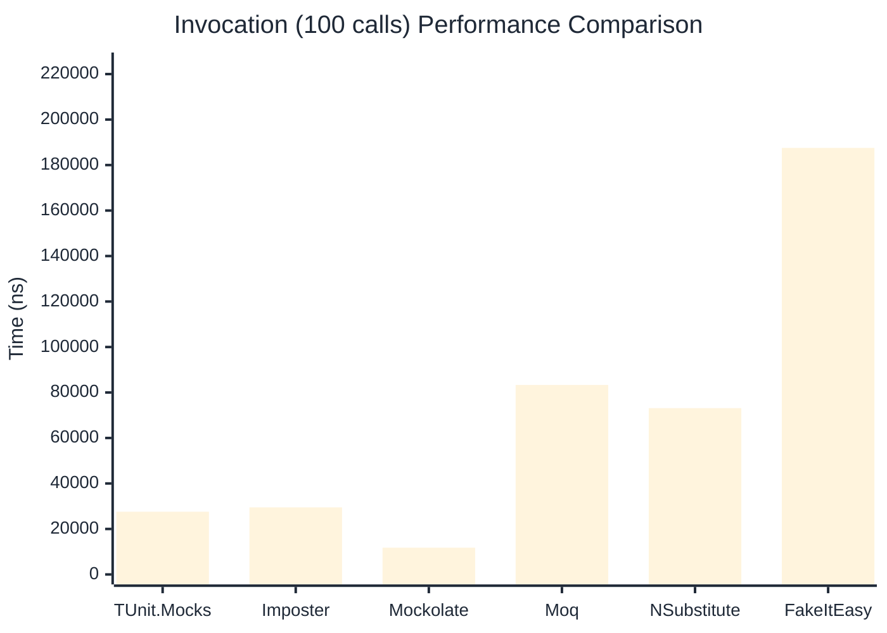

# Invocation Benchmark

> Calling methods on mock objects — comparing **TUnit.Mocks** (source-generated) against runtime proxy-based mocking libraries.

:::info Last Updated
This benchmark was automatically generated on **2026-06-19** from the latest CI run.

**Environment:** Ubuntu Latest • .NET SDK 10.0.301
:::

## 📊 Results

Calling methods on mock objects:

| Library | Mean | Error | StdDev | Allocated |
|---------|------|-------|--------|-----------|
| **TUnit.Mocks** | 274.8 ns | 88.68 ns | 4.86 ns | 128 B |
| Imposter | 299.9 ns | 66.81 ns | 3.66 ns | 168 B |
| Mockolate | 124.0 ns | 42.11 ns | 2.31 ns | 84 B |
| Moq | 848.4 ns | 162.83 ns | 8.93 ns | 376 B |
| NSubstitute | 738.4 ns | 103.83 ns | 5.69 ns | 304 B |
| FakeItEasy | 1,827.2 ns | 45.03 ns | 2.47 ns | 944 B |

---

### String

| Library | Mean | Error | StdDev | Allocated |
|---------|------|-------|--------|-----------|
| **TUnit.Mocks** | 166.7 ns | 57.05 ns | 3.13 ns | 96 B |
| Imposter | 297.9 ns | 54.27 ns | 2.97 ns | 168 B |
| Mockolate | 105.1 ns | 73.09 ns | 4.01 ns | 60 B |
| Moq | 562.1 ns | 157.00 ns | 8.61 ns | 296 B |
| NSubstitute | 628.4 ns | 92.25 ns | 5.06 ns | 272 B |
| FakeItEasy | 1,609.9 ns | 350.39 ns | 19.21 ns | 776 B |

---

### 100 calls

| Library | Mean | Error | StdDev | Allocated |
|---------|------|-------|--------|-----------|
| **TUnit.Mocks** | 27,582.9 ns | 16,334.68 ns | 895.36 ns | 12736 B |
| Imposter | 29,495.4 ns | 9,482.65 ns | 519.78 ns | 16800 B |
| Mockolate | 11,756.6 ns | 3,847.27 ns | 210.88 ns | 8400 B |
| Moq | 83,319.3 ns | 22,111.43 ns | 1,212.00 ns | 37600 B |
| NSubstitute | 73,136.5 ns | 9,854.58 ns | 540.16 ns | 30848 B |
| FakeItEasy | 187,548.1 ns | 30,365.87 ns | 1,664.46 ns | 94400 B |

## 🎯 Key Insights

This benchmark compares **TUnit.Mocks** (source-generated) against runtime proxy-based mocking libraries for calling methods on mock objects.

---

:::note Methodology
View the [mock benchmarks overview](/docs/benchmarks/mocks) for methodology details and environment information.
:::

*Last generated: 2026-06-19T03:29:43.427Z*
