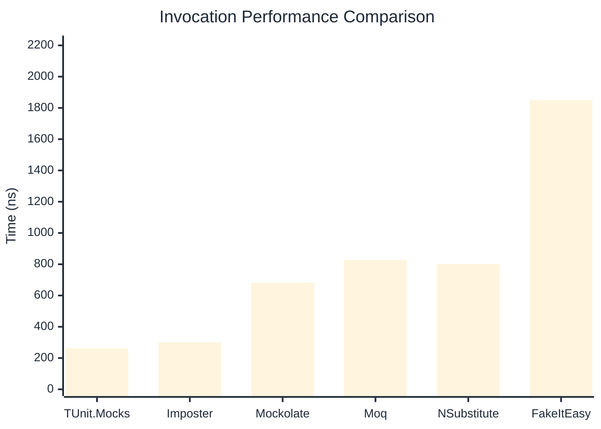
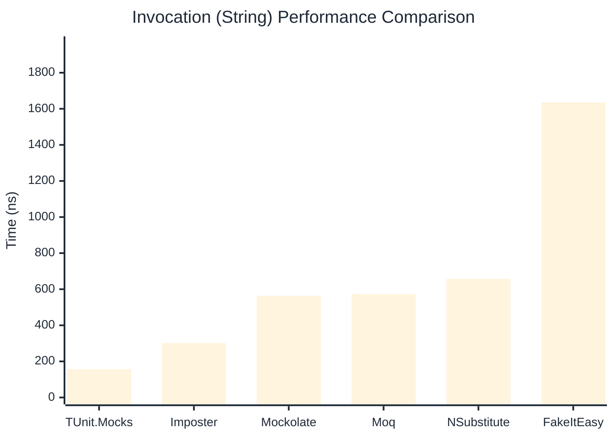
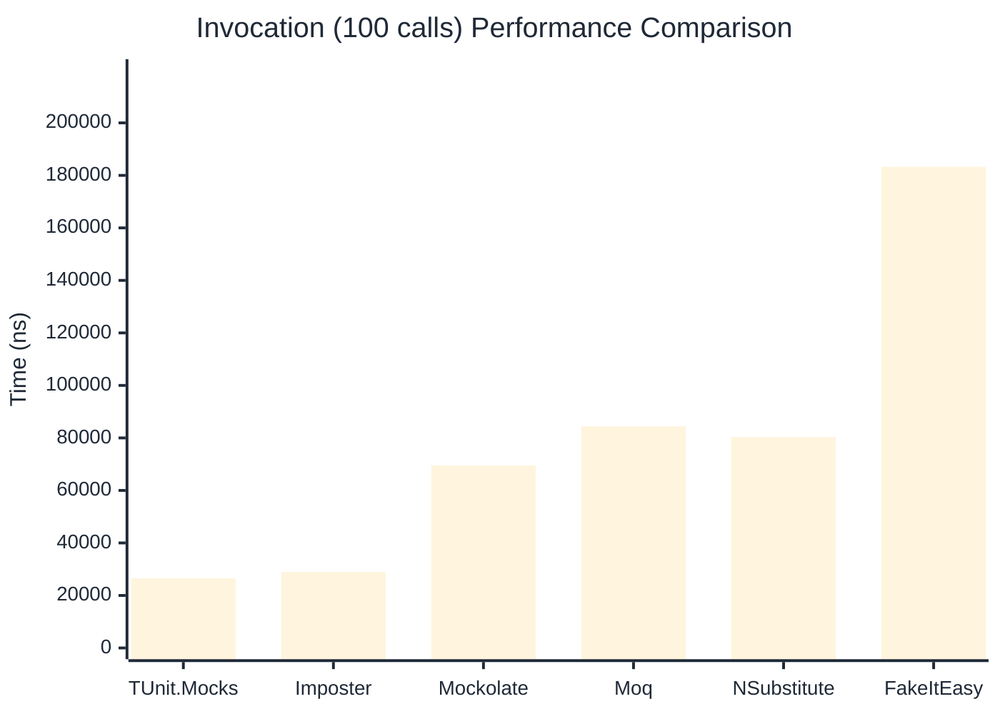

# Invocation Benchmark

:::info Last Updated
This benchmark was automatically generated on **2026-04-22** from the latest CI run.

**Environment:** Ubuntu Latest • .NET SDK 10.0.203
:::

## 📊 Results

Calling methods on mock objects:

| Library | Mean | Error | StdDev | Allocated |
|---------|------|-------|--------|-----------|
| **TUnit.Mocks** | 262.2 ns | 81.13 ns | 4.45 ns | 120 B |
| Imposter | 300.4 ns | 55.27 ns | 3.03 ns | 168 B |
| Mockolate | 681.7 ns | 444.03 ns | 24.34 ns | 640 B |
| Moq | 828.4 ns | 238.23 ns | 13.06 ns | 376 B |
| NSubstitute | 801.8 ns | 151.15 ns | 8.28 ns | 360 B |
| FakeItEasy | 1,849.1 ns | 564.26 ns | 30.93 ns | 944 B |

---

### String

| Library | Mean | Error | StdDev | Allocated |
|---------|------|-------|--------|-----------|
| **TUnit.Mocks** | 157.3 ns | 73.30 ns | 4.02 ns | 88 B |
| Imposter | 302.0 ns | 107.83 ns | 5.91 ns | 168 B |
| Mockolate | 563.5 ns | 239.12 ns | 13.11 ns | 520 B |
| Moq | 573.0 ns | 118.13 ns | 6.47 ns | 296 B |
| NSubstitute | 657.6 ns | 150.92 ns | 8.27 ns | 328 B |
| FakeItEasy | 1,635.1 ns | 126.93 ns | 6.96 ns | 776 B |

---

### 100 calls

| Library | Mean | Error | StdDev | Allocated |
|---------|------|-------|--------|-----------|
| **TUnit.Mocks** | 26,485.8 ns | 11,929.13 ns | 653.88 ns | 11936 B |
| Imposter | 28,986.1 ns | 5,499.65 ns | 301.45 ns | 16800 B |
| Mockolate | 69,518.2 ns | 47,128.14 ns | 2,583.25 ns | 64000 B |
| Moq | 84,395.4 ns | 26,327.06 ns | 1,443.08 ns | 37600 B |
| NSubstitute | 80,340.1 ns | 24,396.78 ns | 1,337.27 ns | 36448 B |
| FakeItEasy | 183,263.1 ns | 49,532.49 ns | 2,715.04 ns | 94400 B |

## 🎯 Key Insights

This benchmark compares **TUnit.Mocks** (source-generated) against runtime proxy-based mocking libraries for calling methods on mock objects.

---

:::note Methodology
View the [mock benchmarks overview](/docs/benchmarks/mocks) for methodology details and environment information.
:::

*Last generated: 2026-04-22T03:22:46.937Z*
