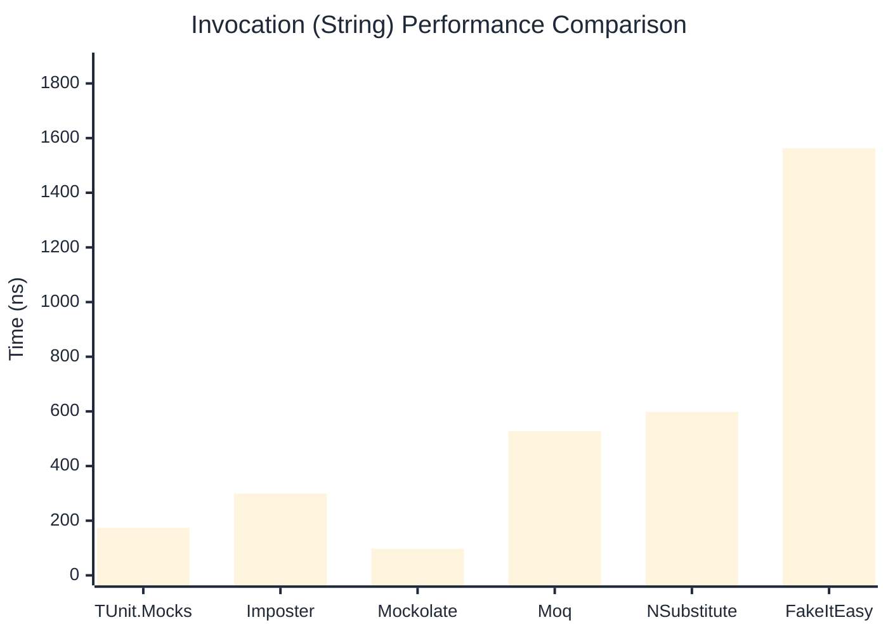

# Invocation Benchmark

> Calling methods on mock objects — comparing **TUnit.Mocks** (source-generated) against runtime proxy-based mocking libraries.

:::info Last Updated
This benchmark was automatically generated on **2026-06-06** from the latest CI run.

**Environment:** Ubuntu Latest • .NET SDK 10.0.300
:::

## 📊 Results

Calling methods on mock objects:

| Library | Mean | Error | StdDev | Allocated |
|---------|------|-------|--------|-----------|
| **TUnit.Mocks** | 272.29 ns | 55.01 ns | 3.015 ns | 128 B |
| Imposter | 299.77 ns | 103.77 ns | 5.688 ns | 168 B |
| Mockolate | 106.55 ns | 16.62 ns | 0.911 ns | 84 B |
| Moq | 786.75 ns | 182.10 ns | 9.981 ns | 376 B |
| NSubstitute | 725.77 ns | 355.36 ns | 19.479 ns | 304 B |
| FakeItEasy | 1,698.02 ns | 167.10 ns | 9.159 ns | 944 B |

---

### String

| Library | Mean | Error | StdDev | Allocated |
|---------|------|-------|--------|-----------|
| **TUnit.Mocks** | 173.79 ns | 72.67 ns | 3.983 ns | 96 B |
| Imposter | 299.15 ns | 78.98 ns | 4.329 ns | 168 B |
| Mockolate | 97.21 ns | 27.59 ns | 1.513 ns | 60 B |
| Moq | 528.09 ns | 96.26 ns | 5.276 ns | 296 B |
| NSubstitute | 598.30 ns | 245.59 ns | 13.462 ns | 272 B |
| FakeItEasy | 1,562.57 ns | 189.72 ns | 10.399 ns | 776 B |

---

### 100 calls

| Library | Mean | Error | StdDev | Allocated |
|---------|------|-------|--------|-----------|
| **TUnit.Mocks** | 27,025.02 ns | 10,888.63 ns | 596.843 ns | 12736 B |
| Imposter | 29,488.92 ns | 8,513.74 ns | 466.667 ns | 16800 B |
| Mockolate | 10,841.59 ns | 7,390.65 ns | 405.106 ns | 8400 B |
| Moq | 80,339.03 ns | 32,805.57 ns | 1,798.184 ns | 37600 B |
| NSubstitute | 71,687.44 ns | 31,874.90 ns | 1,747.171 ns | 30848 B |
| FakeItEasy | 176,563.61 ns | 68,635.49 ns | 3,762.143 ns | 94400 B |

## 🎯 Key Insights

This benchmark compares **TUnit.Mocks** (source-generated) against runtime proxy-based mocking libraries for calling methods on mock objects.

---

:::note Methodology
View the [mock benchmarks overview](/docs/benchmarks/mocks) for methodology details and environment information.
:::

*Last generated: 2026-06-06T03:26:59.455Z*
