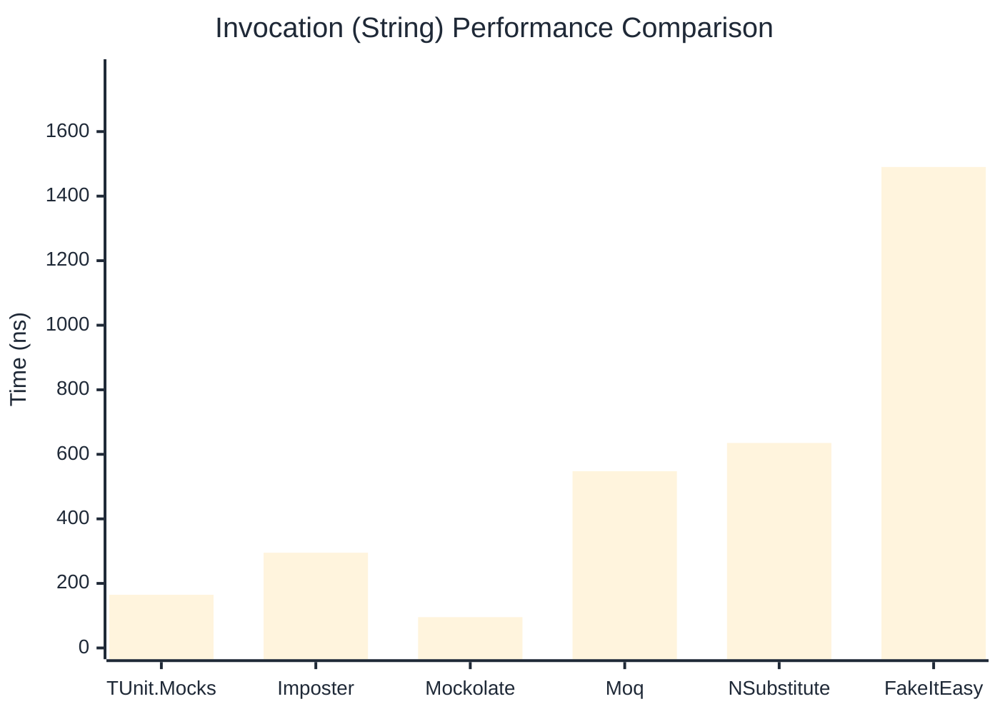

# Invocation Benchmark

> Calling methods on mock objects — comparing **TUnit.Mocks** (source-generated) against runtime proxy-based mocking libraries.

:::info Last Updated
This benchmark was automatically generated on **2026-07-13** from the latest CI run.

**Environment:** Ubuntu Latest • .NET SDK 10.0.301
:::

## 📊 Results

Calling methods on mock objects:

| Library | Mean | Error | StdDev | Allocated |
|---------|------|-------|--------|-----------|
| **TUnit.Mocks** | 277.00 ns | 103.14 ns | 5.653 ns | 128 B |
| Imposter | 302.04 ns | 57.25 ns | 3.138 ns | 168 B |
| Mockolate | 117.07 ns | 32.89 ns | 1.803 ns | 84 B |
| Moq | 840.46 ns | 25.59 ns | 1.403 ns | 376 B |
| NSubstitute | 791.06 ns | 69.44 ns | 3.806 ns | 360 B |
| FakeItEasy | 1,753.44 ns | 678.30 ns | 37.180 ns | 944 B |

---

### String

| Library | Mean | Error | StdDev | Allocated |
|---------|------|-------|--------|-----------|
| **TUnit.Mocks** | 164.71 ns | 78.59 ns | 4.308 ns | 96 B |
| Imposter | 295.07 ns | 92.03 ns | 5.045 ns | 168 B |
| Mockolate | 95.49 ns | 26.85 ns | 1.472 ns | 60 B |
| Moq | 547.70 ns | 280.28 ns | 15.363 ns | 296 B |
| NSubstitute | 635.19 ns | 197.82 ns | 10.843 ns | 328 B |
| FakeItEasy | 1,490.29 ns | 55.99 ns | 3.069 ns | 776 B |

---

### 100 calls

| Library | Mean | Error | StdDev | Allocated |
|---------|------|-------|--------|-----------|
| **TUnit.Mocks** | 26,774.46 ns | 10,402.81 ns | 570.213 ns | 12736 B |
| Imposter | 29,422.66 ns | 13,913.98 ns | 762.672 ns | 16800 B |
| Mockolate | 11,300.93 ns | 15,001.16 ns | 822.264 ns | 8400 B |
| Moq | 84,945.32 ns | 8,344.64 ns | 457.398 ns | 37600 B |
| NSubstitute | 74,207.71 ns | 24,125.22 ns | 1,322.385 ns | 30848 B |
| FakeItEasy | 194,387.96 ns | 35,676.93 ns | 1,955.573 ns | 94400 B |

## 🎯 Key Insights

This benchmark compares **TUnit.Mocks** (source-generated) against runtime proxy-based mocking libraries for calling methods on mock objects.

---

:::note Methodology
View the [mock benchmarks overview](/docs/benchmarks/mocks) for methodology details and environment information.
:::

*Last generated: 2026-07-13T03:22:56.594Z*
