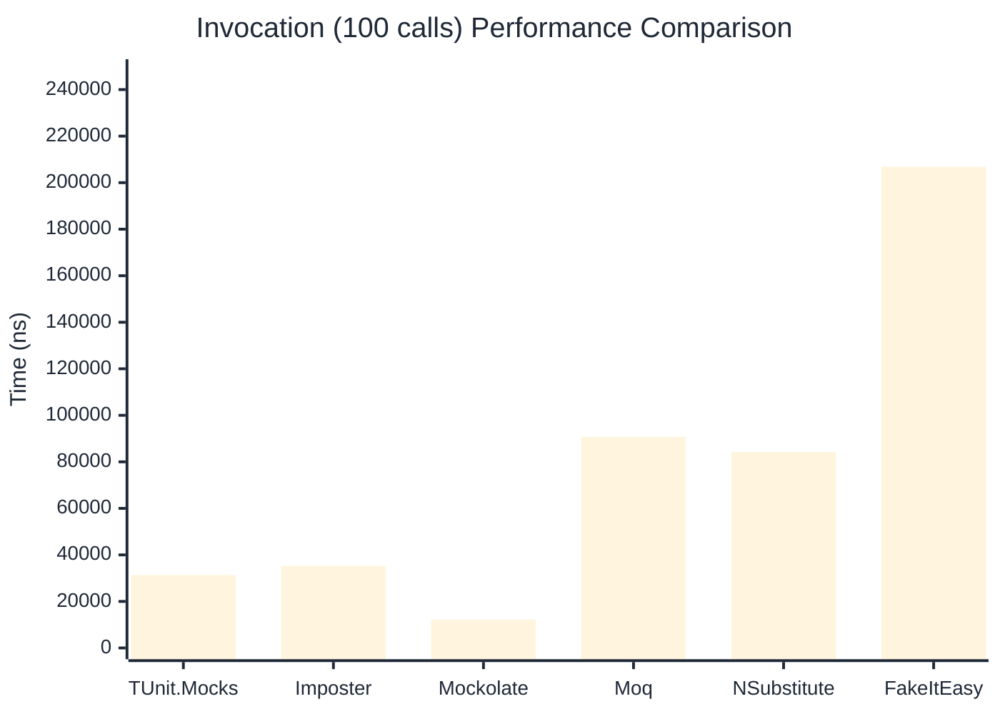

# Invocation Benchmark

:::info Last Updated
This benchmark was automatically generated on **2026-05-31** from the latest CI run.

**Environment:** Ubuntu Latest • .NET SDK 10.0.300
:::

## 📊 Results

Calling methods on mock objects:

| Library | Mean | Error | StdDev | Allocated |
|---------|------|-------|--------|-----------|
| **TUnit.Mocks** | 315.3 ns | 262.25 ns | 14.38 ns | 120 B |
| Imposter | 371.9 ns | 193.48 ns | 10.61 ns | 168 B |
| Mockolate | 124.2 ns | 67.25 ns | 3.69 ns | 84 B |
| Moq | 919.3 ns | 230.95 ns | 12.66 ns | 376 B |
| NSubstitute | 804.0 ns | 269.19 ns | 14.76 ns | 304 B |
| FakeItEasy | 1,977.3 ns | 707.15 ns | 38.76 ns | 944 B |

---

### String

| Library | Mean | Error | StdDev | Allocated |
|---------|------|-------|--------|-----------|
| **TUnit.Mocks** | 182.5 ns | 169.63 ns | 9.30 ns | 88 B |
| Imposter | 375.2 ns | 233.39 ns | 12.79 ns | 168 B |
| Mockolate | 120.0 ns | 72.08 ns | 3.95 ns | 60 B |
| Moq | 604.4 ns | 94.73 ns | 5.19 ns | 296 B |
| NSubstitute | 718.0 ns | 264.56 ns | 14.50 ns | 272 B |
| FakeItEasy | 1,806.2 ns | 1,942.90 ns | 106.50 ns | 776 B |

---

### 100 calls

| Library | Mean | Error | StdDev | Allocated |
|---------|------|-------|--------|-----------|
| **TUnit.Mocks** | 31,346.8 ns | 36,835.53 ns | 2,019.08 ns | 12448 B |
| Imposter | 35,257.4 ns | 14,092.08 ns | 772.43 ns | 16800 B |
| Mockolate | 12,206.7 ns | 2,440.72 ns | 133.78 ns | 8400 B |
| Moq | 90,695.6 ns | 47,920.01 ns | 2,626.66 ns | 37600 B |
| NSubstitute | 84,177.4 ns | 17,504.04 ns | 959.46 ns | 36448 B |
| FakeItEasy | 206,812.3 ns | 33,634.08 ns | 1,843.60 ns | 94400 B |

## 🎯 Key Insights

This benchmark compares **TUnit.Mocks** (source-generated) against runtime proxy-based mocking libraries for calling methods on mock objects.

---

:::note Methodology
View the [mock benchmarks overview](/docs/benchmarks/mocks) for methodology details and environment information.
:::

*Last generated: 2026-05-31T03:32:45.264Z*
