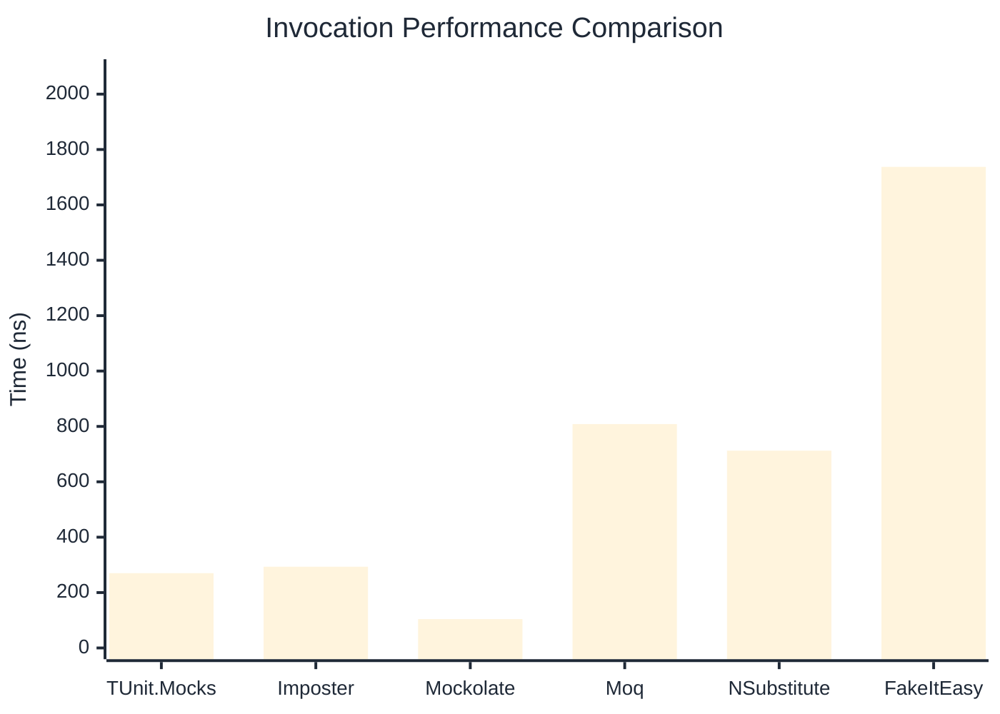

# Invocation Benchmark

> Calling methods on mock objects — comparing **TUnit.Mocks** (source-generated) against runtime proxy-based mocking libraries.

:::info Last Updated
This benchmark was automatically generated on **2026-08-05** from the latest CI run.

**Environment:** Ubuntu Latest • .NET SDK 10.0.302
:::

## 📊 Results

Calling methods on mock objects:

| Library | Mean | Error | StdDev | Allocated |
|---------|------|-------|--------|-----------|
| **TUnit.Mocks** | 270.04 ns | 91.778 ns | 5.031 ns | 128 B |
| Imposter | 293.35 ns | 82.813 ns | 4.539 ns | 168 B |
| Mockolate | 104.17 ns | 24.890 ns | 1.364 ns | 84 B |
| Moq | 808.61 ns | 7.434 ns | 0.407 ns | 376 B |
| NSubstitute | 712.45 ns | 321.108 ns | 17.601 ns | 304 B |
| FakeItEasy | 1,737.35 ns | 355.915 ns | 19.509 ns | 944 B |

```mermaid
%%{init: {
  'theme':'base',
  'themeVariables': {
    'primaryColor': '#2563eb',
    'primaryTextColor': '#1f2937',
    'primaryBorderColor': '#1e40af',
    'lineColor': '#6b7280',
    'secondaryColor': '#7c3aed',
    'tertiaryColor': '#dc2626',
    'background': '#ffffff',
    'pie1': '#2563eb',
    'pie2': '#7c3aed',
    'pie3': '#dc2626',
    'pie4': '#f59e0b',
    'pie5': '#10b981',
    'pie6': '#06b6d4',
    'pie7': '#ec4899',
    'pie8': '#6366f1'
  }
}}%%
xychart-beta
  title "Invocation Performance Comparison"
  x-axis ["TUnit.Mocks", "Imposter", "Mockolate", "Moq", "NSubstitute", "FakeItEasy"]
  y-axis "Time (ns)" 0 --> 2085
  bar [270.04, 293.35, 104.17, 808.61, 712.45, 1737.35]
```

---

### String

| Library | Mean | Error | StdDev | Allocated |
|---------|------|-------|--------|-----------|
| **TUnit.Mocks** | 164.42 ns | 72.362 ns | 3.966 ns | 96 B |
| Imposter | 298.06 ns | 79.832 ns | 4.376 ns | 168 B |
| Mockolate | 91.17 ns | 24.955 ns | 1.368 ns | 60 B |
| Moq | 536.40 ns | 53.580 ns | 2.937 ns | 296 B |
| NSubstitute | 595.22 ns | 92.391 ns | 5.064 ns | 272 B |
| FakeItEasy | 1,578.21 ns | 598.340 ns | 32.797 ns | 776 B |

```mermaid
%%{init: {
  'theme':'base',
  'themeVariables': {
    'primaryColor': '#2563eb',
    'primaryTextColor': '#1f2937',
    'primaryBorderColor': '#1e40af',
    'lineColor': '#6b7280',
    'secondaryColor': '#7c3aed',
    'tertiaryColor': '#dc2626',
    'background': '#ffffff',
    'pie1': '#2563eb',
    'pie2': '#7c3aed',
    'pie3': '#dc2626',
    'pie4': '#f59e0b',
    'pie5': '#10b981',
    'pie6': '#06b6d4',
    'pie7': '#ec4899',
    'pie8': '#6366f1'
  }
}}%%
xychart-beta
  title "Invocation (String) Performance Comparison"
  x-axis ["TUnit.Mocks", "Imposter", "Mockolate", "Moq", "NSubstitute", "FakeItEasy"]
  y-axis "Time (ns)" 0 --> 1894
  bar [164.42, 298.06, 91.17, 536.4, 595.22, 1578.21]
```

---

### 100 calls

| Library | Mean | Error | StdDev | Allocated |
|---------|------|-------|--------|-----------|
| **TUnit.Mocks** | 27,398.54 ns | 10,966.774 ns | 601.126 ns | 12736 B |
| Imposter | 29,066.05 ns | 10,229.484 ns | 560.713 ns | 16800 B |
| Mockolate | 10,258.76 ns | 4,085.246 ns | 223.926 ns | 8400 B |
| Moq | 79,082.11 ns | 15,837.890 ns | 868.128 ns | 37600 B |
| NSubstitute | 69,655.32 ns | 10,485.233 ns | 574.731 ns | 30848 B |
| FakeItEasy | 174,244.34 ns | 71,597.528 ns | 3,924.502 ns | 94400 B |

```mermaid
%%{init: {
  'theme':'base',
  'themeVariables': {
    'primaryColor': '#2563eb',
    'primaryTextColor': '#1f2937',
    'primaryBorderColor': '#1e40af',
    'lineColor': '#6b7280',
    'secondaryColor': '#7c3aed',
    'tertiaryColor': '#dc2626',
    'background': '#ffffff',
    'pie1': '#2563eb',
    'pie2': '#7c3aed',
    'pie3': '#dc2626',
    'pie4': '#f59e0b',
    'pie5': '#10b981',
    'pie6': '#06b6d4',
    'pie7': '#ec4899',
    'pie8': '#6366f1'
  }
}}%%
xychart-beta
  title "Invocation (100 calls) Performance Comparison"
  x-axis ["TUnit.Mocks", "Imposter", "Mockolate", "Moq", "NSubstitute", "FakeItEasy"]
  y-axis "Time (ns)" 0 --> 209094
  bar [27398.54, 29066.05, 10258.76, 79082.11, 69655.32, 174244.34]
```

## 🎯 Key Insights

This benchmark compares **TUnit.Mocks** (source-generated) against runtime proxy-based mocking libraries for calling methods on mock objects.

---

:::note Methodology
View the [mock benchmarks overview](/docs/benchmarks/mocks) for methodology details and environment information.
:::

*Last generated: 2026-08-05T03:21:19.181Z*
