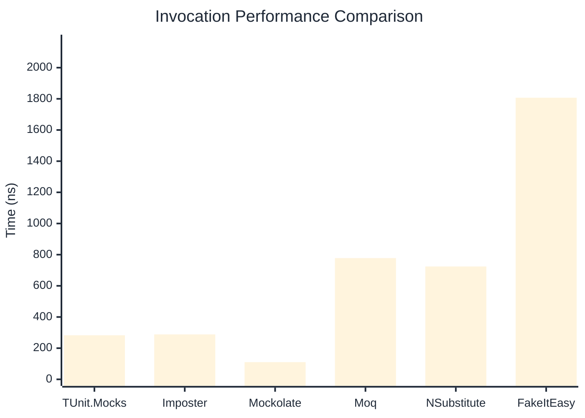

# Invocation Benchmark

> Calling methods on mock objects — comparing **TUnit.Mocks** (source-generated) against runtime proxy-based mocking libraries.

:::info Last Updated
This benchmark was automatically generated on **2026-09-08** from the latest CI run.

**Environment:** Ubuntu Latest • .NET SDK 10.0.400
:::

## 📊 Results

Calling methods on mock objects:

| Library | Mean | Error | StdDev | Allocated |
|---------|------|-------|--------|-----------|
| **TUnit.Mocks** | 282.6 ns | 60.87 ns | 3.34 ns | 128 B |
| Imposter | 288.3 ns | 65.95 ns | 3.61 ns | 168 B |
| Mockolate | 110.4 ns | 106.74 ns | 5.85 ns | 84 B |
| Moq | 778.1 ns | 204.96 ns | 11.23 ns | 376 B |
| NSubstitute | 724.2 ns | 52.24 ns | 2.86 ns | 304 B |
| FakeItEasy | 1,807.1 ns | 960.43 ns | 52.64 ns | 944 B |

```mermaid
%%{init: {
  'theme':'base',
  'themeVariables': {
    'primaryColor': '#2563eb',
    'primaryTextColor': '#1f2937',
    'primaryBorderColor': '#1e40af',
    'lineColor': '#6b7280',
    'secondaryColor': '#7c3aed',
    'tertiaryColor': '#dc2626',
    'background': '#ffffff',
    'pie1': '#2563eb',
    'pie2': '#7c3aed',
    'pie3': '#dc2626',
    'pie4': '#f59e0b',
    'pie5': '#10b981',
    'pie6': '#06b6d4',
    'pie7': '#ec4899',
    'pie8': '#6366f1'
  }
}}%%
xychart-beta
  title "Invocation Performance Comparison"
  x-axis ["TUnit.Mocks", "Imposter", "Mockolate", "Moq", "NSubstitute", "FakeItEasy"]
  y-axis "Time (ns)" 0 --> 2169
  bar [282.6, 288.3, 110.4, 778.1, 724.2, 1807.1]
```

---

### String

| Library | Mean | Error | StdDev | Allocated |
|---------|------|-------|--------|-----------|
| **TUnit.Mocks** | 166.0 ns | 81.56 ns | 4.47 ns | 96 B |
| Imposter | 290.1 ns | 69.89 ns | 3.83 ns | 168 B |
| Mockolate | 100.8 ns | 59.48 ns | 3.26 ns | 60 B |
| Moq | 570.1 ns | 188.26 ns | 10.32 ns | 296 B |
| NSubstitute | 626.3 ns | 726.51 ns | 39.82 ns | 272 B |
| FakeItEasy | 1,655.2 ns | 434.89 ns | 23.84 ns | 776 B |

```mermaid
%%{init: {
  'theme':'base',
  'themeVariables': {
    'primaryColor': '#2563eb',
    'primaryTextColor': '#1f2937',
    'primaryBorderColor': '#1e40af',
    'lineColor': '#6b7280',
    'secondaryColor': '#7c3aed',
    'tertiaryColor': '#dc2626',
    'background': '#ffffff',
    'pie1': '#2563eb',
    'pie2': '#7c3aed',
    'pie3': '#dc2626',
    'pie4': '#f59e0b',
    'pie5': '#10b981',
    'pie6': '#06b6d4',
    'pie7': '#ec4899',
    'pie8': '#6366f1'
  }
}}%%
xychart-beta
  title "Invocation (String) Performance Comparison"
  x-axis ["TUnit.Mocks", "Imposter", "Mockolate", "Moq", "NSubstitute", "FakeItEasy"]
  y-axis "Time (ns)" 0 --> 1987
  bar [166, 290.1, 100.8, 570.1, 626.3, 1655.2]
```

---

### 100 calls

| Library | Mean | Error | StdDev | Allocated |
|---------|------|-------|--------|-----------|
| **TUnit.Mocks** | 27,285.3 ns | 19,590.82 ns | 1,073.84 ns | 12736 B |
| Imposter | 29,727.0 ns | 13,760.22 ns | 754.24 ns | 16800 B |
| Mockolate | 10,893.0 ns | 15,666.26 ns | 858.72 ns | 8400 B |
| Moq | 83,250.9 ns | 55,801.68 ns | 3,058.68 ns | 37600 B |
| NSubstitute | 72,782.9 ns | 13,927.90 ns | 763.44 ns | 30848 B |
| FakeItEasy | 187,730.9 ns | 163,711.66 ns | 8,973.59 ns | 94400 B |

```mermaid
%%{init: {
  'theme':'base',
  'themeVariables': {
    'primaryColor': '#2563eb',
    'primaryTextColor': '#1f2937',
    'primaryBorderColor': '#1e40af',
    'lineColor': '#6b7280',
    'secondaryColor': '#7c3aed',
    'tertiaryColor': '#dc2626',
    'background': '#ffffff',
    'pie1': '#2563eb',
    'pie2': '#7c3aed',
    'pie3': '#dc2626',
    'pie4': '#f59e0b',
    'pie5': '#10b981',
    'pie6': '#06b6d4',
    'pie7': '#ec4899',
    'pie8': '#6366f1'
  }
}}%%
xychart-beta
  title "Invocation (100 calls) Performance Comparison"
  x-axis ["TUnit.Mocks", "Imposter", "Mockolate", "Moq", "NSubstitute", "FakeItEasy"]
  y-axis "Time (ns)" 0 --> 225278
  bar [27285.3, 29727, 10893, 83250.9, 72782.9, 187730.9]
```

## 🎯 Key Insights

This benchmark compares **TUnit.Mocks** (source-generated) against runtime proxy-based mocking libraries for calling methods on mock objects.

---

:::note Methodology
View the [mock benchmarks overview](/docs/benchmarks/mocks) for methodology details and environment information.
:::

*Last generated: 2026-09-08T02:32:39.573Z*
