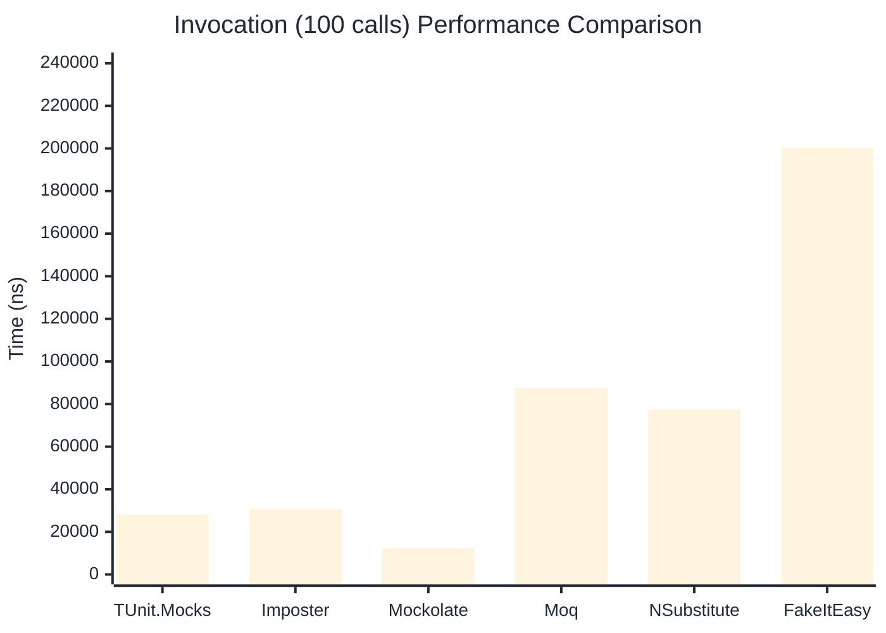

# Invocation Benchmark

> Calling methods on mock objects — comparing **TUnit.Mocks** (source-generated) against runtime proxy-based mocking libraries.

:::info Last Updated
This benchmark was automatically generated on **2026-07-27** from the latest CI run.

**Environment:** Ubuntu Latest • .NET SDK 10.0.302
:::

## 📊 Results

Calling methods on mock objects:

| Library | Mean | Error | StdDev | Allocated |
|---------|------|-------|--------|-----------|
| **TUnit.Mocks** | 279.9 ns | 9.26 ns | 0.51 ns | 128 B |
| Imposter | 301.5 ns | 166.99 ns | 9.15 ns | 168 B |
| Mockolate | 112.2 ns | 115.49 ns | 6.33 ns | 84 B |
| Moq | 800.6 ns | 135.14 ns | 7.41 ns | 376 B |
| NSubstitute | 749.5 ns | 275.93 ns | 15.12 ns | 304 B |
| FakeItEasy | 2,005.8 ns | 628.43 ns | 34.45 ns | 944 B |

```mermaid
%%{init: {
  'theme':'base',
  'themeVariables': {
    'primaryColor': '#2563eb',
    'primaryTextColor': '#1f2937',
    'primaryBorderColor': '#1e40af',
    'lineColor': '#6b7280',
    'secondaryColor': '#7c3aed',
    'tertiaryColor': '#dc2626',
    'background': '#ffffff',
    'pie1': '#2563eb',
    'pie2': '#7c3aed',
    'pie3': '#dc2626',
    'pie4': '#f59e0b',
    'pie5': '#10b981',
    'pie6': '#06b6d4',
    'pie7': '#ec4899',
    'pie8': '#6366f1'
  }
}}%%
xychart-beta
  title "Invocation Performance Comparison"
  x-axis ["TUnit.Mocks", "Imposter", "Mockolate", "Moq", "NSubstitute", "FakeItEasy"]
  y-axis "Time (ns)" 0 --> 2407
  bar [279.9, 301.5, 112.2, 800.6, 749.5, 2005.8]
```

---

### String

| Library | Mean | Error | StdDev | Allocated |
|---------|------|-------|--------|-----------|
| **TUnit.Mocks** | 167.9 ns | 77.74 ns | 4.26 ns | 96 B |
| Imposter | 312.7 ns | 120.67 ns | 6.61 ns | 168 B |
| Mockolate | 108.9 ns | 51.76 ns | 2.84 ns | 60 B |
| Moq | 585.1 ns | 64.44 ns | 3.53 ns | 296 B |
| NSubstitute | 657.7 ns | 257.12 ns | 14.09 ns | 272 B |
| FakeItEasy | 1,707.9 ns | 148.03 ns | 8.11 ns | 776 B |

```mermaid
%%{init: {
  'theme':'base',
  'themeVariables': {
    'primaryColor': '#2563eb',
    'primaryTextColor': '#1f2937',
    'primaryBorderColor': '#1e40af',
    'lineColor': '#6b7280',
    'secondaryColor': '#7c3aed',
    'tertiaryColor': '#dc2626',
    'background': '#ffffff',
    'pie1': '#2563eb',
    'pie2': '#7c3aed',
    'pie3': '#dc2626',
    'pie4': '#f59e0b',
    'pie5': '#10b981',
    'pie6': '#06b6d4',
    'pie7': '#ec4899',
    'pie8': '#6366f1'
  }
}}%%
xychart-beta
  title "Invocation (String) Performance Comparison"
  x-axis ["TUnit.Mocks", "Imposter", "Mockolate", "Moq", "NSubstitute", "FakeItEasy"]
  y-axis "Time (ns)" 0 --> 2050
  bar [167.9, 312.7, 108.9, 585.1, 657.7, 1707.9]
```

---

### 100 calls

| Library | Mean | Error | StdDev | Allocated |
|---------|------|-------|--------|-----------|
| **TUnit.Mocks** | 28,152.4 ns | 13,329.54 ns | 730.64 ns | 12736 B |
| Imposter | 30,798.3 ns | 2,201.85 ns | 120.69 ns | 16800 B |
| Mockolate | 12,202.0 ns | 5,765.47 ns | 316.02 ns | 8400 B |
| Moq | 87,315.3 ns | 18,370.18 ns | 1,006.93 ns | 37600 B |
| NSubstitute | 77,588.1 ns | 10,423.70 ns | 571.36 ns | 30848 B |
| FakeItEasy | 200,265.8 ns | 46,017.46 ns | 2,522.37 ns | 94400 B |

```mermaid
%%{init: {
  'theme':'base',
  'themeVariables': {
    'primaryColor': '#2563eb',
    'primaryTextColor': '#1f2937',
    'primaryBorderColor': '#1e40af',
    'lineColor': '#6b7280',
    'secondaryColor': '#7c3aed',
    'tertiaryColor': '#dc2626',
    'background': '#ffffff',
    'pie1': '#2563eb',
    'pie2': '#7c3aed',
    'pie3': '#dc2626',
    'pie4': '#f59e0b',
    'pie5': '#10b981',
    'pie6': '#06b6d4',
    'pie7': '#ec4899',
    'pie8': '#6366f1'
  }
}}%%
xychart-beta
  title "Invocation (100 calls) Performance Comparison"
  x-axis ["TUnit.Mocks", "Imposter", "Mockolate", "Moq", "NSubstitute", "FakeItEasy"]
  y-axis "Time (ns)" 0 --> 240319
  bar [28152.4, 30798.3, 12202, 87315.3, 77588.1, 200265.8]
```

## 🎯 Key Insights

This benchmark compares **TUnit.Mocks** (source-generated) against runtime proxy-based mocking libraries for calling methods on mock objects.

---

:::note Methodology
View the [mock benchmarks overview](/docs/benchmarks/mocks) for methodology details and environment information.
:::

*Last generated: 2026-07-27T03:23:36.716Z*
