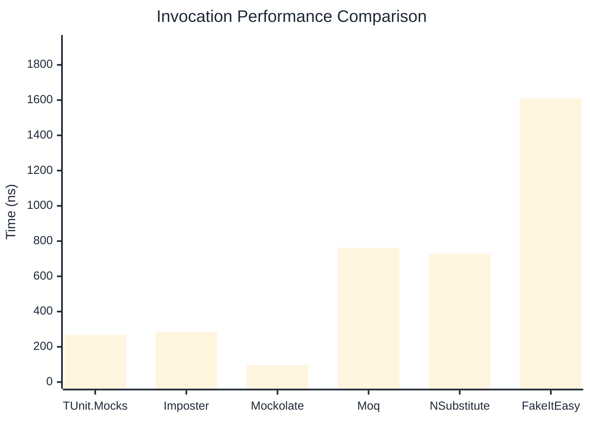

# Invocation Benchmark

> Calling methods on mock objects — comparing **TUnit.Mocks** (source-generated) against runtime proxy-based mocking libraries.

:::info Last Updated
This benchmark was automatically generated on **2026-08-17** from the latest CI run.

**Environment:** Ubuntu Latest • .NET SDK 10.0.400
:::

## 📊 Results

Calling methods on mock objects:

| Library | Mean | Error | StdDev | Allocated |
|---------|------|-------|--------|-----------|
| **TUnit.Mocks** | 268.09 ns | 87.126 ns | 4.776 ns | 128 B |
| Imposter | 284.71 ns | 62.901 ns | 3.448 ns | 168 B |
| Mockolate | 97.26 ns | 23.489 ns | 1.288 ns | 84 B |
| Moq | 760.37 ns | 157.444 ns | 8.630 ns | 376 B |
| NSubstitute | 728.19 ns | 81.304 ns | 4.457 ns | 360 B |
| FakeItEasy | 1,609.26 ns | 223.705 ns | 12.262 ns | 944 B |

```mermaid
%%{init: {
  'theme':'base',
  'themeVariables': {
    'primaryColor': '#2563eb',
    'primaryTextColor': '#1f2937',
    'primaryBorderColor': '#1e40af',
    'lineColor': '#6b7280',
    'secondaryColor': '#7c3aed',
    'tertiaryColor': '#dc2626',
    'background': '#ffffff',
    'pie1': '#2563eb',
    'pie2': '#7c3aed',
    'pie3': '#dc2626',
    'pie4': '#f59e0b',
    'pie5': '#10b981',
    'pie6': '#06b6d4',
    'pie7': '#ec4899',
    'pie8': '#6366f1'
  }
}}%%
xychart-beta
  title "Invocation Performance Comparison"
  x-axis ["TUnit.Mocks", "Imposter", "Mockolate", "Moq", "NSubstitute", "FakeItEasy"]
  y-axis "Time (ns)" 0 --> 1932
  bar [268.09, 284.71, 97.26, 760.37, 728.19, 1609.26]
```

---

### String

| Library | Mean | Error | StdDev | Allocated |
|---------|------|-------|--------|-----------|
| **TUnit.Mocks** | 166.31 ns | 47.236 ns | 2.589 ns | 96 B |
| Imposter | 285.31 ns | 88.204 ns | 4.835 ns | 168 B |
| Mockolate | 89.49 ns | 6.983 ns | 0.383 ns | 60 B |
| Moq | 512.15 ns | 101.769 ns | 5.578 ns | 296 B |
| NSubstitute | 606.78 ns | 183.051 ns | 10.034 ns | 272 B |
| FakeItEasy | 1,466.27 ns | 54.892 ns | 3.009 ns | 776 B |

```mermaid
%%{init: {
  'theme':'base',
  'themeVariables': {
    'primaryColor': '#2563eb',
    'primaryTextColor': '#1f2937',
    'primaryBorderColor': '#1e40af',
    'lineColor': '#6b7280',
    'secondaryColor': '#7c3aed',
    'tertiaryColor': '#dc2626',
    'background': '#ffffff',
    'pie1': '#2563eb',
    'pie2': '#7c3aed',
    'pie3': '#dc2626',
    'pie4': '#f59e0b',
    'pie5': '#10b981',
    'pie6': '#06b6d4',
    'pie7': '#ec4899',
    'pie8': '#6366f1'
  }
}}%%
xychart-beta
  title "Invocation (String) Performance Comparison"
  x-axis ["TUnit.Mocks", "Imposter", "Mockolate", "Moq", "NSubstitute", "FakeItEasy"]
  y-axis "Time (ns)" 0 --> 1760
  bar [166.31, 285.31, 89.49, 512.15, 606.78, 1466.27]
```

---

### 100 calls

| Library | Mean | Error | StdDev | Allocated |
|---------|------|-------|--------|-----------|
| **TUnit.Mocks** | 26,806.42 ns | 9,422.249 ns | 516.465 ns | 12736 B |
| Imposter | 28,140.20 ns | 8,813.693 ns | 483.108 ns | 16800 B |
| Mockolate | 9,731.23 ns | 2,164.372 ns | 118.637 ns | 8400 B |
| Moq | 78,935.73 ns | 9,245.295 ns | 506.766 ns | 37600 B |
| NSubstitute | 72,911.31 ns | 11,147.412 ns | 611.027 ns | 36448 B |
| FakeItEasy | 162,973.07 ns | 59,893.083 ns | 3,282.942 ns | 94400 B |

```mermaid
%%{init: {
  'theme':'base',
  'themeVariables': {
    'primaryColor': '#2563eb',
    'primaryTextColor': '#1f2937',
    'primaryBorderColor': '#1e40af',
    'lineColor': '#6b7280',
    'secondaryColor': '#7c3aed',
    'tertiaryColor': '#dc2626',
    'background': '#ffffff',
    'pie1': '#2563eb',
    'pie2': '#7c3aed',
    'pie3': '#dc2626',
    'pie4': '#f59e0b',
    'pie5': '#10b981',
    'pie6': '#06b6d4',
    'pie7': '#ec4899',
    'pie8': '#6366f1'
  }
}}%%
xychart-beta
  title "Invocation (100 calls) Performance Comparison"
  x-axis ["TUnit.Mocks", "Imposter", "Mockolate", "Moq", "NSubstitute", "FakeItEasy"]
  y-axis "Time (ns)" 0 --> 195568
  bar [26806.42, 28140.2, 9731.23, 78935.73, 72911.31, 162973.07]
```

## 🎯 Key Insights

This benchmark compares **TUnit.Mocks** (source-generated) against runtime proxy-based mocking libraries for calling methods on mock objects.

---

:::note Methodology
View the [mock benchmarks overview](/docs/benchmarks/mocks) for methodology details and environment information.
:::

*Last generated: 2026-08-17T02:43:20.076Z*
