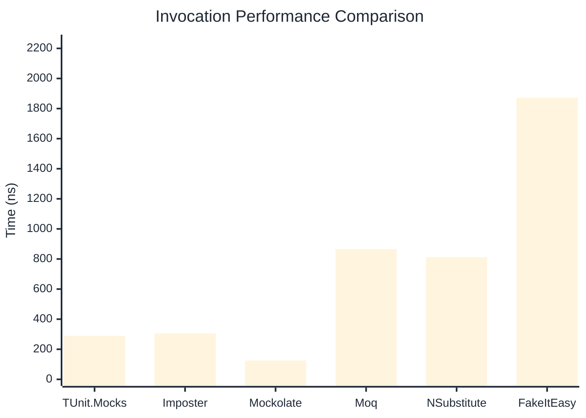

# Invocation Benchmark

> Calling methods on mock objects — comparing **TUnit.Mocks** (source-generated) against runtime proxy-based mocking libraries.

:::info Last Updated
This benchmark was automatically generated on **2026-09-22** from the latest CI run.

**Environment:** Ubuntu Latest • .NET SDK 10.0.401
:::

## 📊 Results

Calling methods on mock objects:

| Library | Mean | Error | StdDev | Allocated |
|---------|------|-------|--------|-----------|
| **TUnit.Mocks** | 288.8 ns | 64.23 ns | 3.52 ns | 128 B |
| Imposter | 304.9 ns | 75.63 ns | 4.15 ns | 168 B |
| Mockolate | 124.8 ns | 107.51 ns | 5.89 ns | 84 B |
| Moq | 865.1 ns | 338.31 ns | 18.54 ns | 376 B |
| NSubstitute | 812.1 ns | 233.56 ns | 12.80 ns | 360 B |
| FakeItEasy | 1,872.3 ns | 1,836.57 ns | 100.67 ns | 944 B |

```mermaid
%%{init: {
  'theme':'base',
  'themeVariables': {
    'primaryColor': '#2563eb',
    'primaryTextColor': '#1f2937',
    'primaryBorderColor': '#1e40af',
    'lineColor': '#6b7280',
    'secondaryColor': '#7c3aed',
    'tertiaryColor': '#dc2626',
    'background': '#ffffff',
    'pie1': '#2563eb',
    'pie2': '#7c3aed',
    'pie3': '#dc2626',
    'pie4': '#f59e0b',
    'pie5': '#10b981',
    'pie6': '#06b6d4',
    'pie7': '#ec4899',
    'pie8': '#6366f1'
  }
}}%%
xychart-beta
  title "Invocation Performance Comparison"
  x-axis ["TUnit.Mocks", "Imposter", "Mockolate", "Moq", "NSubstitute", "FakeItEasy"]
  y-axis "Time (ns)" 0 --> 2247
  bar [288.8, 304.9, 124.8, 865.1, 812.1, 1872.3]
```

---

### String

| Library | Mean | Error | StdDev | Allocated |
|---------|------|-------|--------|-----------|
| **TUnit.Mocks** | 167.4 ns | 66.04 ns | 3.62 ns | 96 B |
| Imposter | 307.7 ns | 24.66 ns | 1.35 ns | 168 B |
| Mockolate | 106.2 ns | 53.12 ns | 2.91 ns | 60 B |
| Moq | 571.2 ns | 81.87 ns | 4.49 ns | 296 B |
| NSubstitute | 642.2 ns | 341.20 ns | 18.70 ns | 272 B |
| FakeItEasy | 1,641.4 ns | 102.00 ns | 5.59 ns | 776 B |

```mermaid
%%{init: {
  'theme':'base',
  'themeVariables': {
    'primaryColor': '#2563eb',
    'primaryTextColor': '#1f2937',
    'primaryBorderColor': '#1e40af',
    'lineColor': '#6b7280',
    'secondaryColor': '#7c3aed',
    'tertiaryColor': '#dc2626',
    'background': '#ffffff',
    'pie1': '#2563eb',
    'pie2': '#7c3aed',
    'pie3': '#dc2626',
    'pie4': '#f59e0b',
    'pie5': '#10b981',
    'pie6': '#06b6d4',
    'pie7': '#ec4899',
    'pie8': '#6366f1'
  }
}}%%
xychart-beta
  title "Invocation (String) Performance Comparison"
  x-axis ["TUnit.Mocks", "Imposter", "Mockolate", "Moq", "NSubstitute", "FakeItEasy"]
  y-axis "Time (ns)" 0 --> 1970
  bar [167.4, 307.7, 106.2, 571.2, 642.2, 1641.4]
```

---

### 100 calls

| Library | Mean | Error | StdDev | Allocated |
|---------|------|-------|--------|-----------|
| **TUnit.Mocks** | 28,422.4 ns | 8,276.11 ns | 453.64 ns | 12736 B |
| Imposter | 30,252.2 ns | 5,403.26 ns | 296.17 ns | 16800 B |
| Mockolate | 11,762.3 ns | 1,486.48 ns | 81.48 ns | 8400 B |
| Moq | 80,885.5 ns | 15,604.50 ns | 855.34 ns | 37600 B |
| NSubstitute | 73,991.9 ns | 32,134.57 ns | 1,761.40 ns | 30848 B |
| FakeItEasy | 191,024.1 ns | 83,236.88 ns | 4,562.49 ns | 94400 B |

```mermaid
%%{init: {
  'theme':'base',
  'themeVariables': {
    'primaryColor': '#2563eb',
    'primaryTextColor': '#1f2937',
    'primaryBorderColor': '#1e40af',
    'lineColor': '#6b7280',
    'secondaryColor': '#7c3aed',
    'tertiaryColor': '#dc2626',
    'background': '#ffffff',
    'pie1': '#2563eb',
    'pie2': '#7c3aed',
    'pie3': '#dc2626',
    'pie4': '#f59e0b',
    'pie5': '#10b981',
    'pie6': '#06b6d4',
    'pie7': '#ec4899',
    'pie8': '#6366f1'
  }
}}%%
xychart-beta
  title "Invocation (100 calls) Performance Comparison"
  x-axis ["TUnit.Mocks", "Imposter", "Mockolate", "Moq", "NSubstitute", "FakeItEasy"]
  y-axis "Time (ns)" 0 --> 229229
  bar [28422.4, 30252.2, 11762.3, 80885.5, 73991.9, 191024.1]
```

## 🎯 Key Insights

This benchmark compares **TUnit.Mocks** (source-generated) against runtime proxy-based mocking libraries for calling methods on mock objects.

---

:::note Methodology
View the [mock benchmarks overview](/docs/benchmarks/mocks) for methodology details and environment information.
:::

*Last generated: 2026-09-22T02:33:33.738Z*
