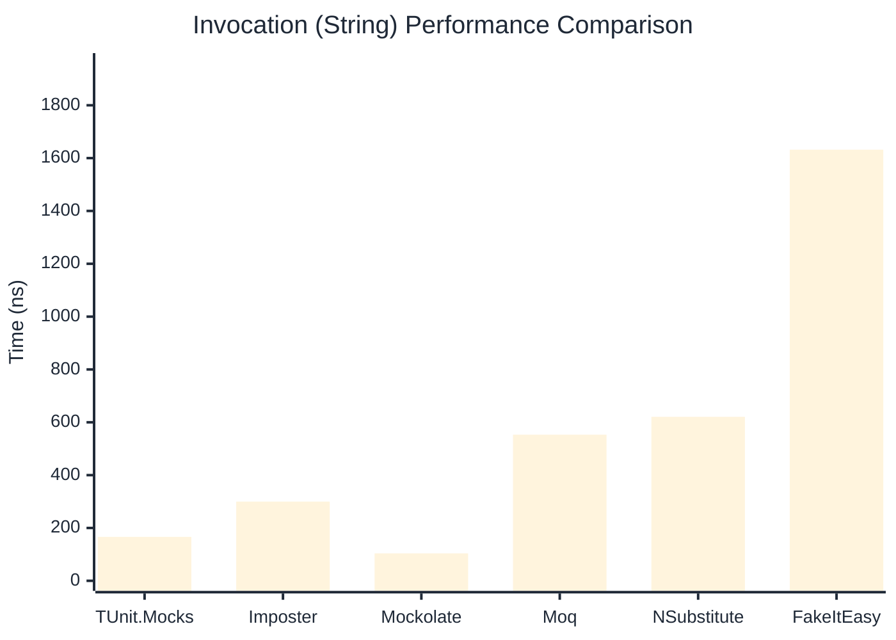

# Invocation Benchmark

> Calling methods on mock objects — comparing **TUnit.Mocks** (source-generated) against runtime proxy-based mocking libraries.

:::info Last Updated
This benchmark was automatically generated on **2026-09-17** from the latest CI run.

**Environment:** Ubuntu Latest • .NET SDK 10.0.401
:::

## 📊 Results

Calling methods on mock objects:

| Library | Mean | Error | StdDev | Allocated |
|---------|------|-------|--------|-----------|
| **TUnit.Mocks** | 277.5 ns | 106.77 ns | 5.85 ns | 128 B |
| Imposter | 299.3 ns | 53.03 ns | 2.91 ns | 168 B |
| Mockolate | 115.1 ns | 104.90 ns | 5.75 ns | 84 B |
| Moq | 843.5 ns | 254.96 ns | 13.98 ns | 376 B |
| NSubstitute | 790.7 ns | 211.53 ns | 11.59 ns | 360 B |
| FakeItEasy | 1,822.5 ns | 313.92 ns | 17.21 ns | 944 B |

```mermaid
%%{init: {
  'theme':'base',
  'themeVariables': {
    'primaryColor': '#2563eb',
    'primaryTextColor': '#1f2937',
    'primaryBorderColor': '#1e40af',
    'lineColor': '#6b7280',
    'secondaryColor': '#7c3aed',
    'tertiaryColor': '#dc2626',
    'background': '#ffffff',
    'pie1': '#2563eb',
    'pie2': '#7c3aed',
    'pie3': '#dc2626',
    'pie4': '#f59e0b',
    'pie5': '#10b981',
    'pie6': '#06b6d4',
    'pie7': '#ec4899',
    'pie8': '#6366f1'
  }
}}%%
xychart-beta
  title "Invocation Performance Comparison"
  x-axis ["TUnit.Mocks", "Imposter", "Mockolate", "Moq", "NSubstitute", "FakeItEasy"]
  y-axis "Time (ns)" 0 --> 2187
  bar [277.5, 299.3, 115.1, 843.5, 790.7, 1822.5]
```

---

### String

| Library | Mean | Error | StdDev | Allocated |
|---------|------|-------|--------|-----------|
| **TUnit.Mocks** | 166.3 ns | 76.35 ns | 4.19 ns | 96 B |
| Imposter | 299.8 ns | 102.33 ns | 5.61 ns | 168 B |
| Mockolate | 103.9 ns | 62.72 ns | 3.44 ns | 60 B |
| Moq | 553.1 ns | 112.75 ns | 6.18 ns | 296 B |
| NSubstitute | 620.7 ns | 196.12 ns | 10.75 ns | 272 B |
| FakeItEasy | 1,632.0 ns | 497.93 ns | 27.29 ns | 776 B |

```mermaid
%%{init: {
  'theme':'base',
  'themeVariables': {
    'primaryColor': '#2563eb',
    'primaryTextColor': '#1f2937',
    'primaryBorderColor': '#1e40af',
    'lineColor': '#6b7280',
    'secondaryColor': '#7c3aed',
    'tertiaryColor': '#dc2626',
    'background': '#ffffff',
    'pie1': '#2563eb',
    'pie2': '#7c3aed',
    'pie3': '#dc2626',
    'pie4': '#f59e0b',
    'pie5': '#10b981',
    'pie6': '#06b6d4',
    'pie7': '#ec4899',
    'pie8': '#6366f1'
  }
}}%%
xychart-beta
  title "Invocation (String) Performance Comparison"
  x-axis ["TUnit.Mocks", "Imposter", "Mockolate", "Moq", "NSubstitute", "FakeItEasy"]
  y-axis "Time (ns)" 0 --> 1959
  bar [166.3, 299.8, 103.9, 553.1, 620.7, 1632]
```

---

### 100 calls

| Library | Mean | Error | StdDev | Allocated |
|---------|------|-------|--------|-----------|
| **TUnit.Mocks** | 27,485.1 ns | 12,573.78 ns | 689.21 ns | 12736 B |
| Imposter | 29,372.1 ns | 10,100.67 ns | 553.65 ns | 16800 B |
| Mockolate | 11,747.4 ns | 4,274.57 ns | 234.30 ns | 8400 B |
| Moq | 83,572.4 ns | 17,406.89 ns | 954.13 ns | 37600 B |
| NSubstitute | 71,612.5 ns | 11,396.06 ns | 624.66 ns | 30848 B |
| FakeItEasy | 187,364.3 ns | 102,372.25 ns | 5,611.37 ns | 94400 B |

```mermaid
%%{init: {
  'theme':'base',
  'themeVariables': {
    'primaryColor': '#2563eb',
    'primaryTextColor': '#1f2937',
    'primaryBorderColor': '#1e40af',
    'lineColor': '#6b7280',
    'secondaryColor': '#7c3aed',
    'tertiaryColor': '#dc2626',
    'background': '#ffffff',
    'pie1': '#2563eb',
    'pie2': '#7c3aed',
    'pie3': '#dc2626',
    'pie4': '#f59e0b',
    'pie5': '#10b981',
    'pie6': '#06b6d4',
    'pie7': '#ec4899',
    'pie8': '#6366f1'
  }
}}%%
xychart-beta
  title "Invocation (100 calls) Performance Comparison"
  x-axis ["TUnit.Mocks", "Imposter", "Mockolate", "Moq", "NSubstitute", "FakeItEasy"]
  y-axis "Time (ns)" 0 --> 224838
  bar [27485.1, 29372.1, 11747.4, 83572.4, 71612.5, 187364.3]
```

## 🎯 Key Insights

This benchmark compares **TUnit.Mocks** (source-generated) against runtime proxy-based mocking libraries for calling methods on mock objects.

---

:::note Methodology
View the [mock benchmarks overview](/docs/benchmarks/mocks) for methodology details and environment information.
:::

*Last generated: 2026-09-17T02:33:27.459Z*
