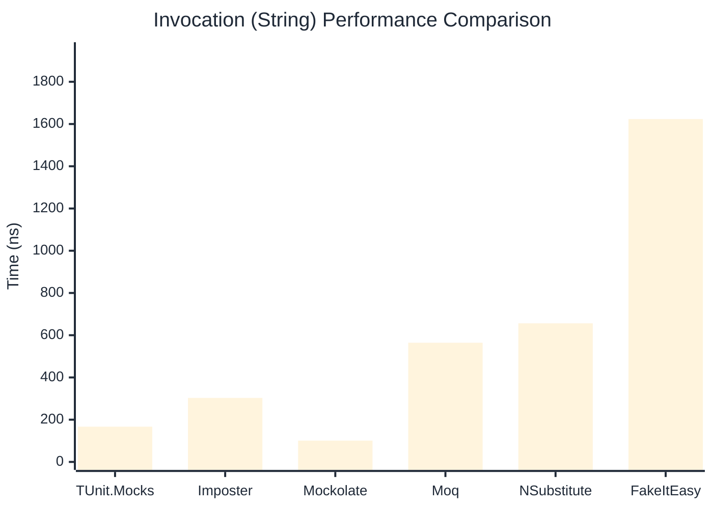

# Invocation Benchmark

> Calling methods on mock objects — comparing **TUnit.Mocks** (source-generated) against runtime proxy-based mocking libraries.

:::info Last Updated
This benchmark was automatically generated on **2026-08-26** from the latest CI run.

**Environment:** Ubuntu Latest • .NET SDK 10.0.400
:::

## 📊 Results

Calling methods on mock objects:

| Library | Mean | Error | StdDev | Allocated |
|---------|------|-------|--------|-----------|
| **TUnit.Mocks** | 276.9 ns | 69.53 ns | 3.81 ns | 128 B |
| Imposter | 298.5 ns | 69.70 ns | 3.82 ns | 168 B |
| Mockolate | 111.1 ns | 16.94 ns | 0.93 ns | 84 B |
| Moq | 810.2 ns | 395.18 ns | 21.66 ns | 376 B |
| NSubstitute | 749.4 ns | 613.64 ns | 33.64 ns | 304 B |
| FakeItEasy | 1,833.6 ns | 350.91 ns | 19.23 ns | 944 B |

```mermaid
%%{init: {
  'theme':'base',
  'themeVariables': {
    'primaryColor': '#2563eb',
    'primaryTextColor': '#1f2937',
    'primaryBorderColor': '#1e40af',
    'lineColor': '#6b7280',
    'secondaryColor': '#7c3aed',
    'tertiaryColor': '#dc2626',
    'background': '#ffffff',
    'pie1': '#2563eb',
    'pie2': '#7c3aed',
    'pie3': '#dc2626',
    'pie4': '#f59e0b',
    'pie5': '#10b981',
    'pie6': '#06b6d4',
    'pie7': '#ec4899',
    'pie8': '#6366f1'
  }
}}%%
xychart-beta
  title "Invocation Performance Comparison"
  x-axis ["TUnit.Mocks", "Imposter", "Mockolate", "Moq", "NSubstitute", "FakeItEasy"]
  y-axis "Time (ns)" 0 --> 2201
  bar [276.9, 298.5, 111.1, 810.2, 749.4, 1833.6]
```

---

### String

| Library | Mean | Error | StdDev | Allocated |
|---------|------|-------|--------|-----------|
| **TUnit.Mocks** | 166.9 ns | 87.98 ns | 4.82 ns | 96 B |
| Imposter | 303.1 ns | 55.19 ns | 3.03 ns | 168 B |
| Mockolate | 100.8 ns | 71.99 ns | 3.95 ns | 60 B |
| Moq | 564.4 ns | 298.13 ns | 16.34 ns | 296 B |
| NSubstitute | 656.3 ns | 101.12 ns | 5.54 ns | 328 B |
| FakeItEasy | 1,623.5 ns | 304.96 ns | 16.72 ns | 776 B |

```mermaid
%%{init: {
  'theme':'base',
  'themeVariables': {
    'primaryColor': '#2563eb',
    'primaryTextColor': '#1f2937',
    'primaryBorderColor': '#1e40af',
    'lineColor': '#6b7280',
    'secondaryColor': '#7c3aed',
    'tertiaryColor': '#dc2626',
    'background': '#ffffff',
    'pie1': '#2563eb',
    'pie2': '#7c3aed',
    'pie3': '#dc2626',
    'pie4': '#f59e0b',
    'pie5': '#10b981',
    'pie6': '#06b6d4',
    'pie7': '#ec4899',
    'pie8': '#6366f1'
  }
}}%%
xychart-beta
  title "Invocation (String) Performance Comparison"
  x-axis ["TUnit.Mocks", "Imposter", "Mockolate", "Moq", "NSubstitute", "FakeItEasy"]
  y-axis "Time (ns)" 0 --> 1949
  bar [166.9, 303.1, 100.8, 564.4, 656.3, 1623.5]
```

---

### 100 calls

| Library | Mean | Error | StdDev | Allocated |
|---------|------|-------|--------|-----------|
| **TUnit.Mocks** | 27,342.5 ns | 10,466.71 ns | 573.72 ns | 12736 B |
| Imposter | 29,495.1 ns | 10,705.06 ns | 586.78 ns | 16800 B |
| Mockolate | 10,825.3 ns | 2,802.84 ns | 153.63 ns | 8400 B |
| Moq | 83,855.2 ns | 24,978.27 ns | 1,369.14 ns | 37600 B |
| NSubstitute | 81,404.3 ns | 34,696.37 ns | 1,901.82 ns | 36448 B |
| FakeItEasy | 182,322.3 ns | 55,668.73 ns | 3,051.39 ns | 94400 B |

```mermaid
%%{init: {
  'theme':'base',
  'themeVariables': {
    'primaryColor': '#2563eb',
    'primaryTextColor': '#1f2937',
    'primaryBorderColor': '#1e40af',
    'lineColor': '#6b7280',
    'secondaryColor': '#7c3aed',
    'tertiaryColor': '#dc2626',
    'background': '#ffffff',
    'pie1': '#2563eb',
    'pie2': '#7c3aed',
    'pie3': '#dc2626',
    'pie4': '#f59e0b',
    'pie5': '#10b981',
    'pie6': '#06b6d4',
    'pie7': '#ec4899',
    'pie8': '#6366f1'
  }
}}%%
xychart-beta
  title "Invocation (100 calls) Performance Comparison"
  x-axis ["TUnit.Mocks", "Imposter", "Mockolate", "Moq", "NSubstitute", "FakeItEasy"]
  y-axis "Time (ns)" 0 --> 218787
  bar [27342.5, 29495.1, 10825.3, 83855.2, 81404.3, 182322.3]
```

## 🎯 Key Insights

This benchmark compares **TUnit.Mocks** (source-generated) against runtime proxy-based mocking libraries for calling methods on mock objects.

---

:::note Methodology
View the [mock benchmarks overview](/docs/benchmarks/mocks) for methodology details and environment information.
:::

*Last generated: 2026-08-26T02:57:20.474Z*
