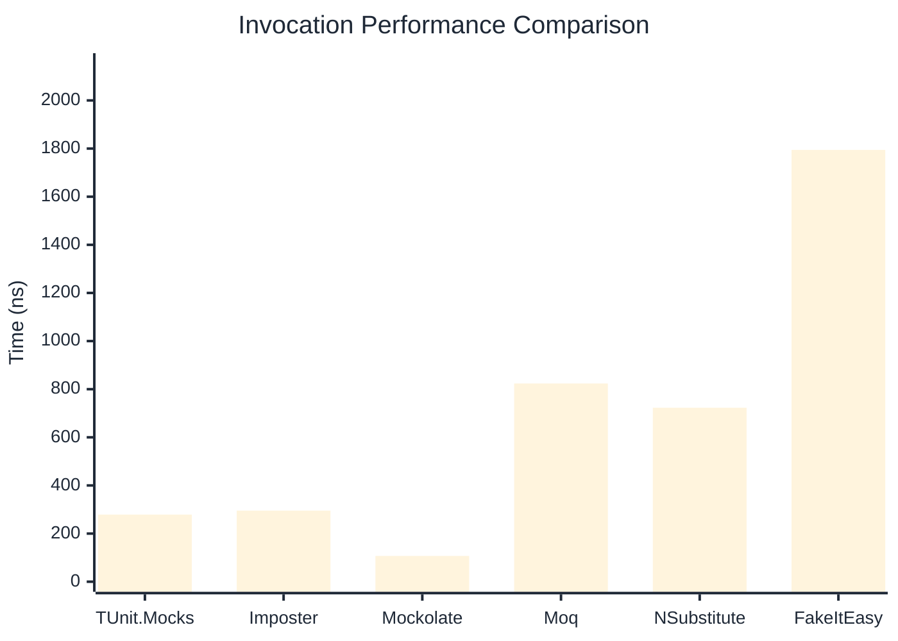

# Invocation Benchmark

> Calling methods on mock objects — comparing **TUnit.Mocks** (source-generated) against runtime proxy-based mocking libraries.

:::info Last Updated
This benchmark was automatically generated on **2026-08-09** from the latest CI run.

**Environment:** Ubuntu Latest • .NET SDK 10.0.302
:::

## 📊 Results

Calling methods on mock objects:

| Library | Mean | Error | StdDev | Allocated |
|---------|------|-------|--------|-----------|
| **TUnit.Mocks** | 278.98 ns | 100.15 ns | 5.490 ns | 128 B |
| Imposter | 295.43 ns | 102.58 ns | 5.623 ns | 168 B |
| Mockolate | 107.08 ns | 39.43 ns | 2.162 ns | 84 B |
| Moq | 823.66 ns | 61.62 ns | 3.378 ns | 376 B |
| NSubstitute | 722.95 ns | 161.88 ns | 8.873 ns | 304 B |
| FakeItEasy | 1,794.39 ns | 374.06 ns | 20.503 ns | 944 B |

```mermaid
%%{init: {
  'theme':'base',
  'themeVariables': {
    'primaryColor': '#2563eb',
    'primaryTextColor': '#1f2937',
    'primaryBorderColor': '#1e40af',
    'lineColor': '#6b7280',
    'secondaryColor': '#7c3aed',
    'tertiaryColor': '#dc2626',
    'background': '#ffffff',
    'pie1': '#2563eb',
    'pie2': '#7c3aed',
    'pie3': '#dc2626',
    'pie4': '#f59e0b',
    'pie5': '#10b981',
    'pie6': '#06b6d4',
    'pie7': '#ec4899',
    'pie8': '#6366f1'
  }
}}%%
xychart-beta
  title "Invocation Performance Comparison"
  x-axis ["TUnit.Mocks", "Imposter", "Mockolate", "Moq", "NSubstitute", "FakeItEasy"]
  y-axis "Time (ns)" 0 --> 2154
  bar [278.98, 295.43, 107.08, 823.66, 722.95, 1794.39]
```

---

### String

| Library | Mean | Error | StdDev | Allocated |
|---------|------|-------|--------|-----------|
| **TUnit.Mocks** | 166.28 ns | 74.56 ns | 4.087 ns | 96 B |
| Imposter | 301.58 ns | 74.85 ns | 4.103 ns | 168 B |
| Mockolate | 99.12 ns | 25.15 ns | 1.378 ns | 60 B |
| Moq | 573.48 ns | 183.22 ns | 10.043 ns | 296 B |
| NSubstitute | 660.88 ns | 235.83 ns | 12.927 ns | 272 B |
| FakeItEasy | 1,677.56 ns | 180.80 ns | 9.910 ns | 776 B |

```mermaid
%%{init: {
  'theme':'base',
  'themeVariables': {
    'primaryColor': '#2563eb',
    'primaryTextColor': '#1f2937',
    'primaryBorderColor': '#1e40af',
    'lineColor': '#6b7280',
    'secondaryColor': '#7c3aed',
    'tertiaryColor': '#dc2626',
    'background': '#ffffff',
    'pie1': '#2563eb',
    'pie2': '#7c3aed',
    'pie3': '#dc2626',
    'pie4': '#f59e0b',
    'pie5': '#10b981',
    'pie6': '#06b6d4',
    'pie7': '#ec4899',
    'pie8': '#6366f1'
  }
}}%%
xychart-beta
  title "Invocation (String) Performance Comparison"
  x-axis ["TUnit.Mocks", "Imposter", "Mockolate", "Moq", "NSubstitute", "FakeItEasy"]
  y-axis "Time (ns)" 0 --> 2014
  bar [166.28, 301.58, 99.12, 573.48, 660.88, 1677.56]
```

---

### 100 calls

| Library | Mean | Error | StdDev | Allocated |
|---------|------|-------|--------|-----------|
| **TUnit.Mocks** | 28,012.03 ns | 14,418.30 ns | 790.316 ns | 12736 B |
| Imposter | 30,301.44 ns | 8,409.07 ns | 460.930 ns | 16800 B |
| Mockolate | 11,845.57 ns | 4,495.45 ns | 246.411 ns | 8400 B |
| Moq | 86,814.61 ns | 35,464.72 ns | 1,943.941 ns | 37600 B |
| NSubstitute | 74,072.23 ns | 9,500.99 ns | 520.781 ns | 30848 B |
| FakeItEasy | 191,167.94 ns | 17,272.06 ns | 946.740 ns | 94400 B |

```mermaid
%%{init: {
  'theme':'base',
  'themeVariables': {
    'primaryColor': '#2563eb',
    'primaryTextColor': '#1f2937',
    'primaryBorderColor': '#1e40af',
    'lineColor': '#6b7280',
    'secondaryColor': '#7c3aed',
    'tertiaryColor': '#dc2626',
    'background': '#ffffff',
    'pie1': '#2563eb',
    'pie2': '#7c3aed',
    'pie3': '#dc2626',
    'pie4': '#f59e0b',
    'pie5': '#10b981',
    'pie6': '#06b6d4',
    'pie7': '#ec4899',
    'pie8': '#6366f1'
  }
}}%%
xychart-beta
  title "Invocation (100 calls) Performance Comparison"
  x-axis ["TUnit.Mocks", "Imposter", "Mockolate", "Moq", "NSubstitute", "FakeItEasy"]
  y-axis "Time (ns)" 0 --> 229402
  bar [28012.03, 30301.44, 11845.57, 86814.61, 74072.23, 191167.94]
```

## 🎯 Key Insights

This benchmark compares **TUnit.Mocks** (source-generated) against runtime proxy-based mocking libraries for calling methods on mock objects.

---

:::note Methodology
View the [mock benchmarks overview](/docs/benchmarks/mocks) for methodology details and environment information.
:::

*Last generated: 2026-08-09T03:02:07.270Z*
