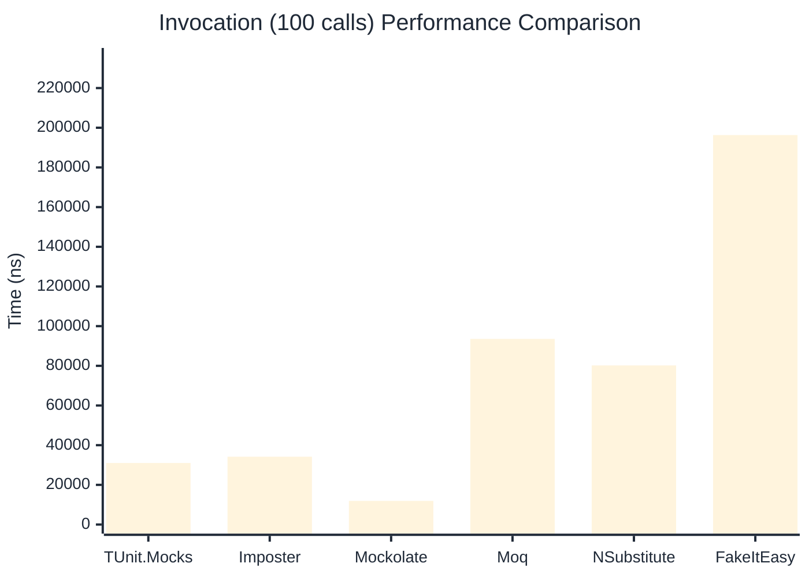

# Invocation Benchmark

> Calling methods on mock objects — comparing **TUnit.Mocks** (source-generated) against runtime proxy-based mocking libraries.

:::info Last Updated
This benchmark was automatically generated on **2026-08-27** from the latest CI run.

**Environment:** Ubuntu Latest • .NET SDK 10.0.400
:::

## 📊 Results

Calling methods on mock objects:

| Library | Mean | Error | StdDev | Allocated |
|---------|------|-------|--------|-----------|
| **TUnit.Mocks** | 309.6 ns | 74.05 ns | 4.06 ns | 128 B |
| Imposter | 348.0 ns | 93.43 ns | 5.12 ns | 168 B |
| Mockolate | 119.4 ns | 25.38 ns | 1.39 ns | 84 B |
| Moq | 898.2 ns | 142.04 ns | 7.79 ns | 376 B |
| NSubstitute | 815.5 ns | 457.77 ns | 25.09 ns | 304 B |
| FakeItEasy | 1,913.3 ns | 376.96 ns | 20.66 ns | 944 B |

```mermaid
%%{init: {
  'theme':'base',
  'themeVariables': {
    'primaryColor': '#2563eb',
    'primaryTextColor': '#1f2937',
    'primaryBorderColor': '#1e40af',
    'lineColor': '#6b7280',
    'secondaryColor': '#7c3aed',
    'tertiaryColor': '#dc2626',
    'background': '#ffffff',
    'pie1': '#2563eb',
    'pie2': '#7c3aed',
    'pie3': '#dc2626',
    'pie4': '#f59e0b',
    'pie5': '#10b981',
    'pie6': '#06b6d4',
    'pie7': '#ec4899',
    'pie8': '#6366f1'
  }
}}%%
xychart-beta
  title "Invocation Performance Comparison"
  x-axis ["TUnit.Mocks", "Imposter", "Mockolate", "Moq", "NSubstitute", "FakeItEasy"]
  y-axis "Time (ns)" 0 --> 2296
  bar [309.6, 348, 119.4, 898.2, 815.5, 1913.3]
```

---

### String

| Library | Mean | Error | StdDev | Allocated |
|---------|------|-------|--------|-----------|
| **TUnit.Mocks** | 200.9 ns | 68.53 ns | 3.76 ns | 96 B |
| Imposter | 347.6 ns | 100.04 ns | 5.48 ns | 168 B |
| Mockolate | 109.9 ns | 41.99 ns | 2.30 ns | 60 B |
| Moq | 594.2 ns | 110.64 ns | 6.06 ns | 296 B |
| NSubstitute | 695.6 ns | 232.95 ns | 12.77 ns | 272 B |
| FakeItEasy | 1,746.2 ns | 178.55 ns | 9.79 ns | 776 B |

```mermaid
%%{init: {
  'theme':'base',
  'themeVariables': {
    'primaryColor': '#2563eb',
    'primaryTextColor': '#1f2937',
    'primaryBorderColor': '#1e40af',
    'lineColor': '#6b7280',
    'secondaryColor': '#7c3aed',
    'tertiaryColor': '#dc2626',
    'background': '#ffffff',
    'pie1': '#2563eb',
    'pie2': '#7c3aed',
    'pie3': '#dc2626',
    'pie4': '#f59e0b',
    'pie5': '#10b981',
    'pie6': '#06b6d4',
    'pie7': '#ec4899',
    'pie8': '#6366f1'
  }
}}%%
xychart-beta
  title "Invocation (String) Performance Comparison"
  x-axis ["TUnit.Mocks", "Imposter", "Mockolate", "Moq", "NSubstitute", "FakeItEasy"]
  y-axis "Time (ns)" 0 --> 2096
  bar [200.9, 347.6, 109.9, 594.2, 695.6, 1746.2]
```

---

### 100 calls

| Library | Mean | Error | StdDev | Allocated |
|---------|------|-------|--------|-----------|
| **TUnit.Mocks** | 31,029.4 ns | 8,862.05 ns | 485.76 ns | 12736 B |
| Imposter | 34,187.4 ns | 8,214.07 ns | 450.24 ns | 16800 B |
| Mockolate | 11,919.1 ns | 3,611.71 ns | 197.97 ns | 8400 B |
| Moq | 93,554.9 ns | 12,325.92 ns | 675.63 ns | 37600 B |
| NSubstitute | 80,192.8 ns | 33,207.57 ns | 1,820.22 ns | 30848 B |
| FakeItEasy | 196,321.6 ns | 50,639.69 ns | 2,775.73 ns | 94400 B |

```mermaid
%%{init: {
  'theme':'base',
  'themeVariables': {
    'primaryColor': '#2563eb',
    'primaryTextColor': '#1f2937',
    'primaryBorderColor': '#1e40af',
    'lineColor': '#6b7280',
    'secondaryColor': '#7c3aed',
    'tertiaryColor': '#dc2626',
    'background': '#ffffff',
    'pie1': '#2563eb',
    'pie2': '#7c3aed',
    'pie3': '#dc2626',
    'pie4': '#f59e0b',
    'pie5': '#10b981',
    'pie6': '#06b6d4',
    'pie7': '#ec4899',
    'pie8': '#6366f1'
  }
}}%%
xychart-beta
  title "Invocation (100 calls) Performance Comparison"
  x-axis ["TUnit.Mocks", "Imposter", "Mockolate", "Moq", "NSubstitute", "FakeItEasy"]
  y-axis "Time (ns)" 0 --> 235586
  bar [31029.4, 34187.4, 11919.1, 93554.9, 80192.8, 196321.6]
```

## 🎯 Key Insights

This benchmark compares **TUnit.Mocks** (source-generated) against runtime proxy-based mocking libraries for calling methods on mock objects.

---

:::note Methodology
View the [mock benchmarks overview](/docs/benchmarks/mocks) for methodology details and environment information.
:::

*Last generated: 2026-08-27T04:05:27.840Z*
