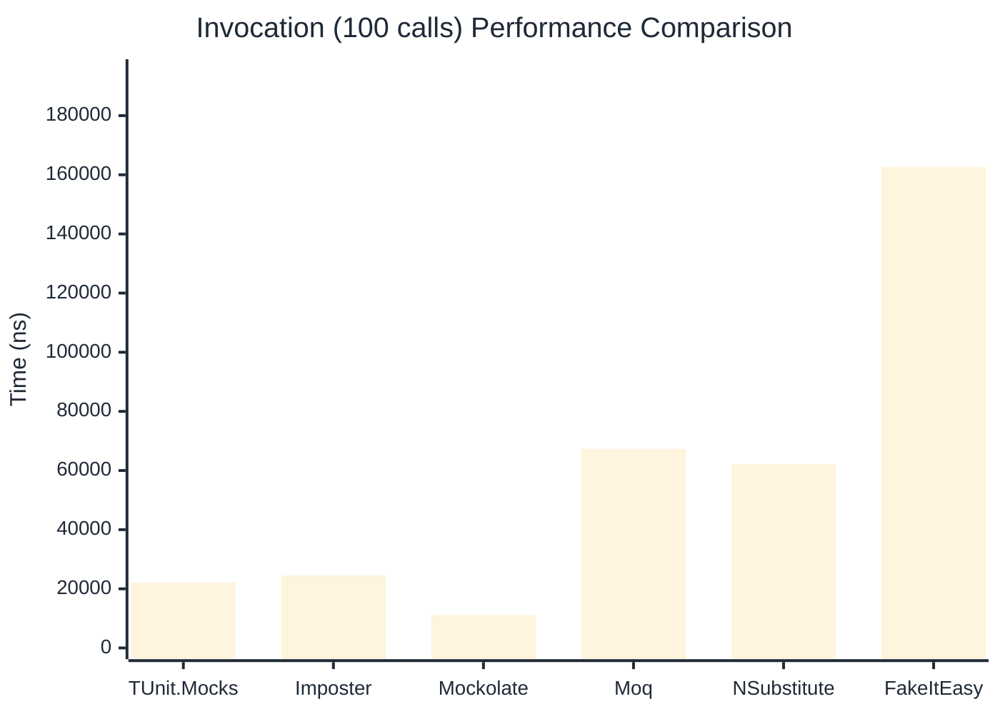

# Invocation Benchmark

> Calling methods on mock objects — comparing **TUnit.Mocks** (source-generated) against runtime proxy-based mocking libraries.

:::info Last Updated
This benchmark was automatically generated on **2026-07-25** from the latest CI run.

**Environment:** Ubuntu Latest • .NET SDK 10.0.302
:::

## 📊 Results

Calling methods on mock objects:

| Library | Mean | Error | StdDev | Allocated |
|---------|------|-------|--------|-----------|
| **TUnit.Mocks** | 224.47 ns | 59.79 ns | 3.277 ns | 128 B |
| Imposter | 245.76 ns | 16.75 ns | 0.918 ns | 168 B |
| Mockolate | 118.71 ns | 28.77 ns | 1.577 ns | 84 B |
| Moq | 695.84 ns | 218.56 ns | 11.980 ns | 376 B |
| NSubstitute | 647.57 ns | 137.43 ns | 7.533 ns | 304 B |
| FakeItEasy | 1,645.12 ns | 282.25 ns | 15.471 ns | 944 B |

```mermaid
%%{init: {
  'theme':'base',
  'themeVariables': {
    'primaryColor': '#2563eb',
    'primaryTextColor': '#1f2937',
    'primaryBorderColor': '#1e40af',
    'lineColor': '#6b7280',
    'secondaryColor': '#7c3aed',
    'tertiaryColor': '#dc2626',
    'background': '#ffffff',
    'pie1': '#2563eb',
    'pie2': '#7c3aed',
    'pie3': '#dc2626',
    'pie4': '#f59e0b',
    'pie5': '#10b981',
    'pie6': '#06b6d4',
    'pie7': '#ec4899',
    'pie8': '#6366f1'
  }
}}%%
xychart-beta
  title "Invocation Performance Comparison"
  x-axis ["TUnit.Mocks", "Imposter", "Mockolate", "Moq", "NSubstitute", "FakeItEasy"]
  y-axis "Time (ns)" 0 --> 1975
  bar [224.47, 245.76, 118.71, 695.84, 647.57, 1645.12]
```

---

### String

| Library | Mean | Error | StdDev | Allocated |
|---------|------|-------|--------|-----------|
| **TUnit.Mocks** | 137.04 ns | 54.23 ns | 2.973 ns | 96 B |
| Imposter | 242.03 ns | 29.03 ns | 1.591 ns | 168 B |
| Mockolate | 96.01 ns | 21.60 ns | 1.184 ns | 60 B |
| Moq | 467.19 ns | 242.44 ns | 13.289 ns | 296 B |
| NSubstitute | 526.42 ns | 154.56 ns | 8.472 ns | 272 B |
| FakeItEasy | 1,415.30 ns | 131.90 ns | 7.230 ns | 776 B |

```mermaid
%%{init: {
  'theme':'base',
  'themeVariables': {
    'primaryColor': '#2563eb',
    'primaryTextColor': '#1f2937',
    'primaryBorderColor': '#1e40af',
    'lineColor': '#6b7280',
    'secondaryColor': '#7c3aed',
    'tertiaryColor': '#dc2626',
    'background': '#ffffff',
    'pie1': '#2563eb',
    'pie2': '#7c3aed',
    'pie3': '#dc2626',
    'pie4': '#f59e0b',
    'pie5': '#10b981',
    'pie6': '#06b6d4',
    'pie7': '#ec4899',
    'pie8': '#6366f1'
  }
}}%%
xychart-beta
  title "Invocation (String) Performance Comparison"
  x-axis ["TUnit.Mocks", "Imposter", "Mockolate", "Moq", "NSubstitute", "FakeItEasy"]
  y-axis "Time (ns)" 0 --> 1699
  bar [137.04, 242.03, 96.01, 467.19, 526.42, 1415.3]
```

---

### 100 calls

| Library | Mean | Error | StdDev | Allocated |
|---------|------|-------|--------|-----------|
| **TUnit.Mocks** | 22,101.89 ns | 11,243.47 ns | 616.293 ns | 12736 B |
| Imposter | 24,515.09 ns | 1,104.40 ns | 60.536 ns | 16800 B |
| Mockolate | 11,135.19 ns | 17,389.21 ns | 953.161 ns | 8400 B |
| Moq | 67,274.15 ns | 16,413.46 ns | 899.677 ns | 37600 B |
| NSubstitute | 62,177.48 ns | 15,010.96 ns | 822.802 ns | 30848 B |
| FakeItEasy | 162,698.93 ns | 39,625.07 ns | 2,171.984 ns | 94400 B |

```mermaid
%%{init: {
  'theme':'base',
  'themeVariables': {
    'primaryColor': '#2563eb',
    'primaryTextColor': '#1f2937',
    'primaryBorderColor': '#1e40af',
    'lineColor': '#6b7280',
    'secondaryColor': '#7c3aed',
    'tertiaryColor': '#dc2626',
    'background': '#ffffff',
    'pie1': '#2563eb',
    'pie2': '#7c3aed',
    'pie3': '#dc2626',
    'pie4': '#f59e0b',
    'pie5': '#10b981',
    'pie6': '#06b6d4',
    'pie7': '#ec4899',
    'pie8': '#6366f1'
  }
}}%%
xychart-beta
  title "Invocation (100 calls) Performance Comparison"
  x-axis ["TUnit.Mocks", "Imposter", "Mockolate", "Moq", "NSubstitute", "FakeItEasy"]
  y-axis "Time (ns)" 0 --> 195239
  bar [22101.89, 24515.09, 11135.19, 67274.15, 62177.48, 162698.93]
```

## 🎯 Key Insights

This benchmark compares **TUnit.Mocks** (source-generated) against runtime proxy-based mocking libraries for calling methods on mock objects.

---

:::note Methodology
View the [mock benchmarks overview](/docs/benchmarks/mocks) for methodology details and environment information.
:::

*Last generated: 2026-07-25T03:20:44.831Z*
