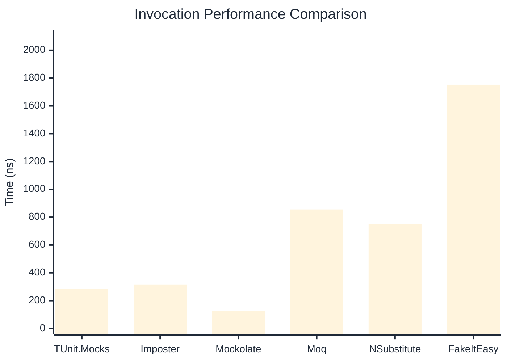

# Invocation Benchmark

> Calling methods on mock objects — comparing **TUnit.Mocks** (source-generated) against runtime proxy-based mocking libraries.

:::info Last Updated
This benchmark was automatically generated on **2026-08-02** from the latest CI run.

**Environment:** Ubuntu Latest • .NET SDK 10.0.302
:::

## 📊 Results

Calling methods on mock objects:

| Library | Mean | Error | StdDev | Allocated |
|---------|------|-------|--------|-----------|
| **TUnit.Mocks** | 284.57 ns | 102.27 ns | 5.606 ns | 128 B |
| Imposter | 316.76 ns | 87.29 ns | 4.785 ns | 168 B |
| Mockolate | 127.13 ns | 33.04 ns | 1.811 ns | 84 B |
| Moq | 855.61 ns | 98.49 ns | 5.399 ns | 376 B |
| NSubstitute | 749.47 ns | 378.68 ns | 20.757 ns | 304 B |
| FakeItEasy | 1,752.54 ns | 794.40 ns | 43.544 ns | 944 B |

```mermaid
%%{init: {
  'theme':'base',
  'themeVariables': {
    'primaryColor': '#2563eb',
    'primaryTextColor': '#1f2937',
    'primaryBorderColor': '#1e40af',
    'lineColor': '#6b7280',
    'secondaryColor': '#7c3aed',
    'tertiaryColor': '#dc2626',
    'background': '#ffffff',
    'pie1': '#2563eb',
    'pie2': '#7c3aed',
    'pie3': '#dc2626',
    'pie4': '#f59e0b',
    'pie5': '#10b981',
    'pie6': '#06b6d4',
    'pie7': '#ec4899',
    'pie8': '#6366f1'
  }
}}%%
xychart-beta
  title "Invocation Performance Comparison"
  x-axis ["TUnit.Mocks", "Imposter", "Mockolate", "Moq", "NSubstitute", "FakeItEasy"]
  y-axis "Time (ns)" 0 --> 2104
  bar [284.57, 316.76, 127.13, 855.61, 749.47, 1752.54]
```

---

### String

| Library | Mean | Error | StdDev | Allocated |
|---------|------|-------|--------|-----------|
| **TUnit.Mocks** | 164.59 ns | 71.83 ns | 3.937 ns | 96 B |
| Imposter | 292.52 ns | 87.49 ns | 4.796 ns | 168 B |
| Mockolate | 96.60 ns | 49.30 ns | 2.702 ns | 60 B |
| Moq | 519.45 ns | 113.11 ns | 6.200 ns | 296 B |
| NSubstitute | 631.47 ns | 501.84 ns | 27.507 ns | 272 B |
| FakeItEasy | 1,528.69 ns | 907.16 ns | 49.724 ns | 776 B |

```mermaid
%%{init: {
  'theme':'base',
  'themeVariables': {
    'primaryColor': '#2563eb',
    'primaryTextColor': '#1f2937',
    'primaryBorderColor': '#1e40af',
    'lineColor': '#6b7280',
    'secondaryColor': '#7c3aed',
    'tertiaryColor': '#dc2626',
    'background': '#ffffff',
    'pie1': '#2563eb',
    'pie2': '#7c3aed',
    'pie3': '#dc2626',
    'pie4': '#f59e0b',
    'pie5': '#10b981',
    'pie6': '#06b6d4',
    'pie7': '#ec4899',
    'pie8': '#6366f1'
  }
}}%%
xychart-beta
  title "Invocation (String) Performance Comparison"
  x-axis ["TUnit.Mocks", "Imposter", "Mockolate", "Moq", "NSubstitute", "FakeItEasy"]
  y-axis "Time (ns)" 0 --> 1835
  bar [164.59, 292.52, 96.6, 519.45, 631.47, 1528.69]
```

---

### 100 calls

| Library | Mean | Error | StdDev | Allocated |
|---------|------|-------|--------|-----------|
| **TUnit.Mocks** | 27,842.02 ns | 17,741.38 ns | 972.465 ns | 12736 B |
| Imposter | 30,485.14 ns | 4,878.91 ns | 267.430 ns | 16800 B |
| Mockolate | 12,371.96 ns | 10,942.91 ns | 599.818 ns | 8400 B |
| Moq | 79,583.59 ns | 19,313.67 ns | 1,058.647 ns | 37600 B |
| NSubstitute | 70,941.37 ns | 45,881.03 ns | 2,514.894 ns | 30848 B |
| FakeItEasy | 174,295.28 ns | 87,490.10 ns | 4,795.628 ns | 94400 B |

```mermaid
%%{init: {
  'theme':'base',
  'themeVariables': {
    'primaryColor': '#2563eb',
    'primaryTextColor': '#1f2937',
    'primaryBorderColor': '#1e40af',
    'lineColor': '#6b7280',
    'secondaryColor': '#7c3aed',
    'tertiaryColor': '#dc2626',
    'background': '#ffffff',
    'pie1': '#2563eb',
    'pie2': '#7c3aed',
    'pie3': '#dc2626',
    'pie4': '#f59e0b',
    'pie5': '#10b981',
    'pie6': '#06b6d4',
    'pie7': '#ec4899',
    'pie8': '#6366f1'
  }
}}%%
xychart-beta
  title "Invocation (100 calls) Performance Comparison"
  x-axis ["TUnit.Mocks", "Imposter", "Mockolate", "Moq", "NSubstitute", "FakeItEasy"]
  y-axis "Time (ns)" 0 --> 209155
  bar [27842.02, 30485.14, 12371.96, 79583.59, 70941.37, 174295.28]
```

## 🎯 Key Insights

This benchmark compares **TUnit.Mocks** (source-generated) against runtime proxy-based mocking libraries for calling methods on mock objects.

---

:::note Methodology
View the [mock benchmarks overview](/docs/benchmarks/mocks) for methodology details and environment information.
:::

*Last generated: 2026-08-02T03:23:38.806Z*
