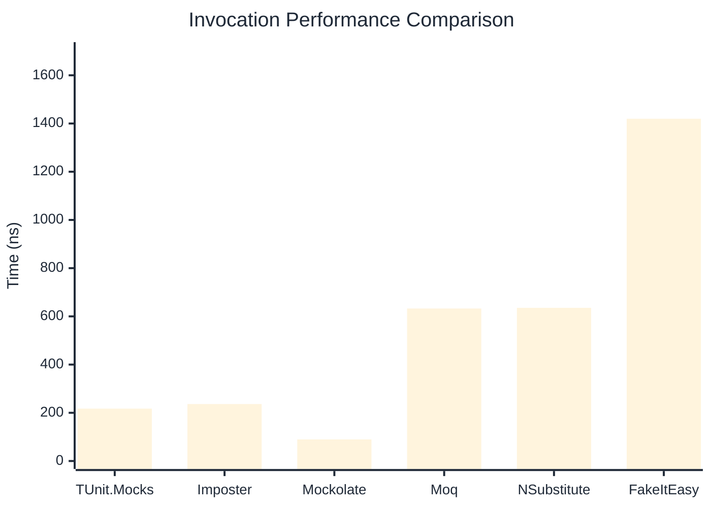

# Invocation Benchmark

> Calling methods on mock objects — comparing **TUnit.Mocks** (source-generated) against runtime proxy-based mocking libraries.

:::info Last Updated
This benchmark was automatically generated on **2026-08-28** from the latest CI run.

**Environment:** Ubuntu Latest • .NET SDK 10.0.400
:::

## 📊 Results

Calling methods on mock objects:

| Library | Mean | Error | StdDev | Allocated |
|---------|------|-------|--------|-----------|
| **TUnit.Mocks** | 217.29 ns | 20.924 ns | 1.147 ns | 128 B |
| Imposter | 236.31 ns | 4.709 ns | 0.258 ns | 168 B |
| Mockolate | 89.66 ns | 25.967 ns | 1.423 ns | 84 B |
| Moq | 632.60 ns | 132.948 ns | 7.287 ns | 376 B |
| NSubstitute | 635.44 ns | 105.732 ns | 5.796 ns | 360 B |
| FakeItEasy | 1,419.74 ns | 93.290 ns | 5.114 ns | 944 B |

```mermaid
%%{init: {
  'theme':'base',
  'themeVariables': {
    'primaryColor': '#2563eb',
    'primaryTextColor': '#1f2937',
    'primaryBorderColor': '#1e40af',
    'lineColor': '#6b7280',
    'secondaryColor': '#7c3aed',
    'tertiaryColor': '#dc2626',
    'background': '#ffffff',
    'pie1': '#2563eb',
    'pie2': '#7c3aed',
    'pie3': '#dc2626',
    'pie4': '#f59e0b',
    'pie5': '#10b981',
    'pie6': '#06b6d4',
    'pie7': '#ec4899',
    'pie8': '#6366f1'
  }
}}%%
xychart-beta
  title "Invocation Performance Comparison"
  x-axis ["TUnit.Mocks", "Imposter", "Mockolate", "Moq", "NSubstitute", "FakeItEasy"]
  y-axis "Time (ns)" 0 --> 1704
  bar [217.29, 236.31, 89.66, 632.6, 635.44, 1419.74]
```

---

### String

| Library | Mean | Error | StdDev | Allocated |
|---------|------|-------|--------|-----------|
| **TUnit.Mocks** | 135.71 ns | 59.911 ns | 3.284 ns | 96 B |
| Imposter | 237.56 ns | 37.133 ns | 2.035 ns | 168 B |
| Mockolate | 80.62 ns | 42.392 ns | 2.324 ns | 60 B |
| Moq | 431.65 ns | 90.805 ns | 4.977 ns | 296 B |
| NSubstitute | 480.06 ns | 47.278 ns | 2.591 ns | 272 B |
| FakeItEasy | 1,277.96 ns | 23.860 ns | 1.308 ns | 776 B |

```mermaid
%%{init: {
  'theme':'base',
  'themeVariables': {
    'primaryColor': '#2563eb',
    'primaryTextColor': '#1f2937',
    'primaryBorderColor': '#1e40af',
    'lineColor': '#6b7280',
    'secondaryColor': '#7c3aed',
    'tertiaryColor': '#dc2626',
    'background': '#ffffff',
    'pie1': '#2563eb',
    'pie2': '#7c3aed',
    'pie3': '#dc2626',
    'pie4': '#f59e0b',
    'pie5': '#10b981',
    'pie6': '#06b6d4',
    'pie7': '#ec4899',
    'pie8': '#6366f1'
  }
}}%%
xychart-beta
  title "Invocation (String) Performance Comparison"
  x-axis ["TUnit.Mocks", "Imposter", "Mockolate", "Moq", "NSubstitute", "FakeItEasy"]
  y-axis "Time (ns)" 0 --> 1534
  bar [135.71, 237.56, 80.62, 431.65, 480.06, 1277.96]
```

---

### 100 calls

| Library | Mean | Error | StdDev | Allocated |
|---------|------|-------|--------|-----------|
| **TUnit.Mocks** | 21,338.84 ns | 5,212.967 ns | 285.740 ns | 12736 B |
| Imposter | 25,176.85 ns | 43,321.854 ns | 2,374.617 ns | 16800 B |
| Mockolate | 8,832.94 ns | 1,811.539 ns | 99.297 ns | 8400 B |
| Moq | 61,913.09 ns | 8,433.591 ns | 462.274 ns | 37600 B |
| NSubstitute | 59,382.33 ns | 15,532.668 ns | 851.398 ns | 30848 B |
| FakeItEasy | 145,367.36 ns | 32,047.049 ns | 1,756.607 ns | 94400 B |

```mermaid
%%{init: {
  'theme':'base',
  'themeVariables': {
    'primaryColor': '#2563eb',
    'primaryTextColor': '#1f2937',
    'primaryBorderColor': '#1e40af',
    'lineColor': '#6b7280',
    'secondaryColor': '#7c3aed',
    'tertiaryColor': '#dc2626',
    'background': '#ffffff',
    'pie1': '#2563eb',
    'pie2': '#7c3aed',
    'pie3': '#dc2626',
    'pie4': '#f59e0b',
    'pie5': '#10b981',
    'pie6': '#06b6d4',
    'pie7': '#ec4899',
    'pie8': '#6366f1'
  }
}}%%
xychart-beta
  title "Invocation (100 calls) Performance Comparison"
  x-axis ["TUnit.Mocks", "Imposter", "Mockolate", "Moq", "NSubstitute", "FakeItEasy"]
  y-axis "Time (ns)" 0 --> 174441
  bar [21338.84, 25176.85, 8832.94, 61913.09, 59382.33, 145367.36]
```

## 🎯 Key Insights

This benchmark compares **TUnit.Mocks** (source-generated) against runtime proxy-based mocking libraries for calling methods on mock objects.

---

:::note Methodology
View the [mock benchmarks overview](/docs/benchmarks/mocks) for methodology details and environment information.
:::

*Last generated: 2026-08-28T05:02:48.374Z*
