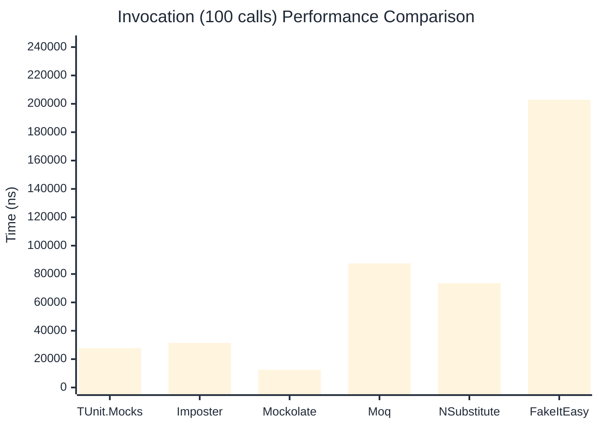

# Invocation Benchmark

> Calling methods on mock objects — comparing **TUnit.Mocks** (source-generated) against runtime proxy-based mocking libraries.

:::info Last Updated
This benchmark was automatically generated on **2026-07-31** from the latest CI run.

**Environment:** Ubuntu Latest • .NET SDK 10.0.302
:::

## 📊 Results

Calling methods on mock objects:

| Library | Mean | Error | StdDev | Allocated |
|---------|------|-------|--------|-----------|
| **TUnit.Mocks** | 282.6 ns | 145.26 ns | 7.96 ns | 128 B |
| Imposter | 305.2 ns | 38.51 ns | 2.11 ns | 168 B |
| Mockolate | 118.7 ns | 61.89 ns | 3.39 ns | 84 B |
| Moq | 852.5 ns | 144.90 ns | 7.94 ns | 376 B |
| NSubstitute | 759.7 ns | 180.77 ns | 9.91 ns | 304 B |
| FakeItEasy | 1,911.4 ns | 938.72 ns | 51.45 ns | 944 B |

```mermaid
%%{init: {
  'theme':'base',
  'themeVariables': {
    'primaryColor': '#2563eb',
    'primaryTextColor': '#1f2937',
    'primaryBorderColor': '#1e40af',
    'lineColor': '#6b7280',
    'secondaryColor': '#7c3aed',
    'tertiaryColor': '#dc2626',
    'background': '#ffffff',
    'pie1': '#2563eb',
    'pie2': '#7c3aed',
    'pie3': '#dc2626',
    'pie4': '#f59e0b',
    'pie5': '#10b981',
    'pie6': '#06b6d4',
    'pie7': '#ec4899',
    'pie8': '#6366f1'
  }
}}%%
xychart-beta
  title "Invocation Performance Comparison"
  x-axis ["TUnit.Mocks", "Imposter", "Mockolate", "Moq", "NSubstitute", "FakeItEasy"]
  y-axis "Time (ns)" 0 --> 2294
  bar [282.6, 305.2, 118.7, 852.5, 759.7, 1911.4]
```

---

### String

| Library | Mean | Error | StdDev | Allocated |
|---------|------|-------|--------|-----------|
| **TUnit.Mocks** | 168.3 ns | 64.36 ns | 3.53 ns | 96 B |
| Imposter | 308.0 ns | 64.93 ns | 3.56 ns | 168 B |
| Mockolate | 110.7 ns | 47.17 ns | 2.59 ns | 60 B |
| Moq | 609.5 ns | 231.14 ns | 12.67 ns | 296 B |
| NSubstitute | 673.2 ns | 96.84 ns | 5.31 ns | 272 B |
| FakeItEasy | 1,677.4 ns | 606.44 ns | 33.24 ns | 776 B |

```mermaid
%%{init: {
  'theme':'base',
  'themeVariables': {
    'primaryColor': '#2563eb',
    'primaryTextColor': '#1f2937',
    'primaryBorderColor': '#1e40af',
    'lineColor': '#6b7280',
    'secondaryColor': '#7c3aed',
    'tertiaryColor': '#dc2626',
    'background': '#ffffff',
    'pie1': '#2563eb',
    'pie2': '#7c3aed',
    'pie3': '#dc2626',
    'pie4': '#f59e0b',
    'pie5': '#10b981',
    'pie6': '#06b6d4',
    'pie7': '#ec4899',
    'pie8': '#6366f1'
  }
}}%%
xychart-beta
  title "Invocation (String) Performance Comparison"
  x-axis ["TUnit.Mocks", "Imposter", "Mockolate", "Moq", "NSubstitute", "FakeItEasy"]
  y-axis "Time (ns)" 0 --> 2013
  bar [168.3, 308, 110.7, 609.5, 673.2, 1677.4]
```

---

### 100 calls

| Library | Mean | Error | StdDev | Allocated |
|---------|------|-------|--------|-----------|
| **TUnit.Mocks** | 27,719.8 ns | 12,442.22 ns | 682.00 ns | 12736 B |
| Imposter | 31,426.8 ns | 4,302.40 ns | 235.83 ns | 16800 B |
| Mockolate | 12,433.9 ns | 9,535.90 ns | 522.69 ns | 8400 B |
| Moq | 87,432.9 ns | 36,379.41 ns | 1,994.08 ns | 37600 B |
| NSubstitute | 73,494.8 ns | 36,861.46 ns | 2,020.50 ns | 30848 B |
| FakeItEasy | 202,860.7 ns | 68,599.10 ns | 3,760.15 ns | 94400 B |

```mermaid
%%{init: {
  'theme':'base',
  'themeVariables': {
    'primaryColor': '#2563eb',
    'primaryTextColor': '#1f2937',
    'primaryBorderColor': '#1e40af',
    'lineColor': '#6b7280',
    'secondaryColor': '#7c3aed',
    'tertiaryColor': '#dc2626',
    'background': '#ffffff',
    'pie1': '#2563eb',
    'pie2': '#7c3aed',
    'pie3': '#dc2626',
    'pie4': '#f59e0b',
    'pie5': '#10b981',
    'pie6': '#06b6d4',
    'pie7': '#ec4899',
    'pie8': '#6366f1'
  }
}}%%
xychart-beta
  title "Invocation (100 calls) Performance Comparison"
  x-axis ["TUnit.Mocks", "Imposter", "Mockolate", "Moq", "NSubstitute", "FakeItEasy"]
  y-axis "Time (ns)" 0 --> 243433
  bar [27719.8, 31426.8, 12433.9, 87432.9, 73494.8, 202860.7]
```

## 🎯 Key Insights

This benchmark compares **TUnit.Mocks** (source-generated) against runtime proxy-based mocking libraries for calling methods on mock objects.

---

:::note Methodology
View the [mock benchmarks overview](/docs/benchmarks/mocks) for methodology details and environment information.
:::

*Last generated: 2026-07-31T03:21:39.823Z*
