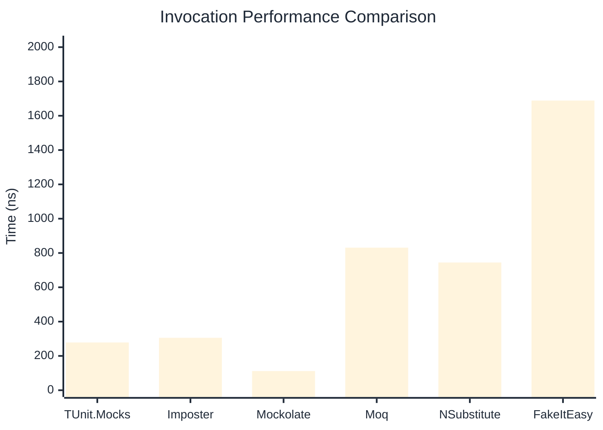
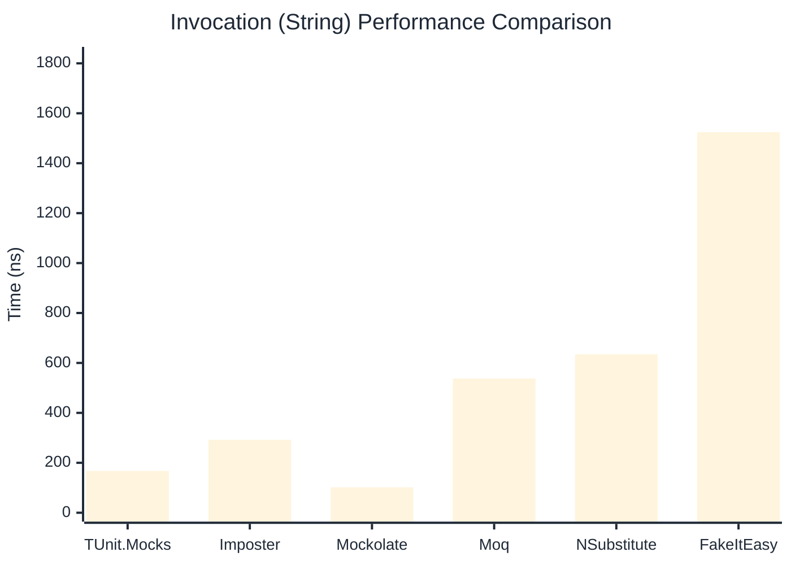

# Invocation Benchmark

> Calling methods on mock objects — comparing **TUnit.Mocks** (source-generated) against runtime proxy-based mocking libraries.

:::info Last Updated
This benchmark was automatically generated on **2026-09-26** from the latest CI run.

**Environment:** Ubuntu Latest • .NET SDK 10.0.401
:::

## 📊 Results

Calling methods on mock objects:

| Library | Mean | Error | StdDev | Allocated |
|---------|------|-------|--------|-----------|
| **TUnit.Mocks** | 278.3 ns | 64.46 ns | 3.53 ns | 128 B |
| Imposter | 305.6 ns | 56.45 ns | 3.09 ns | 168 B |
| Mockolate | 111.9 ns | 111.68 ns | 6.12 ns | 84 B |
| Moq | 831.1 ns | 149.00 ns | 8.17 ns | 376 B |
| NSubstitute | 744.5 ns | 140.97 ns | 7.73 ns | 304 B |
| FakeItEasy | 1,688.6 ns | 905.38 ns | 49.63 ns | 944 B |

```mermaid
%%{init: {
  'theme':'base',
  'themeVariables': {
    'primaryColor': '#2563eb',
    'primaryTextColor': '#1f2937',
    'primaryBorderColor': '#1e40af',
    'lineColor': '#6b7280',
    'secondaryColor': '#7c3aed',
    'tertiaryColor': '#dc2626',
    'background': '#ffffff',
    'pie1': '#2563eb',
    'pie2': '#7c3aed',
    'pie3': '#dc2626',
    'pie4': '#f59e0b',
    'pie5': '#10b981',
    'pie6': '#06b6d4',
    'pie7': '#ec4899',
    'pie8': '#6366f1'
  }
}}%%
xychart-beta
  title "Invocation Performance Comparison"
  x-axis ["TUnit.Mocks", "Imposter", "Mockolate", "Moq", "NSubstitute", "FakeItEasy"]
  y-axis "Time (ns)" 0 --> 2027
  bar [278.3, 305.6, 111.9, 831.1, 744.5, 1688.6]
```

---

### String

| Library | Mean | Error | StdDev | Allocated |
|---------|------|-------|--------|-----------|
| **TUnit.Mocks** | 167.2 ns | 75.10 ns | 4.12 ns | 96 B |
| Imposter | 291.7 ns | 84.80 ns | 4.65 ns | 168 B |
| Mockolate | 101.8 ns | 88.63 ns | 4.86 ns | 60 B |
| Moq | 537.6 ns | 324.75 ns | 17.80 ns | 296 B |
| NSubstitute | 634.4 ns | 118.04 ns | 6.47 ns | 328 B |
| FakeItEasy | 1,524.3 ns | 123.53 ns | 6.77 ns | 776 B |

```mermaid
%%{init: {
  'theme':'base',
  'themeVariables': {
    'primaryColor': '#2563eb',
    'primaryTextColor': '#1f2937',
    'primaryBorderColor': '#1e40af',
    'lineColor': '#6b7280',
    'secondaryColor': '#7c3aed',
    'tertiaryColor': '#dc2626',
    'background': '#ffffff',
    'pie1': '#2563eb',
    'pie2': '#7c3aed',
    'pie3': '#dc2626',
    'pie4': '#f59e0b',
    'pie5': '#10b981',
    'pie6': '#06b6d4',
    'pie7': '#ec4899',
    'pie8': '#6366f1'
  }
}}%%
xychart-beta
  title "Invocation (String) Performance Comparison"
  x-axis ["TUnit.Mocks", "Imposter", "Mockolate", "Moq", "NSubstitute", "FakeItEasy"]
  y-axis "Time (ns)" 0 --> 1830
  bar [167.2, 291.7, 101.8, 537.6, 634.4, 1524.3]
```

---

### 100 calls

| Library | Mean | Error | StdDev | Allocated |
|---------|------|-------|--------|-----------|
| **TUnit.Mocks** | 27,305.3 ns | 6,915.28 ns | 379.05 ns | 12736 B |
| Imposter | 28,938.2 ns | 9,098.55 ns | 498.72 ns | 16800 B |
| Mockolate | 10,132.0 ns | 2,928.97 ns | 160.55 ns | 8400 B |
| Moq | 79,508.0 ns | 22,599.20 ns | 1,238.74 ns | 37600 B |
| NSubstitute | 71,413.4 ns | 6,875.24 ns | 376.86 ns | 30848 B |
| FakeItEasy | 173,884.7 ns | 82,384.32 ns | 4,515.76 ns | 94400 B |

```mermaid
%%{init: {
  'theme':'base',
  'themeVariables': {
    'primaryColor': '#2563eb',
    'primaryTextColor': '#1f2937',
    'primaryBorderColor': '#1e40af',
    'lineColor': '#6b7280',
    'secondaryColor': '#7c3aed',
    'tertiaryColor': '#dc2626',
    'background': '#ffffff',
    'pie1': '#2563eb',
    'pie2': '#7c3aed',
    'pie3': '#dc2626',
    'pie4': '#f59e0b',
    'pie5': '#10b981',
    'pie6': '#06b6d4',
    'pie7': '#ec4899',
    'pie8': '#6366f1'
  }
}}%%
xychart-beta
  title "Invocation (100 calls) Performance Comparison"
  x-axis ["TUnit.Mocks", "Imposter", "Mockolate", "Moq", "NSubstitute", "FakeItEasy"]
  y-axis "Time (ns)" 0 --> 208662
  bar [27305.3, 28938.2, 10132, 79508, 71413.4, 173884.7]
```

## 🎯 Key Insights

This benchmark compares **TUnit.Mocks** (source-generated) against runtime proxy-based mocking libraries for calling methods on mock objects.

---

:::note Methodology
View the [mock benchmarks overview](/docs/benchmarks/mocks) for methodology details and environment information.
:::

*Last generated: 2026-09-26T02:32:00.095Z*
