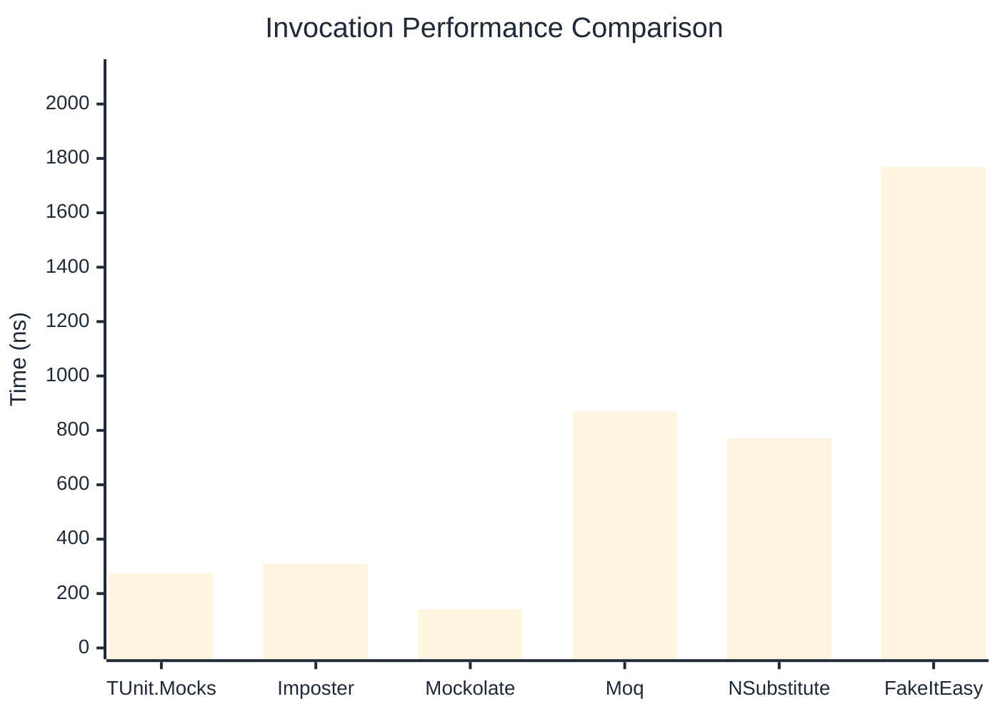
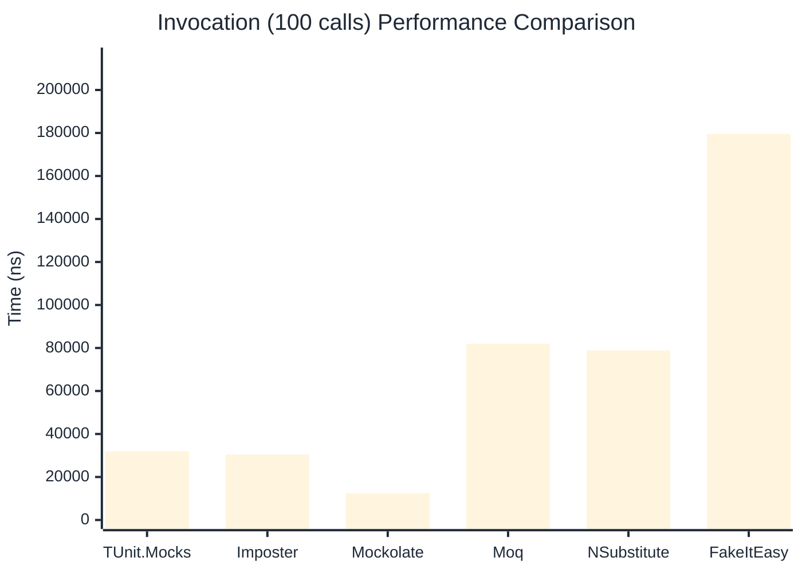

# Invocation Benchmark

> Calling methods on mock objects — comparing **TUnit.Mocks** (source-generated) against runtime proxy-based mocking libraries.

:::info Last Updated
This benchmark was automatically generated on **2026-09-01** from the latest CI run.

**Environment:** Ubuntu Latest • .NET SDK 10.0.400
:::

## 📊 Results

Calling methods on mock objects:

| Library | Mean | Error | StdDev | Allocated |
|---------|------|-------|--------|-----------|
| **TUnit.Mocks** | 274.2 ns | 93.56 ns | 5.13 ns | 128 B |
| Imposter | 309.9 ns | 91.68 ns | 5.03 ns | 168 B |
| Mockolate | 142.4 ns | 139.77 ns | 7.66 ns | 84 B |
| Moq | 870.9 ns | 140.36 ns | 7.69 ns | 376 B |
| NSubstitute | 770.7 ns | 231.01 ns | 12.66 ns | 304 B |
| FakeItEasy | 1,769.1 ns | 269.73 ns | 14.78 ns | 944 B |

```mermaid
%%{init: {
  'theme':'base',
  'themeVariables': {
    'primaryColor': '#2563eb',
    'primaryTextColor': '#1f2937',
    'primaryBorderColor': '#1e40af',
    'lineColor': '#6b7280',
    'secondaryColor': '#7c3aed',
    'tertiaryColor': '#dc2626',
    'background': '#ffffff',
    'pie1': '#2563eb',
    'pie2': '#7c3aed',
    'pie3': '#dc2626',
    'pie4': '#f59e0b',
    'pie5': '#10b981',
    'pie6': '#06b6d4',
    'pie7': '#ec4899',
    'pie8': '#6366f1'
  }
}}%%
xychart-beta
  title "Invocation Performance Comparison"
  x-axis ["TUnit.Mocks", "Imposter", "Mockolate", "Moq", "NSubstitute", "FakeItEasy"]
  y-axis "Time (ns)" 0 --> 2123
  bar [274.2, 309.9, 142.4, 870.9, 770.7, 1769.1]
```

---

### String

| Library | Mean | Error | StdDev | Allocated |
|---------|------|-------|--------|-----------|
| **TUnit.Mocks** | 176.1 ns | 60.38 ns | 3.31 ns | 96 B |
| Imposter | 304.9 ns | 98.43 ns | 5.40 ns | 168 B |
| Mockolate | 106.8 ns | 122.96 ns | 6.74 ns | 60 B |
| Moq | 563.4 ns | 196.70 ns | 10.78 ns | 296 B |
| NSubstitute | 628.9 ns | 306.86 ns | 16.82 ns | 272 B |
| FakeItEasy | 1,600.1 ns | 166.40 ns | 9.12 ns | 776 B |

```mermaid
%%{init: {
  'theme':'base',
  'themeVariables': {
    'primaryColor': '#2563eb',
    'primaryTextColor': '#1f2937',
    'primaryBorderColor': '#1e40af',
    'lineColor': '#6b7280',
    'secondaryColor': '#7c3aed',
    'tertiaryColor': '#dc2626',
    'background': '#ffffff',
    'pie1': '#2563eb',
    'pie2': '#7c3aed',
    'pie3': '#dc2626',
    'pie4': '#f59e0b',
    'pie5': '#10b981',
    'pie6': '#06b6d4',
    'pie7': '#ec4899',
    'pie8': '#6366f1'
  }
}}%%
xychart-beta
  title "Invocation (String) Performance Comparison"
  x-axis ["TUnit.Mocks", "Imposter", "Mockolate", "Moq", "NSubstitute", "FakeItEasy"]
  y-axis "Time (ns)" 0 --> 1921
  bar [176.1, 304.9, 106.8, 563.4, 628.9, 1600.1]
```

---

### 100 calls

| Library | Mean | Error | StdDev | Allocated |
|---------|------|-------|--------|-----------|
| **TUnit.Mocks** | 31,947.0 ns | 14,404.44 ns | 789.56 ns | 13248 B |
| Imposter | 30,420.7 ns | 9,117.27 ns | 499.75 ns | 16800 B |
| Mockolate | 12,490.4 ns | 3,798.92 ns | 208.23 ns | 8400 B |
| Moq | 82,006.8 ns | 41,061.60 ns | 2,250.72 ns | 37600 B |
| NSubstitute | 78,883.0 ns | 29,989.24 ns | 1,643.81 ns | 36448 B |
| FakeItEasy | 179,586.0 ns | 77,230.69 ns | 4,233.27 ns | 94400 B |

```mermaid
%%{init: {
  'theme':'base',
  'themeVariables': {
    'primaryColor': '#2563eb',
    'primaryTextColor': '#1f2937',
    'primaryBorderColor': '#1e40af',
    'lineColor': '#6b7280',
    'secondaryColor': '#7c3aed',
    'tertiaryColor': '#dc2626',
    'background': '#ffffff',
    'pie1': '#2563eb',
    'pie2': '#7c3aed',
    'pie3': '#dc2626',
    'pie4': '#f59e0b',
    'pie5': '#10b981',
    'pie6': '#06b6d4',
    'pie7': '#ec4899',
    'pie8': '#6366f1'
  }
}}%%
xychart-beta
  title "Invocation (100 calls) Performance Comparison"
  x-axis ["TUnit.Mocks", "Imposter", "Mockolate", "Moq", "NSubstitute", "FakeItEasy"]
  y-axis "Time (ns)" 0 --> 215504
  bar [31947, 30420.7, 12490.4, 82006.8, 78883, 179586]
```

## 🎯 Key Insights

This benchmark compares **TUnit.Mocks** (source-generated) against runtime proxy-based mocking libraries for calling methods on mock objects.

---

:::note Methodology
View the [mock benchmarks overview](/docs/benchmarks/mocks) for methodology details and environment information.
:::

*Last generated: 2026-09-01T02:34:33.391Z*
