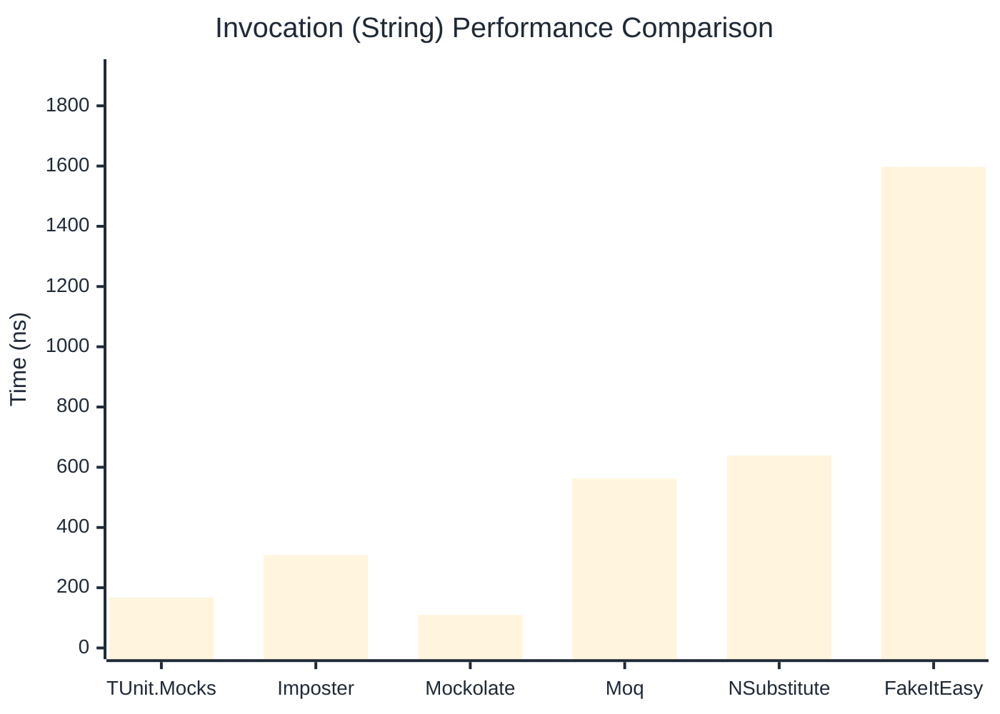

# Invocation Benchmark

> Calling methods on mock objects — comparing **TUnit.Mocks** (source-generated) against runtime proxy-based mocking libraries.

:::info Last Updated
This benchmark was automatically generated on **2026-07-29** from the latest CI run.

**Environment:** Ubuntu Latest • .NET SDK 10.0.302
:::

## 📊 Results

Calling methods on mock objects:

| Library | Mean | Error | StdDev | Allocated |
|---------|------|-------|--------|-----------|
| **TUnit.Mocks** | 281.6 ns | 94.48 ns | 5.18 ns | 128 B |
| Imposter | 309.4 ns | 88.98 ns | 4.88 ns | 168 B |
| Mockolate | 119.1 ns | 63.68 ns | 3.49 ns | 84 B |
| Moq | 889.7 ns | 244.17 ns | 13.38 ns | 376 B |
| NSubstitute | 775.8 ns | 190.68 ns | 10.45 ns | 304 B |
| FakeItEasy | 1,829.1 ns | 408.10 ns | 22.37 ns | 944 B |

```mermaid
%%{init: {
  'theme':'base',
  'themeVariables': {
    'primaryColor': '#2563eb',
    'primaryTextColor': '#1f2937',
    'primaryBorderColor': '#1e40af',
    'lineColor': '#6b7280',
    'secondaryColor': '#7c3aed',
    'tertiaryColor': '#dc2626',
    'background': '#ffffff',
    'pie1': '#2563eb',
    'pie2': '#7c3aed',
    'pie3': '#dc2626',
    'pie4': '#f59e0b',
    'pie5': '#10b981',
    'pie6': '#06b6d4',
    'pie7': '#ec4899',
    'pie8': '#6366f1'
  }
}}%%
xychart-beta
  title "Invocation Performance Comparison"
  x-axis ["TUnit.Mocks", "Imposter", "Mockolate", "Moq", "NSubstitute", "FakeItEasy"]
  y-axis "Time (ns)" 0 --> 2195
  bar [281.6, 309.4, 119.1, 889.7, 775.8, 1829.1]
```

---

### String

| Library | Mean | Error | StdDev | Allocated |
|---------|------|-------|--------|-----------|
| **TUnit.Mocks** | 167.0 ns | 65.15 ns | 3.57 ns | 96 B |
| Imposter | 308.8 ns | 70.03 ns | 3.84 ns | 168 B |
| Mockolate | 109.5 ns | 45.62 ns | 2.50 ns | 60 B |
| Moq | 562.8 ns | 111.22 ns | 6.10 ns | 296 B |
| NSubstitute | 639.0 ns | 153.63 ns | 8.42 ns | 272 B |
| FakeItEasy | 1,597.4 ns | 378.07 ns | 20.72 ns | 776 B |

```mermaid
%%{init: {
  'theme':'base',
  'themeVariables': {
    'primaryColor': '#2563eb',
    'primaryTextColor': '#1f2937',
    'primaryBorderColor': '#1e40af',
    'lineColor': '#6b7280',
    'secondaryColor': '#7c3aed',
    'tertiaryColor': '#dc2626',
    'background': '#ffffff',
    'pie1': '#2563eb',
    'pie2': '#7c3aed',
    'pie3': '#dc2626',
    'pie4': '#f59e0b',
    'pie5': '#10b981',
    'pie6': '#06b6d4',
    'pie7': '#ec4899',
    'pie8': '#6366f1'
  }
}}%%
xychart-beta
  title "Invocation (String) Performance Comparison"
  x-axis ["TUnit.Mocks", "Imposter", "Mockolate", "Moq", "NSubstitute", "FakeItEasy"]
  y-axis "Time (ns)" 0 --> 1917
  bar [167, 308.8, 109.5, 562.8, 639, 1597.4]
```

---

### 100 calls

| Library | Mean | Error | StdDev | Allocated |
|---------|------|-------|--------|-----------|
| **TUnit.Mocks** | 27,271.6 ns | 10,721.37 ns | 587.67 ns | 12736 B |
| Imposter | 28,912.2 ns | 10,544.91 ns | 578.00 ns | 16800 B |
| Mockolate | 10,501.8 ns | 6,376.12 ns | 349.50 ns | 8400 B |
| Moq | 81,033.1 ns | 64,912.60 ns | 3,558.08 ns | 37600 B |
| NSubstitute | 69,833.7 ns | 4,230.23 ns | 231.87 ns | 30848 B |
| FakeItEasy | 180,610.0 ns | 216,901.66 ns | 11,889.11 ns | 94400 B |

```mermaid
%%{init: {
  'theme':'base',
  'themeVariables': {
    'primaryColor': '#2563eb',
    'primaryTextColor': '#1f2937',
    'primaryBorderColor': '#1e40af',
    'lineColor': '#6b7280',
    'secondaryColor': '#7c3aed',
    'tertiaryColor': '#dc2626',
    'background': '#ffffff',
    'pie1': '#2563eb',
    'pie2': '#7c3aed',
    'pie3': '#dc2626',
    'pie4': '#f59e0b',
    'pie5': '#10b981',
    'pie6': '#06b6d4',
    'pie7': '#ec4899',
    'pie8': '#6366f1'
  }
}}%%
xychart-beta
  title "Invocation (100 calls) Performance Comparison"
  x-axis ["TUnit.Mocks", "Imposter", "Mockolate", "Moq", "NSubstitute", "FakeItEasy"]
  y-axis "Time (ns)" 0 --> 216732
  bar [27271.6, 28912.2, 10501.8, 81033.1, 69833.7, 180610]
```

## 🎯 Key Insights

This benchmark compares **TUnit.Mocks** (source-generated) against runtime proxy-based mocking libraries for calling methods on mock objects.

---

:::note Methodology
View the [mock benchmarks overview](/docs/benchmarks/mocks) for methodology details and environment information.
:::

*Last generated: 2026-07-29T03:20:13.661Z*
