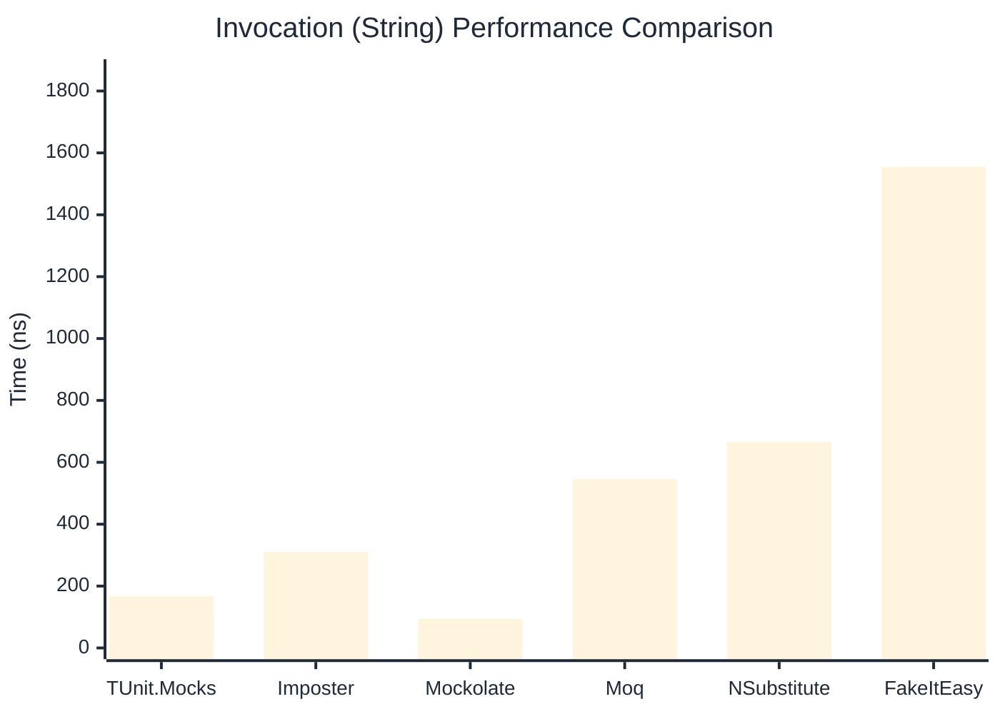

# Invocation Benchmark

> Calling methods on mock objects — comparing **TUnit.Mocks** (source-generated) against runtime proxy-based mocking libraries.

:::info Last Updated
This benchmark was automatically generated on **2026-08-30** from the latest CI run.

**Environment:** Ubuntu Latest • .NET SDK 10.0.400
:::

## 📊 Results

Calling methods on mock objects:

| Library | Mean | Error | StdDev | Allocated |
|---------|------|-------|--------|-----------|
| **TUnit.Mocks** | 276.88 ns | 158.69 ns | 8.699 ns | 128 B |
| Imposter | 296.02 ns | 181.52 ns | 9.950 ns | 168 B |
| Mockolate | 102.02 ns | 10.27 ns | 0.563 ns | 84 B |
| Moq | 810.93 ns | 344.84 ns | 18.902 ns | 376 B |
| NSubstitute | 732.70 ns | 307.35 ns | 16.847 ns | 304 B |
| FakeItEasy | 1,928.71 ns | 210.74 ns | 11.551 ns | 944 B |

```mermaid
%%{init: {
  'theme':'base',
  'themeVariables': {
    'primaryColor': '#2563eb',
    'primaryTextColor': '#1f2937',
    'primaryBorderColor': '#1e40af',
    'lineColor': '#6b7280',
    'secondaryColor': '#7c3aed',
    'tertiaryColor': '#dc2626',
    'background': '#ffffff',
    'pie1': '#2563eb',
    'pie2': '#7c3aed',
    'pie3': '#dc2626',
    'pie4': '#f59e0b',
    'pie5': '#10b981',
    'pie6': '#06b6d4',
    'pie7': '#ec4899',
    'pie8': '#6366f1'
  }
}}%%
xychart-beta
  title "Invocation Performance Comparison"
  x-axis ["TUnit.Mocks", "Imposter", "Mockolate", "Moq", "NSubstitute", "FakeItEasy"]
  y-axis "Time (ns)" 0 --> 2315
  bar [276.88, 296.02, 102.02, 810.93, 732.7, 1928.71]
```

---

### String

| Library | Mean | Error | StdDev | Allocated |
|---------|------|-------|--------|-----------|
| **TUnit.Mocks** | 166.94 ns | 85.61 ns | 4.692 ns | 96 B |
| Imposter | 309.84 ns | 97.70 ns | 5.355 ns | 168 B |
| Mockolate | 94.48 ns | 24.58 ns | 1.348 ns | 60 B |
| Moq | 545.99 ns | 223.48 ns | 12.250 ns | 296 B |
| NSubstitute | 664.69 ns | 272.77 ns | 14.951 ns | 272 B |
| FakeItEasy | 1,554.76 ns | 705.61 ns | 38.677 ns | 776 B |

```mermaid
%%{init: {
  'theme':'base',
  'themeVariables': {
    'primaryColor': '#2563eb',
    'primaryTextColor': '#1f2937',
    'primaryBorderColor': '#1e40af',
    'lineColor': '#6b7280',
    'secondaryColor': '#7c3aed',
    'tertiaryColor': '#dc2626',
    'background': '#ffffff',
    'pie1': '#2563eb',
    'pie2': '#7c3aed',
    'pie3': '#dc2626',
    'pie4': '#f59e0b',
    'pie5': '#10b981',
    'pie6': '#06b6d4',
    'pie7': '#ec4899',
    'pie8': '#6366f1'
  }
}}%%
xychart-beta
  title "Invocation (String) Performance Comparison"
  x-axis ["TUnit.Mocks", "Imposter", "Mockolate", "Moq", "NSubstitute", "FakeItEasy"]
  y-axis "Time (ns)" 0 --> 1866
  bar [166.94, 309.84, 94.48, 545.99, 664.69, 1554.76]
```

---

### 100 calls

| Library | Mean | Error | StdDev | Allocated |
|---------|------|-------|--------|-----------|
| **TUnit.Mocks** | 27,128.48 ns | 10,234.60 ns | 560.993 ns | 12736 B |
| Imposter | 29,301.52 ns | 7,532.87 ns | 412.902 ns | 16800 B |
| Mockolate | 10,497.08 ns | 2,326.71 ns | 127.535 ns | 8400 B |
| Moq | 86,211.47 ns | 12,207.78 ns | 669.149 ns | 37600 B |
| NSubstitute | 74,233.13 ns | 4,699.05 ns | 257.571 ns | 30848 B |
| FakeItEasy | 183,034.66 ns | 116,281.52 ns | 6,373.782 ns | 94400 B |

```mermaid
%%{init: {
  'theme':'base',
  'themeVariables': {
    'primaryColor': '#2563eb',
    'primaryTextColor': '#1f2937',
    'primaryBorderColor': '#1e40af',
    'lineColor': '#6b7280',
    'secondaryColor': '#7c3aed',
    'tertiaryColor': '#dc2626',
    'background': '#ffffff',
    'pie1': '#2563eb',
    'pie2': '#7c3aed',
    'pie3': '#dc2626',
    'pie4': '#f59e0b',
    'pie5': '#10b981',
    'pie6': '#06b6d4',
    'pie7': '#ec4899',
    'pie8': '#6366f1'
  }
}}%%
xychart-beta
  title "Invocation (100 calls) Performance Comparison"
  x-axis ["TUnit.Mocks", "Imposter", "Mockolate", "Moq", "NSubstitute", "FakeItEasy"]
  y-axis "Time (ns)" 0 --> 219642
  bar [27128.48, 29301.52, 10497.08, 86211.47, 74233.13, 183034.66]
```

## 🎯 Key Insights

This benchmark compares **TUnit.Mocks** (source-generated) against runtime proxy-based mocking libraries for calling methods on mock objects.

---

:::note Methodology
View the [mock benchmarks overview](/docs/benchmarks/mocks) for methodology details and environment information.
:::

*Last generated: 2026-08-30T02:44:44.759Z*
