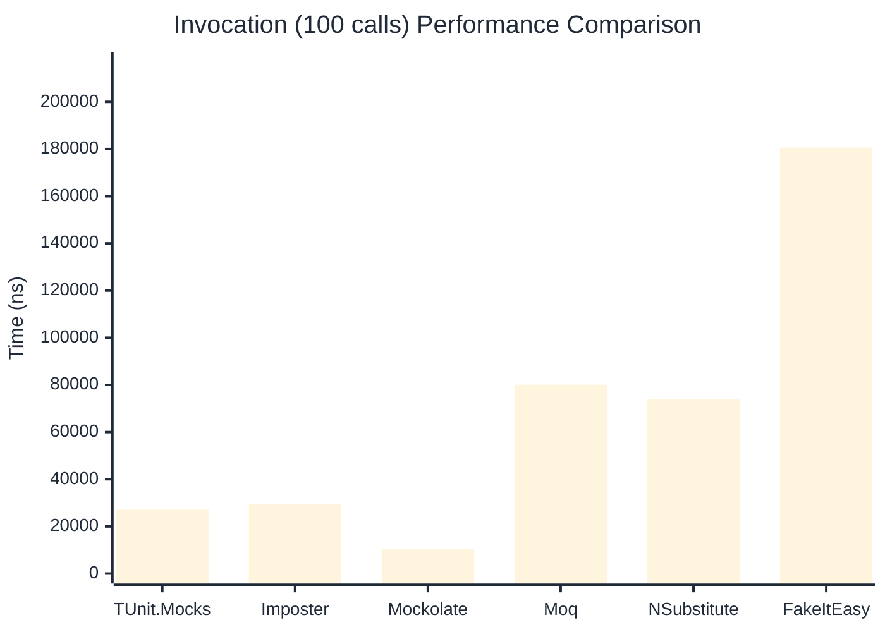

# Invocation Benchmark

> Calling methods on mock objects — comparing **TUnit.Mocks** (source-generated) against runtime proxy-based mocking libraries.

:::info Last Updated
This benchmark was automatically generated on **2026-08-24** from the latest CI run.

**Environment:** Ubuntu Latest • .NET SDK 10.0.400
:::

## 📊 Results

Calling methods on mock objects:

| Library | Mean | Error | StdDev | Allocated |
|---------|------|-------|--------|-----------|
| **TUnit.Mocks** | 272.45 ns | 75.77 ns | 4.153 ns | 128 B |
| Imposter | 290.68 ns | 63.53 ns | 3.482 ns | 168 B |
| Mockolate | 107.48 ns | 71.94 ns | 3.943 ns | 84 B |
| Moq | 825.07 ns | 272.41 ns | 14.932 ns | 376 B |
| NSubstitute | 707.78 ns | 193.02 ns | 10.580 ns | 304 B |
| FakeItEasy | 1,734.81 ns | 204.30 ns | 11.198 ns | 944 B |

```mermaid
%%{init: {
  'theme':'base',
  'themeVariables': {
    'primaryColor': '#2563eb',
    'primaryTextColor': '#1f2937',
    'primaryBorderColor': '#1e40af',
    'lineColor': '#6b7280',
    'secondaryColor': '#7c3aed',
    'tertiaryColor': '#dc2626',
    'background': '#ffffff',
    'pie1': '#2563eb',
    'pie2': '#7c3aed',
    'pie3': '#dc2626',
    'pie4': '#f59e0b',
    'pie5': '#10b981',
    'pie6': '#06b6d4',
    'pie7': '#ec4899',
    'pie8': '#6366f1'
  }
}}%%
xychart-beta
  title "Invocation Performance Comparison"
  x-axis ["TUnit.Mocks", "Imposter", "Mockolate", "Moq", "NSubstitute", "FakeItEasy"]
  y-axis "Time (ns)" 0 --> 2082
  bar [272.45, 290.68, 107.48, 825.07, 707.78, 1734.81]
```

---

### String

| Library | Mean | Error | StdDev | Allocated |
|---------|------|-------|--------|-----------|
| **TUnit.Mocks** | 166.51 ns | 72.61 ns | 3.980 ns | 96 B |
| Imposter | 291.14 ns | 88.90 ns | 4.873 ns | 168 B |
| Mockolate | 97.53 ns | 49.61 ns | 2.719 ns | 60 B |
| Moq | 543.50 ns | 245.10 ns | 13.435 ns | 296 B |
| NSubstitute | 610.89 ns | 202.49 ns | 11.099 ns | 272 B |
| FakeItEasy | 1,545.20 ns | 112.26 ns | 6.153 ns | 776 B |

```mermaid
%%{init: {
  'theme':'base',
  'themeVariables': {
    'primaryColor': '#2563eb',
    'primaryTextColor': '#1f2937',
    'primaryBorderColor': '#1e40af',
    'lineColor': '#6b7280',
    'secondaryColor': '#7c3aed',
    'tertiaryColor': '#dc2626',
    'background': '#ffffff',
    'pie1': '#2563eb',
    'pie2': '#7c3aed',
    'pie3': '#dc2626',
    'pie4': '#f59e0b',
    'pie5': '#10b981',
    'pie6': '#06b6d4',
    'pie7': '#ec4899',
    'pie8': '#6366f1'
  }
}}%%
xychart-beta
  title "Invocation (String) Performance Comparison"
  x-axis ["TUnit.Mocks", "Imposter", "Mockolate", "Moq", "NSubstitute", "FakeItEasy"]
  y-axis "Time (ns)" 0 --> 1855
  bar [166.51, 291.14, 97.53, 543.5, 610.89, 1545.2]
```

---

### 100 calls

| Library | Mean | Error | StdDev | Allocated |
|---------|------|-------|--------|-----------|
| **TUnit.Mocks** | 27,119.77 ns | 7,353.58 ns | 403.075 ns | 12736 B |
| Imposter | 29,375.44 ns | 8,038.29 ns | 440.606 ns | 16800 B |
| Mockolate | 10,307.65 ns | 3,281.68 ns | 179.880 ns | 8400 B |
| Moq | 80,072.10 ns | 8,608.29 ns | 471.850 ns | 37600 B |
| NSubstitute | 73,798.98 ns | 13,640.65 ns | 747.690 ns | 30848 B |
| FakeItEasy | 180,604.71 ns | 65,636.90 ns | 3,597.780 ns | 94400 B |

```mermaid
%%{init: {
  'theme':'base',
  'themeVariables': {
    'primaryColor': '#2563eb',
    'primaryTextColor': '#1f2937',
    'primaryBorderColor': '#1e40af',
    'lineColor': '#6b7280',
    'secondaryColor': '#7c3aed',
    'tertiaryColor': '#dc2626',
    'background': '#ffffff',
    'pie1': '#2563eb',
    'pie2': '#7c3aed',
    'pie3': '#dc2626',
    'pie4': '#f59e0b',
    'pie5': '#10b981',
    'pie6': '#06b6d4',
    'pie7': '#ec4899',
    'pie8': '#6366f1'
  }
}}%%
xychart-beta
  title "Invocation (100 calls) Performance Comparison"
  x-axis ["TUnit.Mocks", "Imposter", "Mockolate", "Moq", "NSubstitute", "FakeItEasy"]
  y-axis "Time (ns)" 0 --> 216726
  bar [27119.77, 29375.44, 10307.65, 80072.1, 73798.98, 180604.71]
```

## 🎯 Key Insights

This benchmark compares **TUnit.Mocks** (source-generated) against runtime proxy-based mocking libraries for calling methods on mock objects.

---

:::note Methodology
View the [mock benchmarks overview](/docs/benchmarks/mocks) for methodology details and environment information.
:::

*Last generated: 2026-08-24T02:46:06.016Z*
