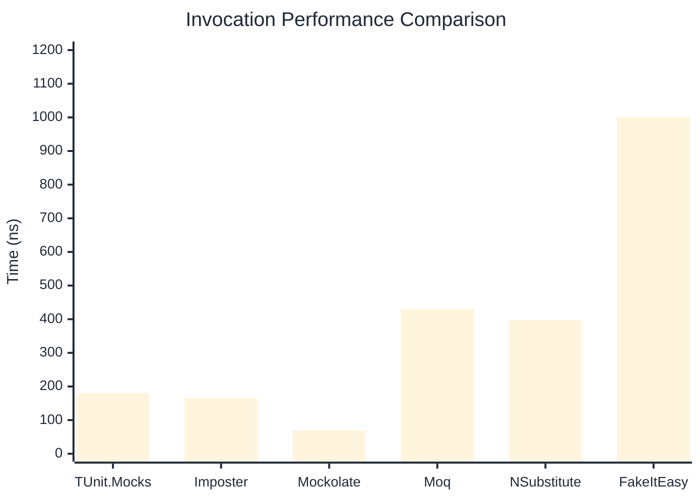
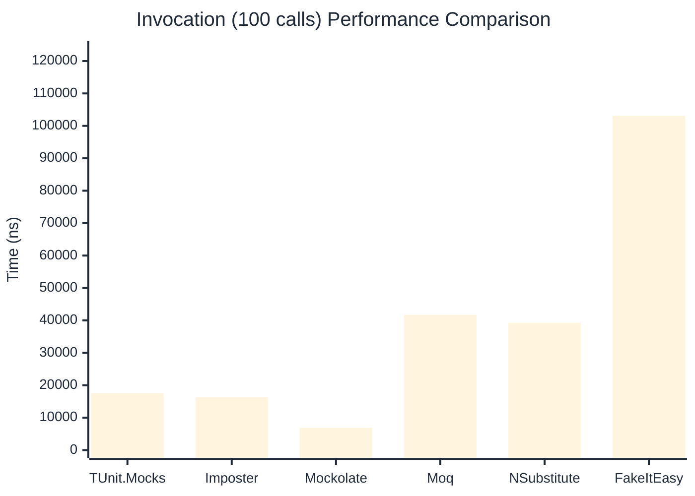

# Invocation Benchmark

> Calling methods on mock objects — comparing **TUnit.Mocks** (source-generated) against runtime proxy-based mocking libraries.

:::info Last Updated
This benchmark was automatically generated on **2026-08-18** from the latest CI run.

**Environment:** Ubuntu Latest • .NET SDK 10.0.400
:::

## 📊 Results

Calling methods on mock objects:

| Library | Mean | Error | StdDev | Allocated |
|---------|------|-------|--------|-----------|
| **TUnit.Mocks** | 179.60 ns | 61.019 ns | 3.345 ns | 128 B |
| Imposter | 165.10 ns | 7.917 ns | 0.434 ns | 168 B |
| Mockolate | 69.37 ns | 50.267 ns | 2.755 ns | 84 B |
| Moq | 430.67 ns | 343.778 ns | 18.844 ns | 376 B |
| NSubstitute | 397.10 ns | 14.298 ns | 0.784 ns | 304 B |
| FakeItEasy | 1,001.48 ns | 224.078 ns | 12.282 ns | 944 B |

```mermaid
%%{init: {
  'theme':'base',
  'themeVariables': {
    'primaryColor': '#2563eb',
    'primaryTextColor': '#1f2937',
    'primaryBorderColor': '#1e40af',
    'lineColor': '#6b7280',
    'secondaryColor': '#7c3aed',
    'tertiaryColor': '#dc2626',
    'background': '#ffffff',
    'pie1': '#2563eb',
    'pie2': '#7c3aed',
    'pie3': '#dc2626',
    'pie4': '#f59e0b',
    'pie5': '#10b981',
    'pie6': '#06b6d4',
    'pie7': '#ec4899',
    'pie8': '#6366f1'
  }
}}%%
xychart-beta
  title "Invocation Performance Comparison"
  x-axis ["TUnit.Mocks", "Imposter", "Mockolate", "Moq", "NSubstitute", "FakeItEasy"]
  y-axis "Time (ns)" 0 --> 1202
  bar [179.6, 165.1, 69.37, 430.67, 397.1, 1001.48]
```

---

### String

| Library | Mean | Error | StdDev | Allocated |
|---------|------|-------|--------|-----------|
| **TUnit.Mocks** | 120.72 ns | 55.547 ns | 3.045 ns | 96 B |
| Imposter | 166.34 ns | 5.611 ns | 0.308 ns | 168 B |
| Mockolate | 61.33 ns | 17.716 ns | 0.971 ns | 60 B |
| Moq | 296.37 ns | 94.444 ns | 5.177 ns | 296 B |
| NSubstitute | 333.00 ns | 37.814 ns | 2.073 ns | 272 B |
| FakeItEasy | 930.56 ns | 187.617 ns | 10.284 ns | 776 B |

```mermaid
%%{init: {
  'theme':'base',
  'themeVariables': {
    'primaryColor': '#2563eb',
    'primaryTextColor': '#1f2937',
    'primaryBorderColor': '#1e40af',
    'lineColor': '#6b7280',
    'secondaryColor': '#7c3aed',
    'tertiaryColor': '#dc2626',
    'background': '#ffffff',
    'pie1': '#2563eb',
    'pie2': '#7c3aed',
    'pie3': '#dc2626',
    'pie4': '#f59e0b',
    'pie5': '#10b981',
    'pie6': '#06b6d4',
    'pie7': '#ec4899',
    'pie8': '#6366f1'
  }
}}%%
xychart-beta
  title "Invocation (String) Performance Comparison"
  x-axis ["TUnit.Mocks", "Imposter", "Mockolate", "Moq", "NSubstitute", "FakeItEasy"]
  y-axis "Time (ns)" 0 --> 1117
  bar [120.72, 166.34, 61.33, 296.37, 333, 930.56]
```

---

### 100 calls

| Library | Mean | Error | StdDev | Allocated |
|---------|------|-------|--------|-----------|
| **TUnit.Mocks** | 17,589.62 ns | 5,619.319 ns | 308.014 ns | 12736 B |
| Imposter | 16,396.96 ns | 1,122.206 ns | 61.512 ns | 16800 B |
| Mockolate | 6,853.72 ns | 2,197.338 ns | 120.444 ns | 8400 B |
| Moq | 41,704.28 ns | 6,101.535 ns | 334.446 ns | 37600 B |
| NSubstitute | 39,271.66 ns | 5,610.566 ns | 307.534 ns | 30848 B |
| FakeItEasy | 103,071.39 ns | 51,755.101 ns | 2,836.872 ns | 94400 B |

```mermaid
%%{init: {
  'theme':'base',
  'themeVariables': {
    'primaryColor': '#2563eb',
    'primaryTextColor': '#1f2937',
    'primaryBorderColor': '#1e40af',
    'lineColor': '#6b7280',
    'secondaryColor': '#7c3aed',
    'tertiaryColor': '#dc2626',
    'background': '#ffffff',
    'pie1': '#2563eb',
    'pie2': '#7c3aed',
    'pie3': '#dc2626',
    'pie4': '#f59e0b',
    'pie5': '#10b981',
    'pie6': '#06b6d4',
    'pie7': '#ec4899',
    'pie8': '#6366f1'
  }
}}%%
xychart-beta
  title "Invocation (100 calls) Performance Comparison"
  x-axis ["TUnit.Mocks", "Imposter", "Mockolate", "Moq", "NSubstitute", "FakeItEasy"]
  y-axis "Time (ns)" 0 --> 123686
  bar [17589.62, 16396.96, 6853.72, 41704.28, 39271.66, 103071.39]
```

## 🎯 Key Insights

This benchmark compares **TUnit.Mocks** (source-generated) against runtime proxy-based mocking libraries for calling methods on mock objects.

---

:::note Methodology
View the [mock benchmarks overview](/docs/benchmarks/mocks) for methodology details and environment information.
:::

*Last generated: 2026-08-18T02:39:29.373Z*
