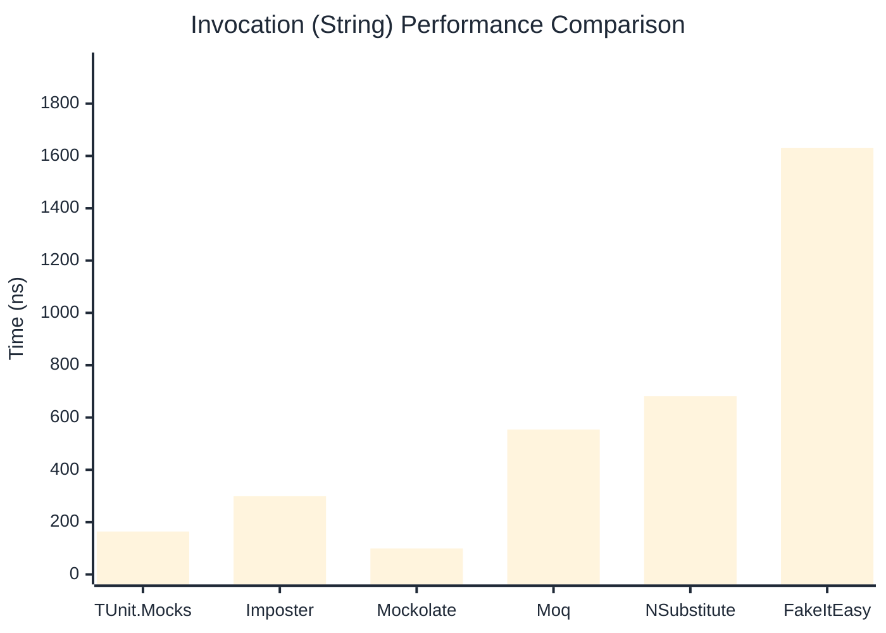

# Invocation Benchmark

> Calling methods on mock objects — comparing **TUnit.Mocks** (source-generated) against runtime proxy-based mocking libraries.

:::info Last Updated
This benchmark was automatically generated on **2026-08-19** from the latest CI run.

**Environment:** Ubuntu Latest • .NET SDK 10.0.400
:::

## 📊 Results

Calling methods on mock objects:

| Library | Mean | Error | StdDev | Allocated |
|---------|------|-------|--------|-----------|
| **TUnit.Mocks** | 275.52 ns | 100.47 ns | 5.507 ns | 128 B |
| Imposter | 298.59 ns | 58.72 ns | 3.218 ns | 168 B |
| Mockolate | 119.63 ns | 28.70 ns | 1.573 ns | 84 B |
| Moq | 849.37 ns | 184.14 ns | 10.093 ns | 376 B |
| NSubstitute | 794.92 ns | 52.84 ns | 2.896 ns | 360 B |
| FakeItEasy | 1,853.11 ns | 422.77 ns | 23.173 ns | 944 B |

```mermaid
%%{init: {
  'theme':'base',
  'themeVariables': {
    'primaryColor': '#2563eb',
    'primaryTextColor': '#1f2937',
    'primaryBorderColor': '#1e40af',
    'lineColor': '#6b7280',
    'secondaryColor': '#7c3aed',
    'tertiaryColor': '#dc2626',
    'background': '#ffffff',
    'pie1': '#2563eb',
    'pie2': '#7c3aed',
    'pie3': '#dc2626',
    'pie4': '#f59e0b',
    'pie5': '#10b981',
    'pie6': '#06b6d4',
    'pie7': '#ec4899',
    'pie8': '#6366f1'
  }
}}%%
xychart-beta
  title "Invocation Performance Comparison"
  x-axis ["TUnit.Mocks", "Imposter", "Mockolate", "Moq", "NSubstitute", "FakeItEasy"]
  y-axis "Time (ns)" 0 --> 2224
  bar [275.52, 298.59, 119.63, 849.37, 794.92, 1853.11]
```

---

### String

| Library | Mean | Error | StdDev | Allocated |
|---------|------|-------|--------|-----------|
| **TUnit.Mocks** | 164.17 ns | 69.20 ns | 3.793 ns | 96 B |
| Imposter | 299.06 ns | 122.62 ns | 6.721 ns | 168 B |
| Mockolate | 99.39 ns | 31.70 ns | 1.738 ns | 60 B |
| Moq | 554.12 ns | 124.53 ns | 6.826 ns | 296 B |
| NSubstitute | 681.35 ns | 72.64 ns | 3.982 ns | 328 B |
| FakeItEasy | 1,630.14 ns | 145.67 ns | 7.984 ns | 776 B |

```mermaid
%%{init: {
  'theme':'base',
  'themeVariables': {
    'primaryColor': '#2563eb',
    'primaryTextColor': '#1f2937',
    'primaryBorderColor': '#1e40af',
    'lineColor': '#6b7280',
    'secondaryColor': '#7c3aed',
    'tertiaryColor': '#dc2626',
    'background': '#ffffff',
    'pie1': '#2563eb',
    'pie2': '#7c3aed',
    'pie3': '#dc2626',
    'pie4': '#f59e0b',
    'pie5': '#10b981',
    'pie6': '#06b6d4',
    'pie7': '#ec4899',
    'pie8': '#6366f1'
  }
}}%%
xychart-beta
  title "Invocation (String) Performance Comparison"
  x-axis ["TUnit.Mocks", "Imposter", "Mockolate", "Moq", "NSubstitute", "FakeItEasy"]
  y-axis "Time (ns)" 0 --> 1957
  bar [164.17, 299.06, 99.39, 554.12, 681.35, 1630.14]
```

---

### 100 calls

| Library | Mean | Error | StdDev | Allocated |
|---------|------|-------|--------|-----------|
| **TUnit.Mocks** | 27,638.69 ns | 6,742.62 ns | 369.586 ns | 12736 B |
| Imposter | 29,573.68 ns | 3,712.19 ns | 203.478 ns | 16800 B |
| Mockolate | 11,545.30 ns | 1,035.24 ns | 56.745 ns | 8400 B |
| Moq | 83,341.67 ns | 14,349.15 ns | 786.525 ns | 37600 B |
| NSubstitute | 75,440.95 ns | 20,146.87 ns | 1,104.318 ns | 30848 B |
| FakeItEasy | 186,107.50 ns | 53,531.85 ns | 2,934.261 ns | 94400 B |

```mermaid
%%{init: {
  'theme':'base',
  'themeVariables': {
    'primaryColor': '#2563eb',
    'primaryTextColor': '#1f2937',
    'primaryBorderColor': '#1e40af',
    'lineColor': '#6b7280',
    'secondaryColor': '#7c3aed',
    'tertiaryColor': '#dc2626',
    'background': '#ffffff',
    'pie1': '#2563eb',
    'pie2': '#7c3aed',
    'pie3': '#dc2626',
    'pie4': '#f59e0b',
    'pie5': '#10b981',
    'pie6': '#06b6d4',
    'pie7': '#ec4899',
    'pie8': '#6366f1'
  }
}}%%
xychart-beta
  title "Invocation (100 calls) Performance Comparison"
  x-axis ["TUnit.Mocks", "Imposter", "Mockolate", "Moq", "NSubstitute", "FakeItEasy"]
  y-axis "Time (ns)" 0 --> 223329
  bar [27638.69, 29573.68, 11545.3, 83341.67, 75440.95, 186107.5]
```

## 🎯 Key Insights

This benchmark compares **TUnit.Mocks** (source-generated) against runtime proxy-based mocking libraries for calling methods on mock objects.

---

:::note Methodology
View the [mock benchmarks overview](/docs/benchmarks/mocks) for methodology details and environment information.
:::

*Last generated: 2026-08-19T02:42:18.029Z*
