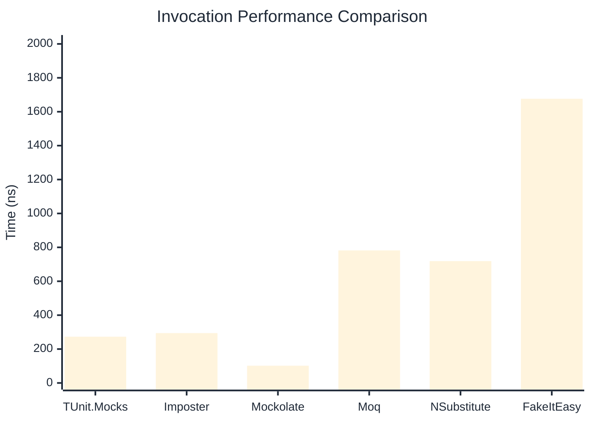

# Invocation Benchmark

> Calling methods on mock objects — comparing **TUnit.Mocks** (source-generated) against runtime proxy-based mocking libraries.

:::info Last Updated
This benchmark was automatically generated on **2026-08-16** from the latest CI run.

**Environment:** Ubuntu Latest • .NET SDK 10.0.400
:::

## 📊 Results

Calling methods on mock objects:

| Library | Mean | Error | StdDev | Allocated |
|---------|------|-------|--------|-----------|
| **TUnit.Mocks** | 273.10 ns | 83.11 ns | 4.555 ns | 128 B |
| Imposter | 294.26 ns | 86.60 ns | 4.747 ns | 168 B |
| Mockolate | 101.89 ns | 19.10 ns | 1.047 ns | 84 B |
| Moq | 781.84 ns | 227.00 ns | 12.443 ns | 376 B |
| NSubstitute | 718.88 ns | 291.45 ns | 15.975 ns | 304 B |
| FakeItEasy | 1,676.72 ns | 316.95 ns | 17.373 ns | 944 B |

```mermaid
%%{init: {
  'theme':'base',
  'themeVariables': {
    'primaryColor': '#2563eb',
    'primaryTextColor': '#1f2937',
    'primaryBorderColor': '#1e40af',
    'lineColor': '#6b7280',
    'secondaryColor': '#7c3aed',
    'tertiaryColor': '#dc2626',
    'background': '#ffffff',
    'pie1': '#2563eb',
    'pie2': '#7c3aed',
    'pie3': '#dc2626',
    'pie4': '#f59e0b',
    'pie5': '#10b981',
    'pie6': '#06b6d4',
    'pie7': '#ec4899',
    'pie8': '#6366f1'
  }
}}%%
xychart-beta
  title "Invocation Performance Comparison"
  x-axis ["TUnit.Mocks", "Imposter", "Mockolate", "Moq", "NSubstitute", "FakeItEasy"]
  y-axis "Time (ns)" 0 --> 2013
  bar [273.1, 294.26, 101.89, 781.84, 718.88, 1676.72]
```

---

### String

| Library | Mean | Error | StdDev | Allocated |
|---------|------|-------|--------|-----------|
| **TUnit.Mocks** | 166.71 ns | 73.43 ns | 4.025 ns | 96 B |
| Imposter | 292.61 ns | 75.15 ns | 4.119 ns | 168 B |
| Mockolate | 92.88 ns | 20.22 ns | 1.108 ns | 60 B |
| Moq | 520.85 ns | 63.55 ns | 3.484 ns | 296 B |
| NSubstitute | 593.12 ns | 228.51 ns | 12.525 ns | 272 B |
| FakeItEasy | 1,508.27 ns | 56.10 ns | 3.075 ns | 776 B |

```mermaid
%%{init: {
  'theme':'base',
  'themeVariables': {
    'primaryColor': '#2563eb',
    'primaryTextColor': '#1f2937',
    'primaryBorderColor': '#1e40af',
    'lineColor': '#6b7280',
    'secondaryColor': '#7c3aed',
    'tertiaryColor': '#dc2626',
    'background': '#ffffff',
    'pie1': '#2563eb',
    'pie2': '#7c3aed',
    'pie3': '#dc2626',
    'pie4': '#f59e0b',
    'pie5': '#10b981',
    'pie6': '#06b6d4',
    'pie7': '#ec4899',
    'pie8': '#6366f1'
  }
}}%%
xychart-beta
  title "Invocation (String) Performance Comparison"
  x-axis ["TUnit.Mocks", "Imposter", "Mockolate", "Moq", "NSubstitute", "FakeItEasy"]
  y-axis "Time (ns)" 0 --> 1810
  bar [166.71, 292.61, 92.88, 520.85, 593.12, 1508.27]
```

---

### 100 calls

| Library | Mean | Error | StdDev | Allocated |
|---------|------|-------|--------|-----------|
| **TUnit.Mocks** | 26,953.44 ns | 10,466.53 ns | 573.706 ns | 12736 B |
| Imposter | 28,649.75 ns | 10,071.76 ns | 552.067 ns | 16800 B |
| Mockolate | 10,090.50 ns | 2,931.86 ns | 160.705 ns | 8400 B |
| Moq | 78,753.53 ns | 8,092.07 ns | 443.553 ns | 37600 B |
| NSubstitute | 69,309.45 ns | 20,066.85 ns | 1,099.932 ns | 30848 B |
| FakeItEasy | 170,530.15 ns | 79,007.93 ns | 4,330.691 ns | 94400 B |

```mermaid
%%{init: {
  'theme':'base',
  'themeVariables': {
    'primaryColor': '#2563eb',
    'primaryTextColor': '#1f2937',
    'primaryBorderColor': '#1e40af',
    'lineColor': '#6b7280',
    'secondaryColor': '#7c3aed',
    'tertiaryColor': '#dc2626',
    'background': '#ffffff',
    'pie1': '#2563eb',
    'pie2': '#7c3aed',
    'pie3': '#dc2626',
    'pie4': '#f59e0b',
    'pie5': '#10b981',
    'pie6': '#06b6d4',
    'pie7': '#ec4899',
    'pie8': '#6366f1'
  }
}}%%
xychart-beta
  title "Invocation (100 calls) Performance Comparison"
  x-axis ["TUnit.Mocks", "Imposter", "Mockolate", "Moq", "NSubstitute", "FakeItEasy"]
  y-axis "Time (ns)" 0 --> 204637
  bar [26953.44, 28649.75, 10090.5, 78753.53, 69309.45, 170530.15]
```

## 🎯 Key Insights

This benchmark compares **TUnit.Mocks** (source-generated) against runtime proxy-based mocking libraries for calling methods on mock objects.

---

:::note Methodology
View the [mock benchmarks overview](/docs/benchmarks/mocks) for methodology details and environment information.
:::

*Last generated: 2026-08-16T02:49:35.790Z*
