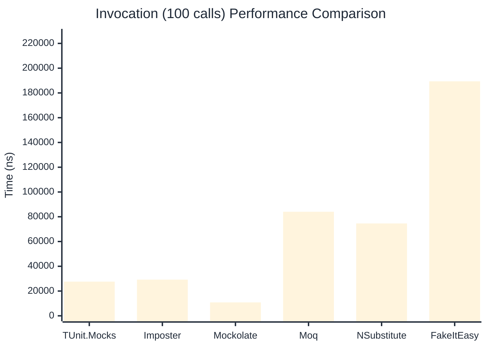

# Invocation Benchmark

> Calling methods on mock objects — comparing **TUnit.Mocks** (source-generated) against runtime proxy-based mocking libraries.

:::info Last Updated
This benchmark was automatically generated on **2026-09-24** from the latest CI run.

**Environment:** Ubuntu Latest • .NET SDK 10.0.401
:::

## 📊 Results

Calling methods on mock objects:

| Library | Mean | Error | StdDev | Allocated |
|---------|------|-------|--------|-----------|
| **TUnit.Mocks** | 278.6 ns | 96.33 ns | 5.28 ns | 128 B |
| Imposter | 301.0 ns | 21.97 ns | 1.20 ns | 168 B |
| Mockolate | 109.5 ns | 18.93 ns | 1.04 ns | 84 B |
| Moq | 809.9 ns | 78.22 ns | 4.29 ns | 376 B |
| NSubstitute | 743.6 ns | 368.07 ns | 20.18 ns | 304 B |
| FakeItEasy | 1,909.3 ns | 463.58 ns | 25.41 ns | 944 B |

```mermaid
%%{init: {
  'theme':'base',
  'themeVariables': {
    'primaryColor': '#2563eb',
    'primaryTextColor': '#1f2937',
    'primaryBorderColor': '#1e40af',
    'lineColor': '#6b7280',
    'secondaryColor': '#7c3aed',
    'tertiaryColor': '#dc2626',
    'background': '#ffffff',
    'pie1': '#2563eb',
    'pie2': '#7c3aed',
    'pie3': '#dc2626',
    'pie4': '#f59e0b',
    'pie5': '#10b981',
    'pie6': '#06b6d4',
    'pie7': '#ec4899',
    'pie8': '#6366f1'
  }
}}%%
xychart-beta
  title "Invocation Performance Comparison"
  x-axis ["TUnit.Mocks", "Imposter", "Mockolate", "Moq", "NSubstitute", "FakeItEasy"]
  y-axis "Time (ns)" 0 --> 2292
  bar [278.6, 301, 109.5, 809.9, 743.6, 1909.3]
```

---

### String

| Library | Mean | Error | StdDev | Allocated |
|---------|------|-------|--------|-----------|
| **TUnit.Mocks** | 167.2 ns | 79.97 ns | 4.38 ns | 96 B |
| Imposter | 301.9 ns | 111.25 ns | 6.10 ns | 168 B |
| Mockolate | 103.5 ns | 58.65 ns | 3.21 ns | 60 B |
| Moq | 546.2 ns | 188.89 ns | 10.35 ns | 296 B |
| NSubstitute | 632.5 ns | 234.57 ns | 12.86 ns | 272 B |
| FakeItEasy | 1,636.6 ns | 742.59 ns | 40.70 ns | 776 B |

```mermaid
%%{init: {
  'theme':'base',
  'themeVariables': {
    'primaryColor': '#2563eb',
    'primaryTextColor': '#1f2937',
    'primaryBorderColor': '#1e40af',
    'lineColor': '#6b7280',
    'secondaryColor': '#7c3aed',
    'tertiaryColor': '#dc2626',
    'background': '#ffffff',
    'pie1': '#2563eb',
    'pie2': '#7c3aed',
    'pie3': '#dc2626',
    'pie4': '#f59e0b',
    'pie5': '#10b981',
    'pie6': '#06b6d4',
    'pie7': '#ec4899',
    'pie8': '#6366f1'
  }
}}%%
xychart-beta
  title "Invocation (String) Performance Comparison"
  x-axis ["TUnit.Mocks", "Imposter", "Mockolate", "Moq", "NSubstitute", "FakeItEasy"]
  y-axis "Time (ns)" 0 --> 1964
  bar [167.2, 301.9, 103.5, 546.2, 632.5, 1636.6]
```

---

### 100 calls

| Library | Mean | Error | StdDev | Allocated |
|---------|------|-------|--------|-----------|
| **TUnit.Mocks** | 27,609.6 ns | 9,642.52 ns | 528.54 ns | 12736 B |
| Imposter | 29,217.7 ns | 4,483.09 ns | 245.73 ns | 16800 B |
| Mockolate | 10,839.9 ns | 3,325.50 ns | 182.28 ns | 8400 B |
| Moq | 84,030.1 ns | 42,844.58 ns | 2,348.46 ns | 37600 B |
| NSubstitute | 74,589.0 ns | 25,175.44 ns | 1,379.95 ns | 30848 B |
| FakeItEasy | 189,394.3 ns | 84,958.13 ns | 4,656.84 ns | 94400 B |

```mermaid
%%{init: {
  'theme':'base',
  'themeVariables': {
    'primaryColor': '#2563eb',
    'primaryTextColor': '#1f2937',
    'primaryBorderColor': '#1e40af',
    'lineColor': '#6b7280',
    'secondaryColor': '#7c3aed',
    'tertiaryColor': '#dc2626',
    'background': '#ffffff',
    'pie1': '#2563eb',
    'pie2': '#7c3aed',
    'pie3': '#dc2626',
    'pie4': '#f59e0b',
    'pie5': '#10b981',
    'pie6': '#06b6d4',
    'pie7': '#ec4899',
    'pie8': '#6366f1'
  }
}}%%
xychart-beta
  title "Invocation (100 calls) Performance Comparison"
  x-axis ["TUnit.Mocks", "Imposter", "Mockolate", "Moq", "NSubstitute", "FakeItEasy"]
  y-axis "Time (ns)" 0 --> 227274
  bar [27609.6, 29217.7, 10839.9, 84030.1, 74589, 189394.3]
```

## 🎯 Key Insights

This benchmark compares **TUnit.Mocks** (source-generated) against runtime proxy-based mocking libraries for calling methods on mock objects.

---

:::note Methodology
View the [mock benchmarks overview](/docs/benchmarks/mocks) for methodology details and environment information.
:::

*Last generated: 2026-09-24T02:33:35.117Z*
