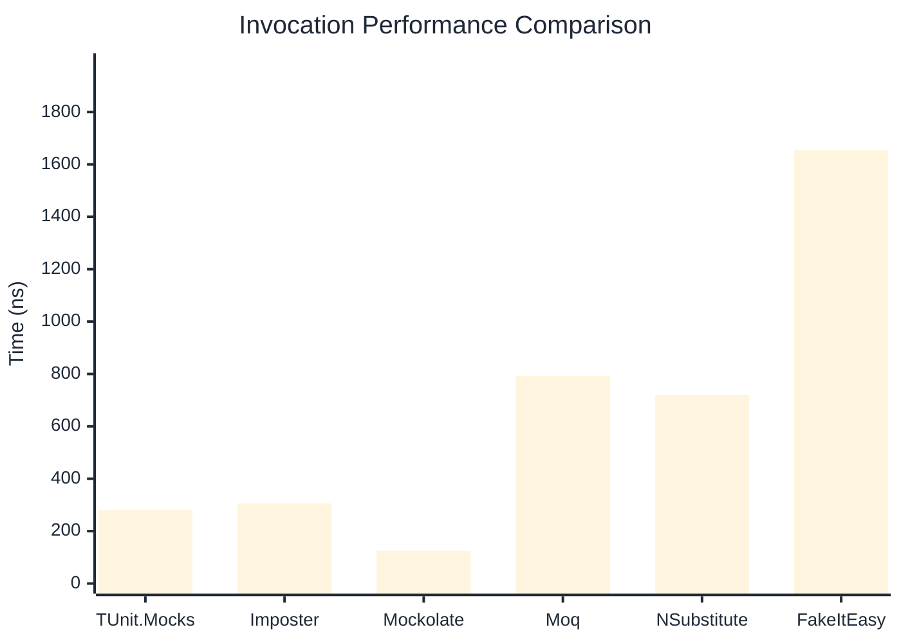

# Invocation Benchmark

> Calling methods on mock objects — comparing **TUnit.Mocks** (source-generated) against runtime proxy-based mocking libraries.

:::info Last Updated
This benchmark was automatically generated on **2026-08-08** from the latest CI run.

**Environment:** Ubuntu Latest • .NET SDK 10.0.302
:::

## 📊 Results

Calling methods on mock objects:

| Library | Mean | Error | StdDev | Allocated |
|---------|------|-------|--------|-----------|
| **TUnit.Mocks** | 280.23 ns | 63.399 ns | 3.475 ns | 128 B |
| Imposter | 305.69 ns | 59.821 ns | 3.279 ns | 168 B |
| Mockolate | 125.16 ns | 11.538 ns | 0.632 ns | 84 B |
| Moq | 792.49 ns | 210.510 ns | 11.539 ns | 376 B |
| NSubstitute | 720.44 ns | 88.247 ns | 4.837 ns | 304 B |
| FakeItEasy | 1,654.13 ns | 90.165 ns | 4.942 ns | 944 B |

```mermaid
%%{init: {
  'theme':'base',
  'themeVariables': {
    'primaryColor': '#2563eb',
    'primaryTextColor': '#1f2937',
    'primaryBorderColor': '#1e40af',
    'lineColor': '#6b7280',
    'secondaryColor': '#7c3aed',
    'tertiaryColor': '#dc2626',
    'background': '#ffffff',
    'pie1': '#2563eb',
    'pie2': '#7c3aed',
    'pie3': '#dc2626',
    'pie4': '#f59e0b',
    'pie5': '#10b981',
    'pie6': '#06b6d4',
    'pie7': '#ec4899',
    'pie8': '#6366f1'
  }
}}%%
xychart-beta
  title "Invocation Performance Comparison"
  x-axis ["TUnit.Mocks", "Imposter", "Mockolate", "Moq", "NSubstitute", "FakeItEasy"]
  y-axis "Time (ns)" 0 --> 1985
  bar [280.23, 305.69, 125.16, 792.49, 720.44, 1654.13]
```

---

### String

| Library | Mean | Error | StdDev | Allocated |
|---------|------|-------|--------|-----------|
| **TUnit.Mocks** | 165.84 ns | 65.299 ns | 3.579 ns | 96 B |
| Imposter | 294.01 ns | 122.124 ns | 6.694 ns | 168 B |
| Mockolate | 93.40 ns | 7.171 ns | 0.393 ns | 60 B |
| Moq | 544.33 ns | 169.639 ns | 9.298 ns | 296 B |
| NSubstitute | 615.83 ns | 230.650 ns | 12.643 ns | 272 B |
| FakeItEasy | 1,585.26 ns | 996.476 ns | 54.620 ns | 776 B |

```mermaid
%%{init: {
  'theme':'base',
  'themeVariables': {
    'primaryColor': '#2563eb',
    'primaryTextColor': '#1f2937',
    'primaryBorderColor': '#1e40af',
    'lineColor': '#6b7280',
    'secondaryColor': '#7c3aed',
    'tertiaryColor': '#dc2626',
    'background': '#ffffff',
    'pie1': '#2563eb',
    'pie2': '#7c3aed',
    'pie3': '#dc2626',
    'pie4': '#f59e0b',
    'pie5': '#10b981',
    'pie6': '#06b6d4',
    'pie7': '#ec4899',
    'pie8': '#6366f1'
  }
}}%%
xychart-beta
  title "Invocation (String) Performance Comparison"
  x-axis ["TUnit.Mocks", "Imposter", "Mockolate", "Moq", "NSubstitute", "FakeItEasy"]
  y-axis "Time (ns)" 0 --> 1903
  bar [165.84, 294.01, 93.4, 544.33, 615.83, 1585.26]
```

---

### 100 calls

| Library | Mean | Error | StdDev | Allocated |
|---------|------|-------|--------|-----------|
| **TUnit.Mocks** | 27,380.54 ns | 15,339.772 ns | 840.825 ns | 12736 B |
| Imposter | 29,751.31 ns | 10,946.571 ns | 600.018 ns | 16800 B |
| Mockolate | 12,090.37 ns | 4,286.149 ns | 234.938 ns | 8400 B |
| Moq | 80,856.50 ns | 24,432.557 ns | 1,339.231 ns | 37600 B |
| NSubstitute | 70,181.92 ns | 16,750.463 ns | 918.149 ns | 30848 B |
| FakeItEasy | 178,852.86 ns | 33,989.630 ns | 1,863.086 ns | 94400 B |

```mermaid
%%{init: {
  'theme':'base',
  'themeVariables': {
    'primaryColor': '#2563eb',
    'primaryTextColor': '#1f2937',
    'primaryBorderColor': '#1e40af',
    'lineColor': '#6b7280',
    'secondaryColor': '#7c3aed',
    'tertiaryColor': '#dc2626',
    'background': '#ffffff',
    'pie1': '#2563eb',
    'pie2': '#7c3aed',
    'pie3': '#dc2626',
    'pie4': '#f59e0b',
    'pie5': '#10b981',
    'pie6': '#06b6d4',
    'pie7': '#ec4899',
    'pie8': '#6366f1'
  }
}}%%
xychart-beta
  title "Invocation (100 calls) Performance Comparison"
  x-axis ["TUnit.Mocks", "Imposter", "Mockolate", "Moq", "NSubstitute", "FakeItEasy"]
  y-axis "Time (ns)" 0 --> 214624
  bar [27380.54, 29751.31, 12090.37, 80856.5, 70181.92, 178852.86]
```

## 🎯 Key Insights

This benchmark compares **TUnit.Mocks** (source-generated) against runtime proxy-based mocking libraries for calling methods on mock objects.

---

:::note Methodology
View the [mock benchmarks overview](/docs/benchmarks/mocks) for methodology details and environment information.
:::

*Last generated: 2026-08-08T02:56:03.834Z*
