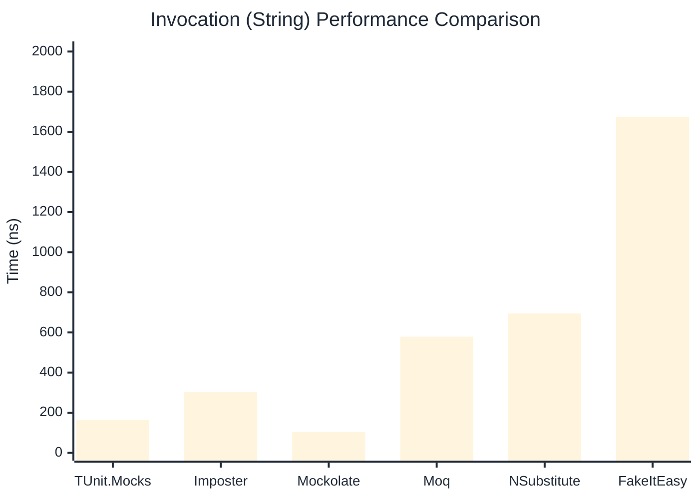

# Invocation Benchmark

> Calling methods on mock objects — comparing **TUnit.Mocks** (source-generated) against runtime proxy-based mocking libraries.

:::info Last Updated
This benchmark was automatically generated on **2026-08-20** from the latest CI run.

**Environment:** Ubuntu Latest • .NET SDK 10.0.400
:::

## 📊 Results

Calling methods on mock objects:

| Library | Mean | Error | StdDev | Allocated |
|---------|------|-------|--------|-----------|
| **TUnit.Mocks** | 286.2 ns | 81.65 ns | 4.48 ns | 128 B |
| Imposter | 310.4 ns | 60.51 ns | 3.32 ns | 168 B |
| Mockolate | 123.5 ns | 113.96 ns | 6.25 ns | 84 B |
| Moq | 866.0 ns | 87.87 ns | 4.82 ns | 376 B |
| NSubstitute | 757.2 ns | 157.38 ns | 8.63 ns | 304 B |
| FakeItEasy | 1,854.7 ns | 436.38 ns | 23.92 ns | 944 B |

```mermaid
%%{init: {
  'theme':'base',
  'themeVariables': {
    'primaryColor': '#2563eb',
    'primaryTextColor': '#1f2937',
    'primaryBorderColor': '#1e40af',
    'lineColor': '#6b7280',
    'secondaryColor': '#7c3aed',
    'tertiaryColor': '#dc2626',
    'background': '#ffffff',
    'pie1': '#2563eb',
    'pie2': '#7c3aed',
    'pie3': '#dc2626',
    'pie4': '#f59e0b',
    'pie5': '#10b981',
    'pie6': '#06b6d4',
    'pie7': '#ec4899',
    'pie8': '#6366f1'
  }
}}%%
xychart-beta
  title "Invocation Performance Comparison"
  x-axis ["TUnit.Mocks", "Imposter", "Mockolate", "Moq", "NSubstitute", "FakeItEasy"]
  y-axis "Time (ns)" 0 --> 2226
  bar [286.2, 310.4, 123.5, 866, 757.2, 1854.7]
```

---

### String

| Library | Mean | Error | StdDev | Allocated |
|---------|------|-------|--------|-----------|
| **TUnit.Mocks** | 165.4 ns | 80.81 ns | 4.43 ns | 96 B |
| Imposter | 304.3 ns | 127.83 ns | 7.01 ns | 168 B |
| Mockolate | 104.7 ns | 104.24 ns | 5.71 ns | 60 B |
| Moq | 579.1 ns | 384.15 ns | 21.06 ns | 296 B |
| NSubstitute | 694.5 ns | 93.29 ns | 5.11 ns | 272 B |
| FakeItEasy | 1,675.3 ns | 230.64 ns | 12.64 ns | 776 B |

```mermaid
%%{init: {
  'theme':'base',
  'themeVariables': {
    'primaryColor': '#2563eb',
    'primaryTextColor': '#1f2937',
    'primaryBorderColor': '#1e40af',
    'lineColor': '#6b7280',
    'secondaryColor': '#7c3aed',
    'tertiaryColor': '#dc2626',
    'background': '#ffffff',
    'pie1': '#2563eb',
    'pie2': '#7c3aed',
    'pie3': '#dc2626',
    'pie4': '#f59e0b',
    'pie5': '#10b981',
    'pie6': '#06b6d4',
    'pie7': '#ec4899',
    'pie8': '#6366f1'
  }
}}%%
xychart-beta
  title "Invocation (String) Performance Comparison"
  x-axis ["TUnit.Mocks", "Imposter", "Mockolate", "Moq", "NSubstitute", "FakeItEasy"]
  y-axis "Time (ns)" 0 --> 2011
  bar [165.4, 304.3, 104.7, 579.1, 694.5, 1675.3]
```

---

### 100 calls

| Library | Mean | Error | StdDev | Allocated |
|---------|------|-------|--------|-----------|
| **TUnit.Mocks** | 27,935.7 ns | 9,146.41 ns | 501.35 ns | 12736 B |
| Imposter | 30,228.0 ns | 7,311.69 ns | 400.78 ns | 16800 B |
| Mockolate | 13,100.4 ns | 856.89 ns | 46.97 ns | 8400 B |
| Moq | 87,322.3 ns | 19,158.50 ns | 1,050.14 ns | 37600 B |
| NSubstitute | 84,457.3 ns | 14,570.43 ns | 798.65 ns | 36448 B |
| FakeItEasy | 192,705.8 ns | 18,844.22 ns | 1,032.92 ns | 94400 B |

```mermaid
%%{init: {
  'theme':'base',
  'themeVariables': {
    'primaryColor': '#2563eb',
    'primaryTextColor': '#1f2937',
    'primaryBorderColor': '#1e40af',
    'lineColor': '#6b7280',
    'secondaryColor': '#7c3aed',
    'tertiaryColor': '#dc2626',
    'background': '#ffffff',
    'pie1': '#2563eb',
    'pie2': '#7c3aed',
    'pie3': '#dc2626',
    'pie4': '#f59e0b',
    'pie5': '#10b981',
    'pie6': '#06b6d4',
    'pie7': '#ec4899',
    'pie8': '#6366f1'
  }
}}%%
xychart-beta
  title "Invocation (100 calls) Performance Comparison"
  x-axis ["TUnit.Mocks", "Imposter", "Mockolate", "Moq", "NSubstitute", "FakeItEasy"]
  y-axis "Time (ns)" 0 --> 231247
  bar [27935.7, 30228, 13100.4, 87322.3, 84457.3, 192705.8]
```

## 🎯 Key Insights

This benchmark compares **TUnit.Mocks** (source-generated) against runtime proxy-based mocking libraries for calling methods on mock objects.

---

:::note Methodology
View the [mock benchmarks overview](/docs/benchmarks/mocks) for methodology details and environment information.
:::

*Last generated: 2026-08-20T02:41:11.657Z*
