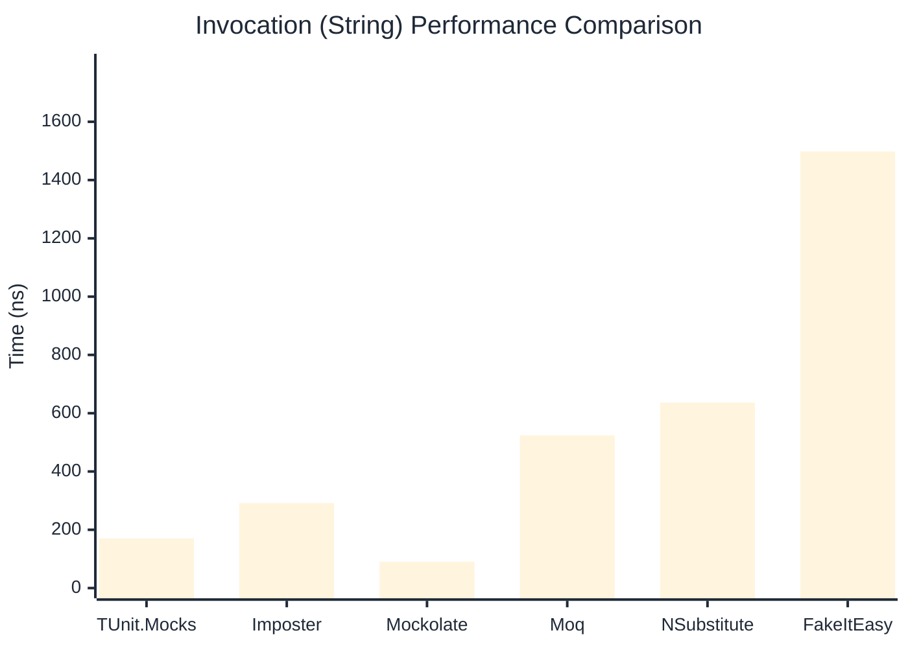

# Invocation Benchmark

> Calling methods on mock objects — comparing **TUnit.Mocks** (source-generated) against runtime proxy-based mocking libraries.

:::info Last Updated
This benchmark was automatically generated on **2026-09-23** from the latest CI run.

**Environment:** Ubuntu Latest • .NET SDK 10.0.401
:::

## 📊 Results

Calling methods on mock objects:

| Library | Mean | Error | StdDev | Allocated |
|---------|------|-------|--------|-----------|
| **TUnit.Mocks** | 267.99 ns | 90.39 ns | 4.955 ns | 128 B |
| Imposter | 290.83 ns | 64.89 ns | 3.557 ns | 168 B |
| Mockolate | 100.69 ns | 26.09 ns | 1.430 ns | 84 B |
| Moq | 795.40 ns | 131.07 ns | 7.184 ns | 376 B |
| NSubstitute | 701.76 ns | 237.34 ns | 13.009 ns | 304 B |
| FakeItEasy | 1,687.02 ns | 228.55 ns | 12.528 ns | 944 B |

```mermaid
%%{init: {
  'theme':'base',
  'themeVariables': {
    'primaryColor': '#2563eb',
    'primaryTextColor': '#1f2937',
    'primaryBorderColor': '#1e40af',
    'lineColor': '#6b7280',
    'secondaryColor': '#7c3aed',
    'tertiaryColor': '#dc2626',
    'background': '#ffffff',
    'pie1': '#2563eb',
    'pie2': '#7c3aed',
    'pie3': '#dc2626',
    'pie4': '#f59e0b',
    'pie5': '#10b981',
    'pie6': '#06b6d4',
    'pie7': '#ec4899',
    'pie8': '#6366f1'
  }
}}%%
xychart-beta
  title "Invocation Performance Comparison"
  x-axis ["TUnit.Mocks", "Imposter", "Mockolate", "Moq", "NSubstitute", "FakeItEasy"]
  y-axis "Time (ns)" 0 --> 2025
  bar [267.99, 290.83, 100.69, 795.4, 701.76, 1687.02]
```

---

### String

| Library | Mean | Error | StdDev | Allocated |
|---------|------|-------|--------|-----------|
| **TUnit.Mocks** | 170.21 ns | 68.15 ns | 3.735 ns | 96 B |
| Imposter | 291.30 ns | 66.20 ns | 3.629 ns | 168 B |
| Mockolate | 90.45 ns | 34.55 ns | 1.894 ns | 60 B |
| Moq | 523.89 ns | 42.77 ns | 2.344 ns | 296 B |
| NSubstitute | 636.40 ns | 215.01 ns | 11.786 ns | 328 B |
| FakeItEasy | 1,497.97 ns | 63.05 ns | 3.456 ns | 776 B |

```mermaid
%%{init: {
  'theme':'base',
  'themeVariables': {
    'primaryColor': '#2563eb',
    'primaryTextColor': '#1f2937',
    'primaryBorderColor': '#1e40af',
    'lineColor': '#6b7280',
    'secondaryColor': '#7c3aed',
    'tertiaryColor': '#dc2626',
    'background': '#ffffff',
    'pie1': '#2563eb',
    'pie2': '#7c3aed',
    'pie3': '#dc2626',
    'pie4': '#f59e0b',
    'pie5': '#10b981',
    'pie6': '#06b6d4',
    'pie7': '#ec4899',
    'pie8': '#6366f1'
  }
}}%%
xychart-beta
  title "Invocation (String) Performance Comparison"
  x-axis ["TUnit.Mocks", "Imposter", "Mockolate", "Moq", "NSubstitute", "FakeItEasy"]
  y-axis "Time (ns)" 0 --> 1798
  bar [170.21, 291.3, 90.45, 523.89, 636.4, 1497.97]
```

---

### 100 calls

| Library | Mean | Error | StdDev | Allocated |
|---------|------|-------|--------|-----------|
| **TUnit.Mocks** | 26,952.45 ns | 6,171.98 ns | 338.307 ns | 12736 B |
| Imposter | 28,726.85 ns | 10,385.84 ns | 569.283 ns | 16800 B |
| Mockolate | 9,914.66 ns | 4,124.62 ns | 226.084 ns | 8400 B |
| Moq | 79,160.41 ns | 26,774.10 ns | 1,467.579 ns | 37600 B |
| NSubstitute | 69,449.77 ns | 41,054.14 ns | 2,250.316 ns | 30848 B |
| FakeItEasy | 169,619.40 ns | 72,363.01 ns | 3,966.461 ns | 94400 B |

```mermaid
%%{init: {
  'theme':'base',
  'themeVariables': {
    'primaryColor': '#2563eb',
    'primaryTextColor': '#1f2937',
    'primaryBorderColor': '#1e40af',
    'lineColor': '#6b7280',
    'secondaryColor': '#7c3aed',
    'tertiaryColor': '#dc2626',
    'background': '#ffffff',
    'pie1': '#2563eb',
    'pie2': '#7c3aed',
    'pie3': '#dc2626',
    'pie4': '#f59e0b',
    'pie5': '#10b981',
    'pie6': '#06b6d4',
    'pie7': '#ec4899',
    'pie8': '#6366f1'
  }
}}%%
xychart-beta
  title "Invocation (100 calls) Performance Comparison"
  x-axis ["TUnit.Mocks", "Imposter", "Mockolate", "Moq", "NSubstitute", "FakeItEasy"]
  y-axis "Time (ns)" 0 --> 203544
  bar [26952.45, 28726.85, 9914.66, 79160.41, 69449.77, 169619.4]
```

## 🎯 Key Insights

This benchmark compares **TUnit.Mocks** (source-generated) against runtime proxy-based mocking libraries for calling methods on mock objects.

---

:::note Methodology
View the [mock benchmarks overview](/docs/benchmarks/mocks) for methodology details and environment information.
:::

*Last generated: 2026-09-23T02:34:56.618Z*
