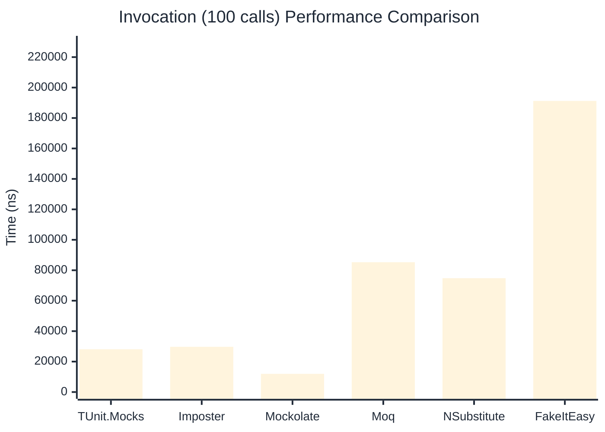

# Invocation Benchmark

> Calling methods on mock objects — comparing **TUnit.Mocks** (source-generated) against runtime proxy-based mocking libraries.

:::info Last Updated
This benchmark was automatically generated on **2026-09-21** from the latest CI run.

**Environment:** Ubuntu Latest • .NET SDK 10.0.401
:::

## 📊 Results

Calling methods on mock objects:

| Library | Mean | Error | StdDev | Allocated |
|---------|------|-------|--------|-----------|
| **TUnit.Mocks** | 277.8 ns | 69.12 ns | 3.79 ns | 128 B |
| Imposter | 303.1 ns | 47.55 ns | 2.61 ns | 168 B |
| Mockolate | 121.4 ns | 49.29 ns | 2.70 ns | 84 B |
| Moq | 855.3 ns | 298.05 ns | 16.34 ns | 376 B |
| NSubstitute | 761.6 ns | 116.64 ns | 6.39 ns | 304 B |
| FakeItEasy | 1,867.9 ns | 1,111.54 ns | 60.93 ns | 944 B |

```mermaid
%%{init: {
  'theme':'base',
  'themeVariables': {
    'primaryColor': '#2563eb',
    'primaryTextColor': '#1f2937',
    'primaryBorderColor': '#1e40af',
    'lineColor': '#6b7280',
    'secondaryColor': '#7c3aed',
    'tertiaryColor': '#dc2626',
    'background': '#ffffff',
    'pie1': '#2563eb',
    'pie2': '#7c3aed',
    'pie3': '#dc2626',
    'pie4': '#f59e0b',
    'pie5': '#10b981',
    'pie6': '#06b6d4',
    'pie7': '#ec4899',
    'pie8': '#6366f1'
  }
}}%%
xychart-beta
  title "Invocation Performance Comparison"
  x-axis ["TUnit.Mocks", "Imposter", "Mockolate", "Moq", "NSubstitute", "FakeItEasy"]
  y-axis "Time (ns)" 0 --> 2242
  bar [277.8, 303.1, 121.4, 855.3, 761.6, 1867.9]
```

---

### String

| Library | Mean | Error | StdDev | Allocated |
|---------|------|-------|--------|-----------|
| **TUnit.Mocks** | 167.0 ns | 67.63 ns | 3.71 ns | 96 B |
| Imposter | 309.0 ns | 86.68 ns | 4.75 ns | 168 B |
| Mockolate | 105.0 ns | 77.58 ns | 4.25 ns | 60 B |
| Moq | 560.2 ns | 208.11 ns | 11.41 ns | 296 B |
| NSubstitute | 663.9 ns | 448.60 ns | 24.59 ns | 272 B |
| FakeItEasy | 1,706.2 ns | 332.62 ns | 18.23 ns | 776 B |

```mermaid
%%{init: {
  'theme':'base',
  'themeVariables': {
    'primaryColor': '#2563eb',
    'primaryTextColor': '#1f2937',
    'primaryBorderColor': '#1e40af',
    'lineColor': '#6b7280',
    'secondaryColor': '#7c3aed',
    'tertiaryColor': '#dc2626',
    'background': '#ffffff',
    'pie1': '#2563eb',
    'pie2': '#7c3aed',
    'pie3': '#dc2626',
    'pie4': '#f59e0b',
    'pie5': '#10b981',
    'pie6': '#06b6d4',
    'pie7': '#ec4899',
    'pie8': '#6366f1'
  }
}}%%
xychart-beta
  title "Invocation (String) Performance Comparison"
  x-axis ["TUnit.Mocks", "Imposter", "Mockolate", "Moq", "NSubstitute", "FakeItEasy"]
  y-axis "Time (ns)" 0 --> 2048
  bar [167, 309, 105, 560.2, 663.9, 1706.2]
```

---

### 100 calls

| Library | Mean | Error | StdDev | Allocated |
|---------|------|-------|--------|-----------|
| **TUnit.Mocks** | 28,103.4 ns | 10,908.88 ns | 597.95 ns | 12736 B |
| Imposter | 29,723.7 ns | 3,025.68 ns | 165.85 ns | 16800 B |
| Mockolate | 11,942.5 ns | 6,545.47 ns | 358.78 ns | 8400 B |
| Moq | 85,275.2 ns | 31,997.98 ns | 1,753.92 ns | 37600 B |
| NSubstitute | 74,783.4 ns | 10,780.57 ns | 590.92 ns | 30848 B |
| FakeItEasy | 191,219.3 ns | 112,040.45 ns | 6,141.32 ns | 94400 B |

```mermaid
%%{init: {
  'theme':'base',
  'themeVariables': {
    'primaryColor': '#2563eb',
    'primaryTextColor': '#1f2937',
    'primaryBorderColor': '#1e40af',
    'lineColor': '#6b7280',
    'secondaryColor': '#7c3aed',
    'tertiaryColor': '#dc2626',
    'background': '#ffffff',
    'pie1': '#2563eb',
    'pie2': '#7c3aed',
    'pie3': '#dc2626',
    'pie4': '#f59e0b',
    'pie5': '#10b981',
    'pie6': '#06b6d4',
    'pie7': '#ec4899',
    'pie8': '#6366f1'
  }
}}%%
xychart-beta
  title "Invocation (100 calls) Performance Comparison"
  x-axis ["TUnit.Mocks", "Imposter", "Mockolate", "Moq", "NSubstitute", "FakeItEasy"]
  y-axis "Time (ns)" 0 --> 229464
  bar [28103.4, 29723.7, 11942.5, 85275.2, 74783.4, 191219.3]
```

## 🎯 Key Insights

This benchmark compares **TUnit.Mocks** (source-generated) against runtime proxy-based mocking libraries for calling methods on mock objects.

---

:::note Methodology
View the [mock benchmarks overview](/docs/benchmarks/mocks) for methodology details and environment information.
:::

*Last generated: 2026-09-21T02:37:24.392Z*
