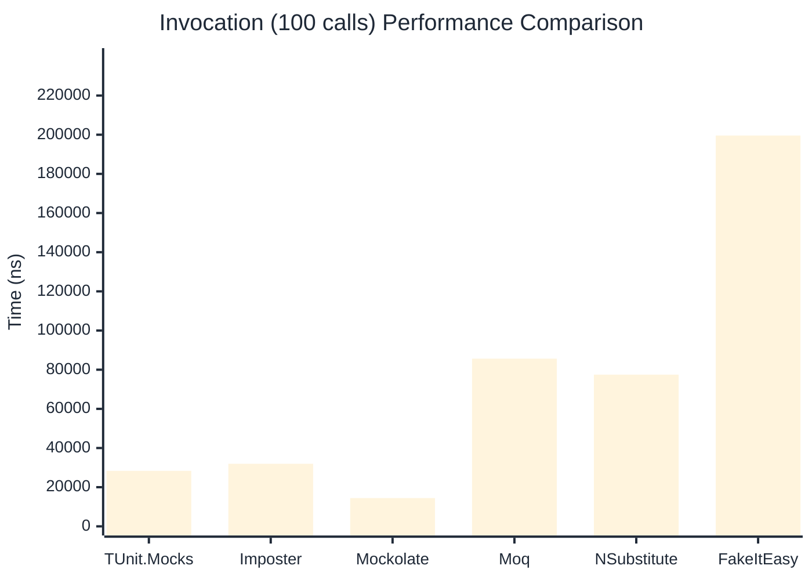

# Invocation Benchmark

> Calling methods on mock objects — comparing **TUnit.Mocks** (source-generated) against runtime proxy-based mocking libraries.

:::info Last Updated
This benchmark was automatically generated on **2026-09-02** from the latest CI run.

**Environment:** Ubuntu Latest • .NET SDK 10.0.400
:::

## 📊 Results

Calling methods on mock objects:

| Library | Mean | Error | StdDev | Allocated |
|---------|------|-------|--------|-----------|
| **TUnit.Mocks** | 284.6 ns | 89.20 ns | 4.89 ns | 128 B |
| Imposter | 315.8 ns | 113.77 ns | 6.24 ns | 168 B |
| Mockolate | 153.2 ns | 252.20 ns | 13.82 ns | 84 B |
| Moq | 844.9 ns | 145.82 ns | 7.99 ns | 376 B |
| NSubstitute | 802.8 ns | 193.13 ns | 10.59 ns | 304 B |
| FakeItEasy | 1,914.7 ns | 566.14 ns | 31.03 ns | 944 B |

```mermaid
%%{init: {
  'theme':'base',
  'themeVariables': {
    'primaryColor': '#2563eb',
    'primaryTextColor': '#1f2937',
    'primaryBorderColor': '#1e40af',
    'lineColor': '#6b7280',
    'secondaryColor': '#7c3aed',
    'tertiaryColor': '#dc2626',
    'background': '#ffffff',
    'pie1': '#2563eb',
    'pie2': '#7c3aed',
    'pie3': '#dc2626',
    'pie4': '#f59e0b',
    'pie5': '#10b981',
    'pie6': '#06b6d4',
    'pie7': '#ec4899',
    'pie8': '#6366f1'
  }
}}%%
xychart-beta
  title "Invocation Performance Comparison"
  x-axis ["TUnit.Mocks", "Imposter", "Mockolate", "Moq", "NSubstitute", "FakeItEasy"]
  y-axis "Time (ns)" 0 --> 2298
  bar [284.6, 315.8, 153.2, 844.9, 802.8, 1914.7]
```

---

### String

| Library | Mean | Error | StdDev | Allocated |
|---------|------|-------|--------|-----------|
| **TUnit.Mocks** | 175.2 ns | 55.38 ns | 3.04 ns | 96 B |
| Imposter | 321.5 ns | 250.52 ns | 13.73 ns | 168 B |
| Mockolate | 119.1 ns | 124.75 ns | 6.84 ns | 60 B |
| Moq | 676.0 ns | 1,099.38 ns | 60.26 ns | 296 B |
| NSubstitute | 665.2 ns | 276.01 ns | 15.13 ns | 272 B |
| FakeItEasy | 1,774.9 ns | 1,172.78 ns | 64.28 ns | 776 B |

```mermaid
%%{init: {
  'theme':'base',
  'themeVariables': {
    'primaryColor': '#2563eb',
    'primaryTextColor': '#1f2937',
    'primaryBorderColor': '#1e40af',
    'lineColor': '#6b7280',
    'secondaryColor': '#7c3aed',
    'tertiaryColor': '#dc2626',
    'background': '#ffffff',
    'pie1': '#2563eb',
    'pie2': '#7c3aed',
    'pie3': '#dc2626',
    'pie4': '#f59e0b',
    'pie5': '#10b981',
    'pie6': '#06b6d4',
    'pie7': '#ec4899',
    'pie8': '#6366f1'
  }
}}%%
xychart-beta
  title "Invocation (String) Performance Comparison"
  x-axis ["TUnit.Mocks", "Imposter", "Mockolate", "Moq", "NSubstitute", "FakeItEasy"]
  y-axis "Time (ns)" 0 --> 2130
  bar [175.2, 321.5, 119.1, 676, 665.2, 1774.9]
```

---

### 100 calls

| Library | Mean | Error | StdDev | Allocated |
|---------|------|-------|--------|-----------|
| **TUnit.Mocks** | 28,351.0 ns | 9,104.00 ns | 499.02 ns | 12736 B |
| Imposter | 31,963.5 ns | 27,938.97 ns | 1,531.43 ns | 16800 B |
| Mockolate | 14,450.4 ns | 39,400.77 ns | 2,159.69 ns | 8400 B |
| Moq | 85,633.2 ns | 39,998.49 ns | 2,192.45 ns | 37600 B |
| NSubstitute | 77,481.4 ns | 17,428.38 ns | 955.31 ns | 30848 B |
| FakeItEasy | 199,594.6 ns | 101,907.05 ns | 5,585.87 ns | 94400 B |

```mermaid
%%{init: {
  'theme':'base',
  'themeVariables': {
    'primaryColor': '#2563eb',
    'primaryTextColor': '#1f2937',
    'primaryBorderColor': '#1e40af',
    'lineColor': '#6b7280',
    'secondaryColor': '#7c3aed',
    'tertiaryColor': '#dc2626',
    'background': '#ffffff',
    'pie1': '#2563eb',
    'pie2': '#7c3aed',
    'pie3': '#dc2626',
    'pie4': '#f59e0b',
    'pie5': '#10b981',
    'pie6': '#06b6d4',
    'pie7': '#ec4899',
    'pie8': '#6366f1'
  }
}}%%
xychart-beta
  title "Invocation (100 calls) Performance Comparison"
  x-axis ["TUnit.Mocks", "Imposter", "Mockolate", "Moq", "NSubstitute", "FakeItEasy"]
  y-axis "Time (ns)" 0 --> 239514
  bar [28351, 31963.5, 14450.4, 85633.2, 77481.4, 199594.6]
```

## 🎯 Key Insights

This benchmark compares **TUnit.Mocks** (source-generated) against runtime proxy-based mocking libraries for calling methods on mock objects.

---

:::note Methodology
View the [mock benchmarks overview](/docs/benchmarks/mocks) for methodology details and environment information.
:::

*Last generated: 2026-09-02T02:49:53.672Z*
