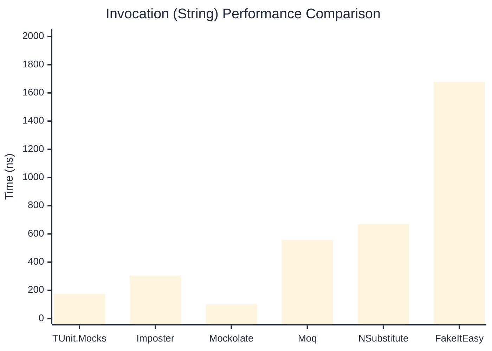
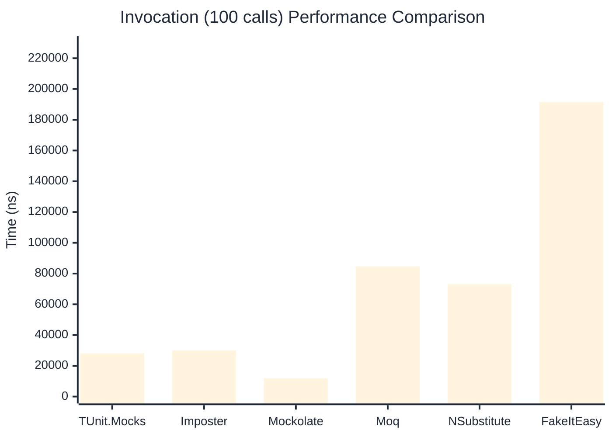

# Invocation Benchmark

> Calling methods on mock objects — comparing **TUnit.Mocks** (source-generated) against runtime proxy-based mocking libraries.

:::info Last Updated
This benchmark was automatically generated on **2026-09-20** from the latest CI run.

**Environment:** Ubuntu Latest • .NET SDK 10.0.401
:::

## 📊 Results

Calling methods on mock objects:

| Library | Mean | Error | StdDev | Allocated |
|---------|------|-------|--------|-----------|
| **TUnit.Mocks** | 278.6 ns | 90.27 ns | 4.95 ns | 128 B |
| Imposter | 305.5 ns | 127.80 ns | 7.01 ns | 168 B |
| Mockolate | 117.6 ns | 58.67 ns | 3.22 ns | 84 B |
| Moq | 843.3 ns | 41.20 ns | 2.26 ns | 376 B |
| NSubstitute | 756.7 ns | 354.69 ns | 19.44 ns | 304 B |
| FakeItEasy | 1,898.0 ns | 1,128.36 ns | 61.85 ns | 944 B |

```mermaid
%%{init: {
  'theme':'base',
  'themeVariables': {
    'primaryColor': '#2563eb',
    'primaryTextColor': '#1f2937',
    'primaryBorderColor': '#1e40af',
    'lineColor': '#6b7280',
    'secondaryColor': '#7c3aed',
    'tertiaryColor': '#dc2626',
    'background': '#ffffff',
    'pie1': '#2563eb',
    'pie2': '#7c3aed',
    'pie3': '#dc2626',
    'pie4': '#f59e0b',
    'pie5': '#10b981',
    'pie6': '#06b6d4',
    'pie7': '#ec4899',
    'pie8': '#6366f1'
  }
}}%%
xychart-beta
  title "Invocation Performance Comparison"
  x-axis ["TUnit.Mocks", "Imposter", "Mockolate", "Moq", "NSubstitute", "FakeItEasy"]
  y-axis "Time (ns)" 0 --> 2278
  bar [278.6, 305.5, 117.6, 843.3, 756.7, 1898]
```

---

### String

| Library | Mean | Error | StdDev | Allocated |
|---------|------|-------|--------|-----------|
| **TUnit.Mocks** | 174.5 ns | 82.39 ns | 4.52 ns | 96 B |
| Imposter | 305.3 ns | 94.27 ns | 5.17 ns | 168 B |
| Mockolate | 101.5 ns | 57.39 ns | 3.15 ns | 60 B |
| Moq | 557.9 ns | 176.99 ns | 9.70 ns | 296 B |
| NSubstitute | 669.1 ns | 448.75 ns | 24.60 ns | 272 B |
| FakeItEasy | 1,677.5 ns | 478.50 ns | 26.23 ns | 776 B |

```mermaid
%%{init: {
  'theme':'base',
  'themeVariables': {
    'primaryColor': '#2563eb',
    'primaryTextColor': '#1f2937',
    'primaryBorderColor': '#1e40af',
    'lineColor': '#6b7280',
    'secondaryColor': '#7c3aed',
    'tertiaryColor': '#dc2626',
    'background': '#ffffff',
    'pie1': '#2563eb',
    'pie2': '#7c3aed',
    'pie3': '#dc2626',
    'pie4': '#f59e0b',
    'pie5': '#10b981',
    'pie6': '#06b6d4',
    'pie7': '#ec4899',
    'pie8': '#6366f1'
  }
}}%%
xychart-beta
  title "Invocation (String) Performance Comparison"
  x-axis ["TUnit.Mocks", "Imposter", "Mockolate", "Moq", "NSubstitute", "FakeItEasy"]
  y-axis "Time (ns)" 0 --> 2013
  bar [174.5, 305.3, 101.5, 557.9, 669.1, 1677.5]
```

---

### 100 calls

| Library | Mean | Error | StdDev | Allocated |
|---------|------|-------|--------|-----------|
| **TUnit.Mocks** | 28,039.8 ns | 7,601.14 ns | 416.64 ns | 12736 B |
| Imposter | 29,993.1 ns | 10,526.42 ns | 576.99 ns | 16800 B |
| Mockolate | 11,850.9 ns | 15,037.08 ns | 824.23 ns | 8400 B |
| Moq | 84,686.0 ns | 27,489.73 ns | 1,506.81 ns | 37600 B |
| NSubstitute | 72,994.7 ns | 26,502.50 ns | 1,452.69 ns | 30848 B |
| FakeItEasy | 191,477.4 ns | 50,048.16 ns | 2,743.31 ns | 94400 B |

```mermaid
%%{init: {
  'theme':'base',
  'themeVariables': {
    'primaryColor': '#2563eb',
    'primaryTextColor': '#1f2937',
    'primaryBorderColor': '#1e40af',
    'lineColor': '#6b7280',
    'secondaryColor': '#7c3aed',
    'tertiaryColor': '#dc2626',
    'background': '#ffffff',
    'pie1': '#2563eb',
    'pie2': '#7c3aed',
    'pie3': '#dc2626',
    'pie4': '#f59e0b',
    'pie5': '#10b981',
    'pie6': '#06b6d4',
    'pie7': '#ec4899',
    'pie8': '#6366f1'
  }
}}%%
xychart-beta
  title "Invocation (100 calls) Performance Comparison"
  x-axis ["TUnit.Mocks", "Imposter", "Mockolate", "Moq", "NSubstitute", "FakeItEasy"]
  y-axis "Time (ns)" 0 --> 229773
  bar [28039.8, 29993.1, 11850.9, 84686, 72994.7, 191477.4]
```

## 🎯 Key Insights

This benchmark compares **TUnit.Mocks** (source-generated) against runtime proxy-based mocking libraries for calling methods on mock objects.

---

:::note Methodology
View the [mock benchmarks overview](/docs/benchmarks/mocks) for methodology details and environment information.
:::

*Last generated: 2026-09-20T02:32:50.293Z*
