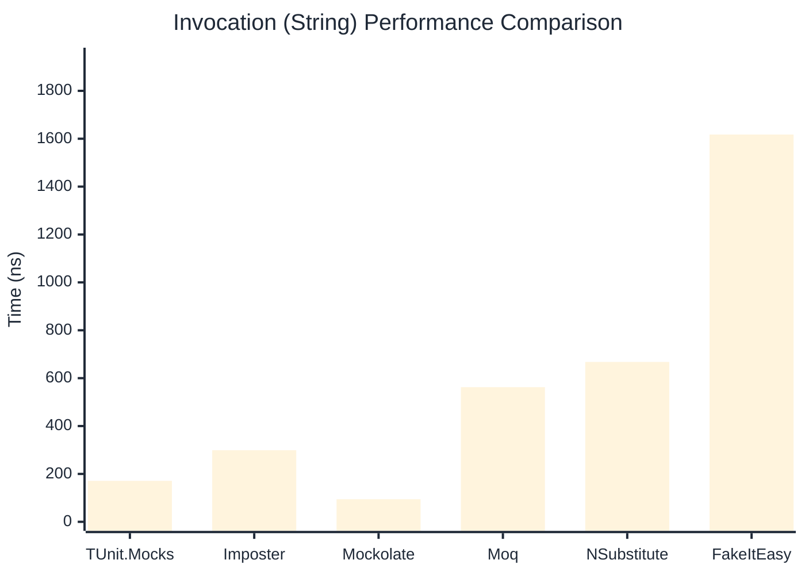
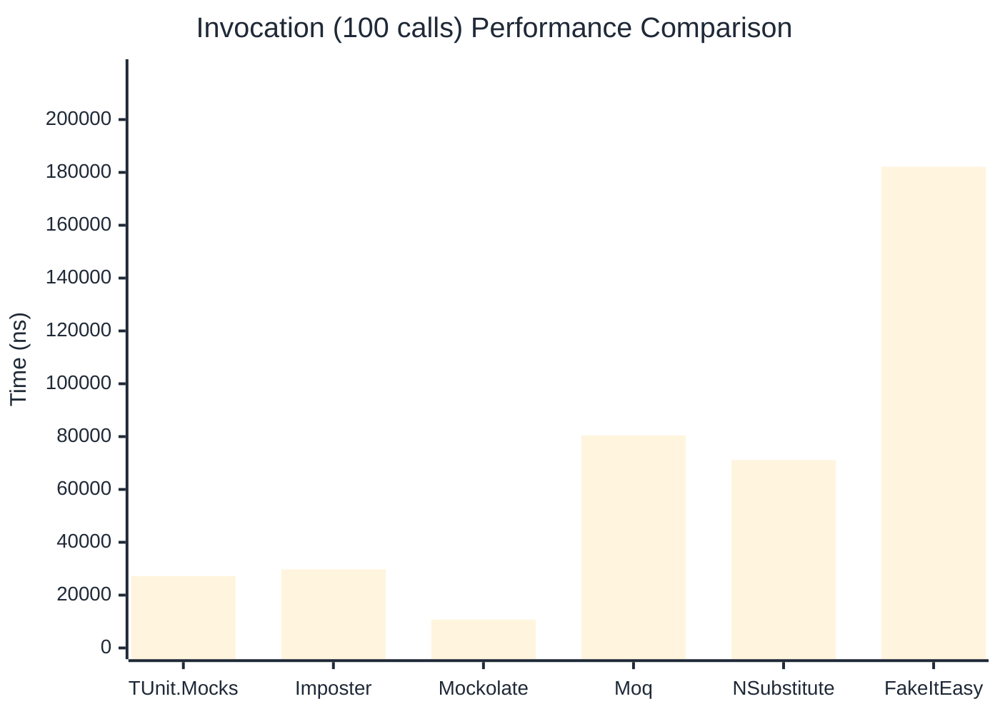

# Invocation Benchmark

> Calling methods on mock objects — comparing **TUnit.Mocks** (source-generated) against runtime proxy-based mocking libraries.

:::info Last Updated
This benchmark was automatically generated on **2026-09-27** from the latest CI run.

**Environment:** Ubuntu Latest • .NET SDK 10.0.401
:::

## 📊 Results

Calling methods on mock objects:

| Library | Mean | Error | StdDev | Allocated |
|---------|------|-------|--------|-----------|
| **TUnit.Mocks** | 277.74 ns | 75.28 ns | 4.126 ns | 128 B |
| Imposter | 290.32 ns | 70.39 ns | 3.858 ns | 168 B |
| Mockolate | 104.55 ns | 16.36 ns | 0.897 ns | 84 B |
| Moq | 791.63 ns | 81.81 ns | 4.485 ns | 376 B |
| NSubstitute | 722.70 ns | 458.58 ns | 25.136 ns | 304 B |
| FakeItEasy | 1,737.95 ns | 1,034.16 ns | 56.686 ns | 944 B |

```mermaid
%%{init: {
  'theme':'base',
  'themeVariables': {
    'primaryColor': '#2563eb',
    'primaryTextColor': '#1f2937',
    'primaryBorderColor': '#1e40af',
    'lineColor': '#6b7280',
    'secondaryColor': '#7c3aed',
    'tertiaryColor': '#dc2626',
    'background': '#ffffff',
    'pie1': '#2563eb',
    'pie2': '#7c3aed',
    'pie3': '#dc2626',
    'pie4': '#f59e0b',
    'pie5': '#10b981',
    'pie6': '#06b6d4',
    'pie7': '#ec4899',
    'pie8': '#6366f1'
  }
}}%%
xychart-beta
  title "Invocation Performance Comparison"
  x-axis ["TUnit.Mocks", "Imposter", "Mockolate", "Moq", "NSubstitute", "FakeItEasy"]
  y-axis "Time (ns)" 0 --> 2086
  bar [277.74, 290.32, 104.55, 791.63, 722.7, 1737.95]
```

---

### String

| Library | Mean | Error | StdDev | Allocated |
|---------|------|-------|--------|-----------|
| **TUnit.Mocks** | 171.11 ns | 160.94 ns | 8.822 ns | 96 B |
| Imposter | 298.89 ns | 83.26 ns | 4.564 ns | 168 B |
| Mockolate | 94.42 ns | 34.59 ns | 1.896 ns | 60 B |
| Moq | 562.45 ns | 222.27 ns | 12.183 ns | 296 B |
| NSubstitute | 667.74 ns | 34.01 ns | 1.864 ns | 328 B |
| FakeItEasy | 1,617.52 ns | 1,042.49 ns | 57.143 ns | 776 B |

```mermaid
%%{init: {
  'theme':'base',
  'themeVariables': {
    'primaryColor': '#2563eb',
    'primaryTextColor': '#1f2937',
    'primaryBorderColor': '#1e40af',
    'lineColor': '#6b7280',
    'secondaryColor': '#7c3aed',
    'tertiaryColor': '#dc2626',
    'background': '#ffffff',
    'pie1': '#2563eb',
    'pie2': '#7c3aed',
    'pie3': '#dc2626',
    'pie4': '#f59e0b',
    'pie5': '#10b981',
    'pie6': '#06b6d4',
    'pie7': '#ec4899',
    'pie8': '#6366f1'
  }
}}%%
xychart-beta
  title "Invocation (String) Performance Comparison"
  x-axis ["TUnit.Mocks", "Imposter", "Mockolate", "Moq", "NSubstitute", "FakeItEasy"]
  y-axis "Time (ns)" 0 --> 1942
  bar [171.11, 298.89, 94.42, 562.45, 667.74, 1617.52]
```

---

### 100 calls

| Library | Mean | Error | StdDev | Allocated |
|---------|------|-------|--------|-----------|
| **TUnit.Mocks** | 27,171.32 ns | 7,492.01 ns | 410.662 ns | 12736 B |
| Imposter | 29,764.99 ns | 16,487.62 ns | 903.742 ns | 16800 B |
| Mockolate | 10,722.31 ns | 22,218.98 ns | 1,217.897 ns | 8400 B |
| Moq | 80,465.61 ns | 22,902.61 ns | 1,255.369 ns | 37600 B |
| NSubstitute | 71,093.26 ns | 33,879.58 ns | 1,857.054 ns | 30848 B |
| FakeItEasy | 182,113.88 ns | 65,007.53 ns | 3,563.282 ns | 94400 B |

```mermaid
%%{init: {
  'theme':'base',
  'themeVariables': {
    'primaryColor': '#2563eb',
    'primaryTextColor': '#1f2937',
    'primaryBorderColor': '#1e40af',
    'lineColor': '#6b7280',
    'secondaryColor': '#7c3aed',
    'tertiaryColor': '#dc2626',
    'background': '#ffffff',
    'pie1': '#2563eb',
    'pie2': '#7c3aed',
    'pie3': '#dc2626',
    'pie4': '#f59e0b',
    'pie5': '#10b981',
    'pie6': '#06b6d4',
    'pie7': '#ec4899',
    'pie8': '#6366f1'
  }
}}%%
xychart-beta
  title "Invocation (100 calls) Performance Comparison"
  x-axis ["TUnit.Mocks", "Imposter", "Mockolate", "Moq", "NSubstitute", "FakeItEasy"]
  y-axis "Time (ns)" 0 --> 218537
  bar [27171.32, 29764.99, 10722.31, 80465.61, 71093.26, 182113.88]
```

## 🎯 Key Insights

This benchmark compares **TUnit.Mocks** (source-generated) against runtime proxy-based mocking libraries for calling methods on mock objects.

---

:::note Methodology
View the [mock benchmarks overview](/docs/benchmarks/mocks) for methodology details and environment information.
:::

*Last generated: 2026-09-27T02:37:02.890Z*
