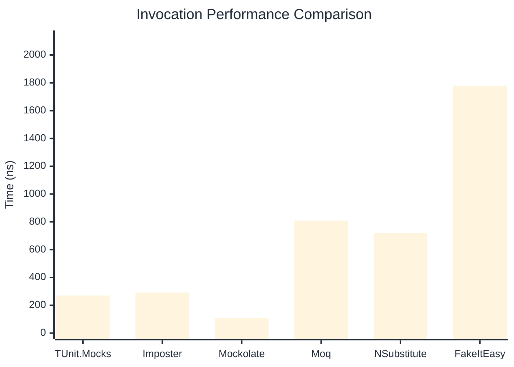

# Invocation Benchmark

> Calling methods on mock objects — comparing **TUnit.Mocks** (source-generated) against runtime proxy-based mocking libraries.

:::info Last Updated
This benchmark was automatically generated on **2026-10-01** from the latest CI run.

**Environment:** Ubuntu Latest • .NET SDK 10.0.401
:::

## 📊 Results

Calling methods on mock objects:

| Library | Mean | Error | StdDev | Allocated |
|---------|------|-------|--------|-----------|
| **TUnit.Mocks** | 269.8 ns | 100.56 ns | 5.51 ns | 128 B |
| Imposter | 291.4 ns | 81.12 ns | 4.45 ns | 168 B |
| Mockolate | 109.2 ns | 13.30 ns | 0.73 ns | 84 B |
| Moq | 808.9 ns | 511.97 ns | 28.06 ns | 376 B |
| NSubstitute | 721.6 ns | 234.08 ns | 12.83 ns | 304 B |
| FakeItEasy | 1,778.5 ns | 2,051.23 ns | 112.43 ns | 944 B |

```mermaid
%%{init: {
  'theme':'base',
  'themeVariables': {
    'primaryColor': '#2563eb',
    'primaryTextColor': '#1f2937',
    'primaryBorderColor': '#1e40af',
    'lineColor': '#6b7280',
    'secondaryColor': '#7c3aed',
    'tertiaryColor': '#dc2626',
    'background': '#ffffff',
    'pie1': '#2563eb',
    'pie2': '#7c3aed',
    'pie3': '#dc2626',
    'pie4': '#f59e0b',
    'pie5': '#10b981',
    'pie6': '#06b6d4',
    'pie7': '#ec4899',
    'pie8': '#6366f1'
  }
}}%%
xychart-beta
  title "Invocation Performance Comparison"
  x-axis ["TUnit.Mocks", "Imposter", "Mockolate", "Moq", "NSubstitute", "FakeItEasy"]
  y-axis "Time (ns)" 0 --> 2135
  bar [269.8, 291.4, 109.2, 808.9, 721.6, 1778.5]
```

---

### String

| Library | Mean | Error | StdDev | Allocated |
|---------|------|-------|--------|-----------|
| **TUnit.Mocks** | 166.8 ns | 45.58 ns | 2.50 ns | 96 B |
| Imposter | 294.0 ns | 59.67 ns | 3.27 ns | 168 B |
| Mockolate | 104.0 ns | 151.59 ns | 8.31 ns | 60 B |
| Moq | 551.3 ns | 66.71 ns | 3.66 ns | 296 B |
| NSubstitute | 611.3 ns | 275.43 ns | 15.10 ns | 272 B |
| FakeItEasy | 1,516.6 ns | 612.08 ns | 33.55 ns | 776 B |

```mermaid
%%{init: {
  'theme':'base',
  'themeVariables': {
    'primaryColor': '#2563eb',
    'primaryTextColor': '#1f2937',
    'primaryBorderColor': '#1e40af',
    'lineColor': '#6b7280',
    'secondaryColor': '#7c3aed',
    'tertiaryColor': '#dc2626',
    'background': '#ffffff',
    'pie1': '#2563eb',
    'pie2': '#7c3aed',
    'pie3': '#dc2626',
    'pie4': '#f59e0b',
    'pie5': '#10b981',
    'pie6': '#06b6d4',
    'pie7': '#ec4899',
    'pie8': '#6366f1'
  }
}}%%
xychart-beta
  title "Invocation (String) Performance Comparison"
  x-axis ["TUnit.Mocks", "Imposter", "Mockolate", "Moq", "NSubstitute", "FakeItEasy"]
  y-axis "Time (ns)" 0 --> 1820
  bar [166.8, 294, 104, 551.3, 611.3, 1516.6]
```

---

### 100 calls

| Library | Mean | Error | StdDev | Allocated |
|---------|------|-------|--------|-----------|
| **TUnit.Mocks** | 27,311.7 ns | 6,422.66 ns | 352.05 ns | 12736 B |
| Imposter | 29,574.5 ns | 18,336.97 ns | 1,005.11 ns | 16800 B |
| Mockolate | 12,015.1 ns | 5,250.42 ns | 287.79 ns | 8400 B |
| Moq | 79,654.2 ns | 53,814.28 ns | 2,949.74 ns | 37600 B |
| NSubstitute | 71,188.4 ns | 16,518.45 ns | 905.43 ns | 30848 B |
| FakeItEasy | 177,405.7 ns | 200,543.33 ns | 10,992.46 ns | 94400 B |

```mermaid
%%{init: {
  'theme':'base',
  'themeVariables': {
    'primaryColor': '#2563eb',
    'primaryTextColor': '#1f2937',
    'primaryBorderColor': '#1e40af',
    'lineColor': '#6b7280',
    'secondaryColor': '#7c3aed',
    'tertiaryColor': '#dc2626',
    'background': '#ffffff',
    'pie1': '#2563eb',
    'pie2': '#7c3aed',
    'pie3': '#dc2626',
    'pie4': '#f59e0b',
    'pie5': '#10b981',
    'pie6': '#06b6d4',
    'pie7': '#ec4899',
    'pie8': '#6366f1'
  }
}}%%
xychart-beta
  title "Invocation (100 calls) Performance Comparison"
  x-axis ["TUnit.Mocks", "Imposter", "Mockolate", "Moq", "NSubstitute", "FakeItEasy"]
  y-axis "Time (ns)" 0 --> 212887
  bar [27311.7, 29574.5, 12015.1, 79654.2, 71188.4, 177405.7]
```

## 🎯 Key Insights

This benchmark compares **TUnit.Mocks** (source-generated) against runtime proxy-based mocking libraries for calling methods on mock objects.

---

:::note Methodology
View the [mock benchmarks overview](/docs/benchmarks/mocks) for methodology details and environment information.
:::

*Last generated: 2026-10-01T02:49:56.169Z*
